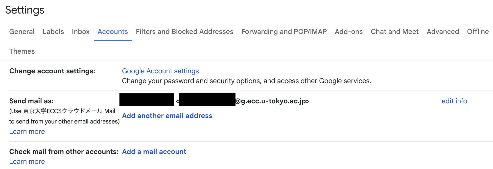
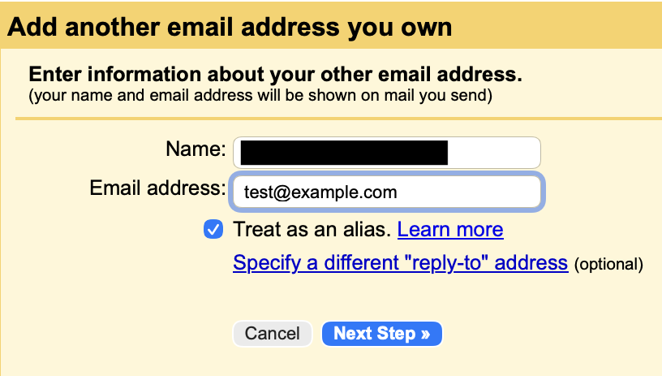

## Introduction

In Gmail of your ECCS Cloud Email, you can send emails from your email address with a domain other than g.ecc.u-tokyo.ac.jp via Gmail after the required setup. 

To fulfill the required setup and use the service, you need to enter your password in some cases. Check the points below before entering your password. 

- The information of your email account is entered and stored in Google's services. 
- If your UTokyo Account or your ECCS Cloud Email account is compromised, your ECCS Cloud Email address and another email address you add could be misused to send targeted attacks. 

In addition, notice that some email services may not support sending email using the method described on this page .

## How to Fulfill the Required Setup

Follow the procedures below to fulfill the required setup. 

1. Access Gmail of your ECCS Cloud Email and click the gear icon at the upper right on the screen. 

1. Select "See all settings" in the "Quick Settings" panel.

1. Select "Accounts" in the "Settings" page.

1. Select "Add another email address" and enter the required information in the displayed form. 
    - In the initial condition, "Treat as an alias" is checked and your added email address is treated equally as your ECCS Cloud Email address (for example, an email sent to your added email address is displayed in the Gmail inbox of your ECCS Cloud Email). However, it is recommended to uncheck "Treat as an alias" in some cases such as when you send an email from your added account on behalf of your ECCS Cloud Email address. For more details of settings, please refer to Google's official Help Page [Should I uncheck "Treat as an alias" in Gmail?](https://knowledge.workspace.google.com/admin/users/should-i-uncheck-treat-as-an-alias-in-gmail?visit_id=639220986364895751-2561577113&rd=1).

<figure class="center">
    
    <figcaption>The Display of Settings</figcaption>
</figure>

<figure class="center">
    
    <figcaption>The Display to add your email address</figcaption>
</figure>
