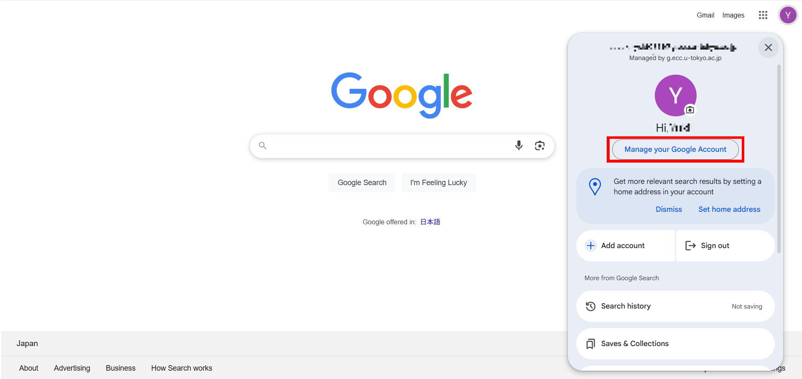
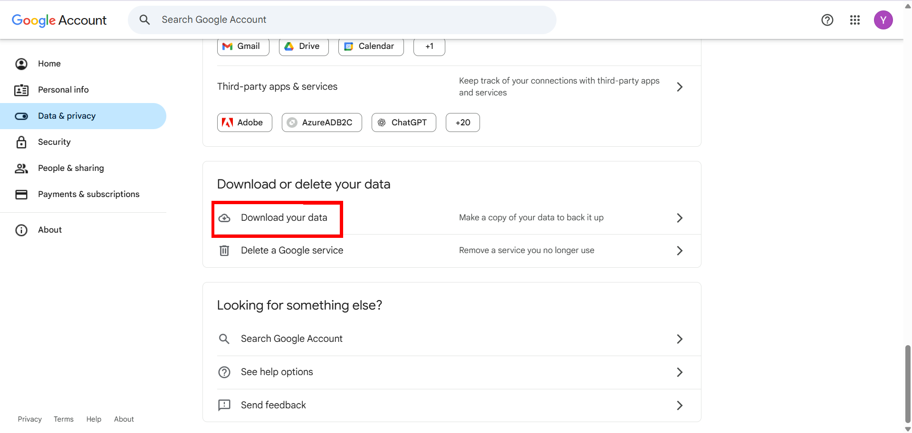
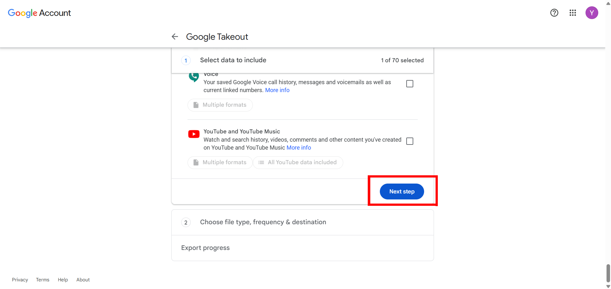
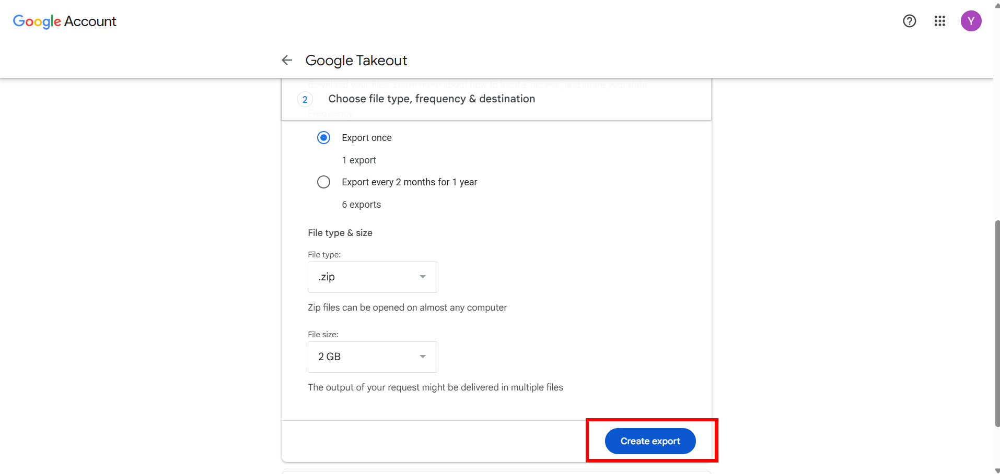
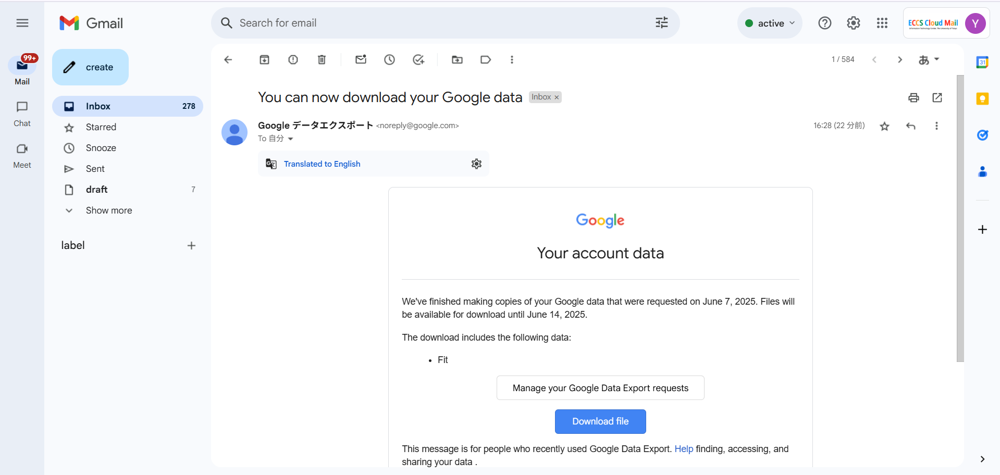

This page explains how to download data stored on your ECCS Cloud Email account all at once.

However, please note that certain types of data, such as emails, can also be transferred to another Google account. For instructions on how to migrate your data, please refer to “[Transferring content from ECCS Cloud Email to another Google account](/google/misc/backup/transfer/) (in Japanese).”

For detailed settings and troubleshooting, please refer to [Google Account Help > Manage your information > How to download your Google data](https://support.google.com/accounts/answer/3024190?hl=en).

1. Please log in to your ECCS Cloud Email.
1. Please click the profile picture or your initials in the top right corner, then select “Manage your Google Account”.

   

1. From the left-hand menu, please select “Data & privacy,”, then click “Download your data”.

   

1. Please select the services where you want to export the data, then click “Next step”.

   

1. Please select the file format, archive size, and delivery method, then click “Create export”.
   - Depending on the size of the data, the export process can take anything from several hours to a few days. If you select “Send download link via email” in the "Destination" section , you’ll receive a notification in your ECCS Cloud Email once exporting has finished.

   

1. If you select “Send download link via email” in the “Destination” section, you’ll receive an email once exporting has finished.  Click the download link in that email to download your data.

   
