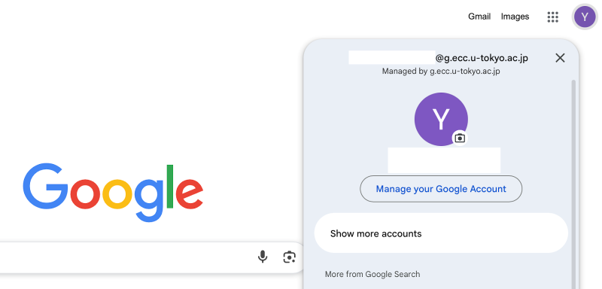
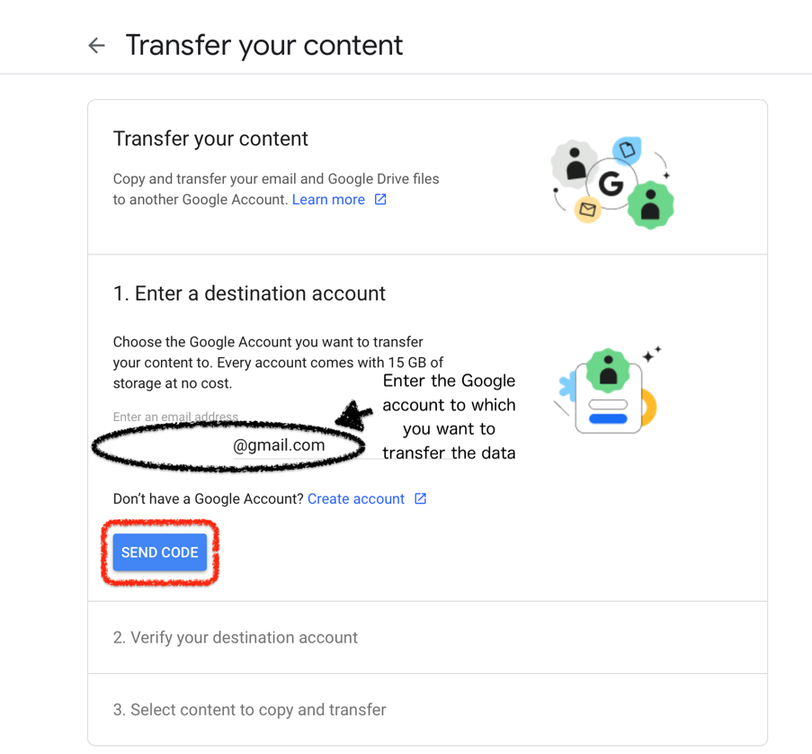
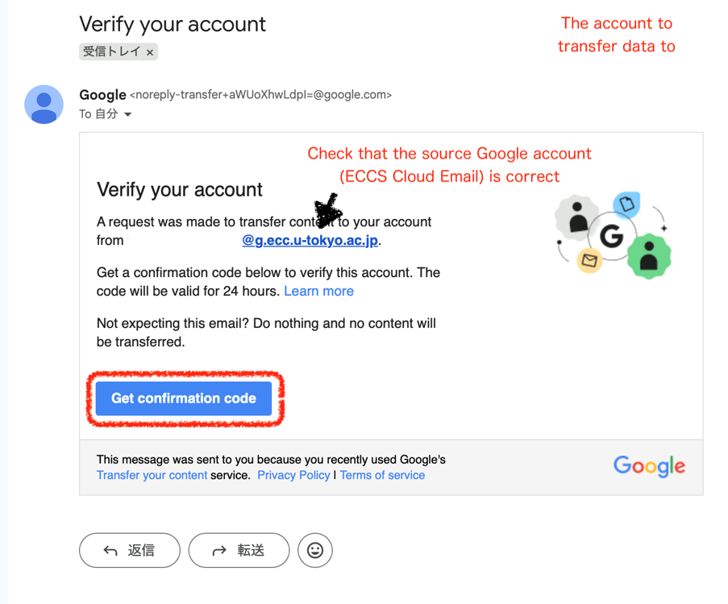
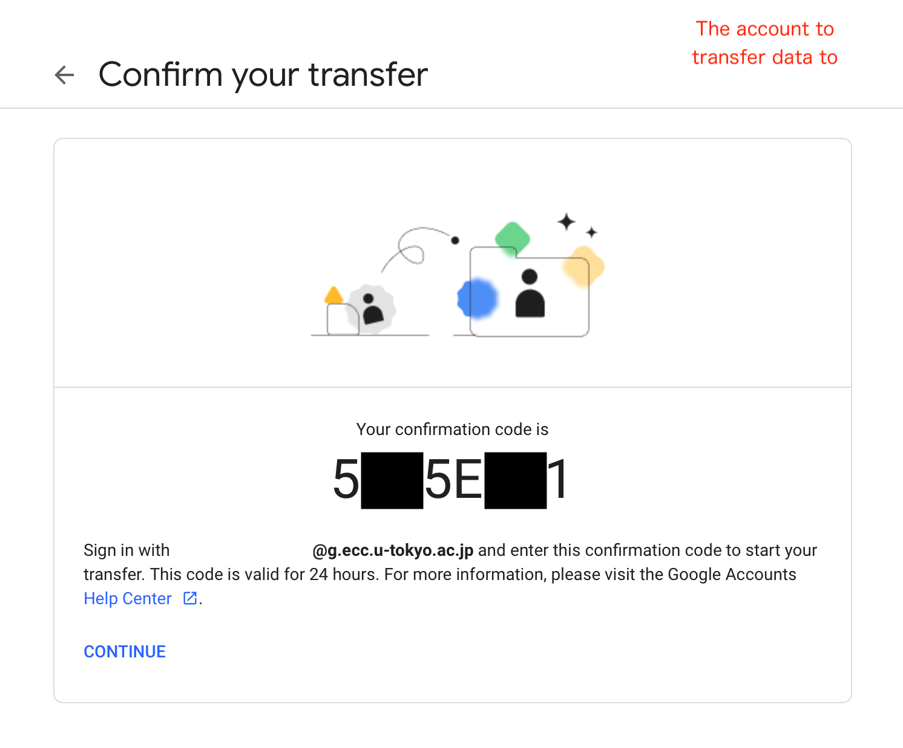
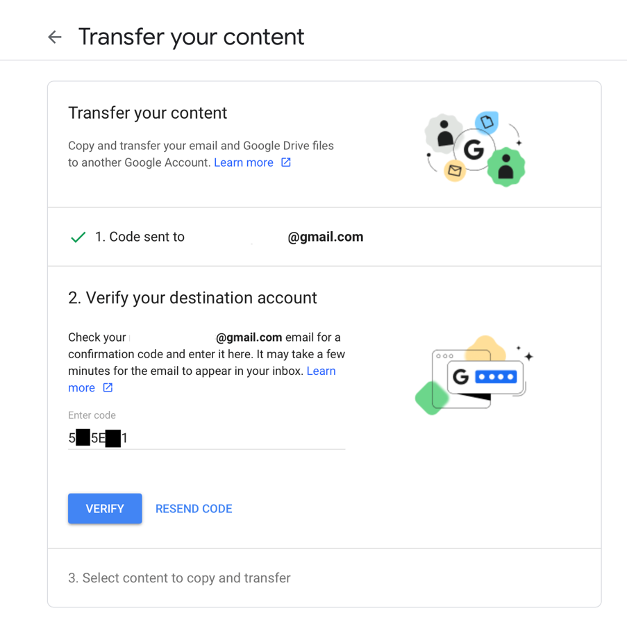
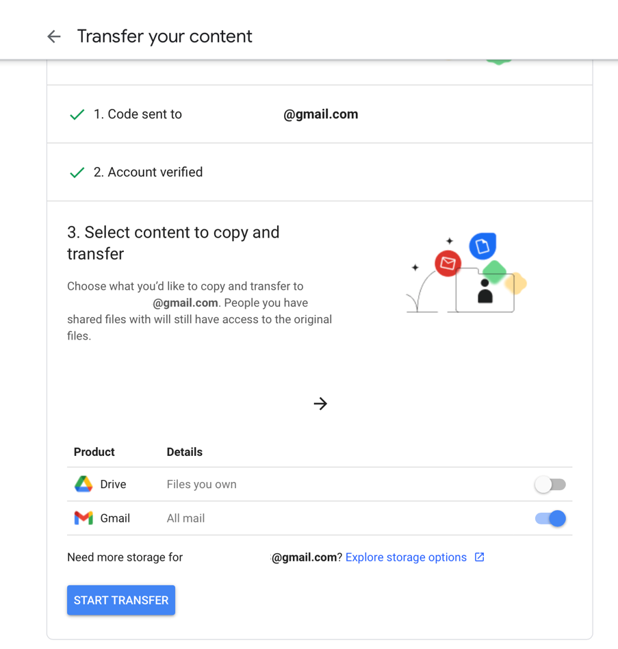
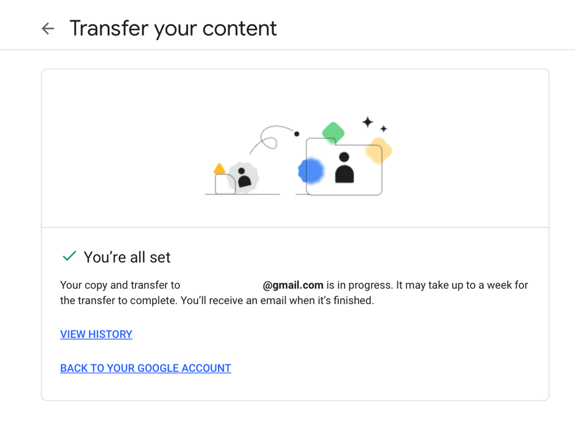
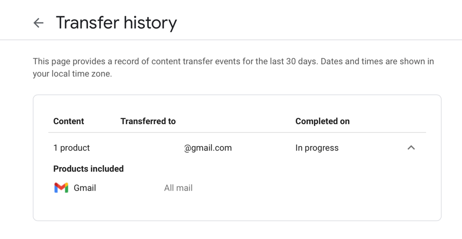

You can copy data from your ECCS Cloud Email account to another Google account—such as a personal Gmail account or a Google Workspace account used at another university or organization by using the "Transfer your content" feature in your Google account.
You can also refer to the "[Copy content from your school account to another account" (Google Account Help)](https://support.google.com/accounts/answer/6386856) for more information.

## Data That Can Be Transferred

The following data can be copied and transferred．

* Mail
* Drive

For information on how to back up other types of data, please refer to "[Downloading Data Stored in ECCS Cloud Email](../download/)".

## Limitations

* You cannot transfer data once you have lost your ECCS Cloud Email account.
* You must already have a Google account other than ECCS Cloud Email when transferring the contents.
* The Google account where you want to copy your content must have sufficient available storage space.
  * Even if it was free to store the data size on the ECCS Cloud Email, additional charges may apply to store the data on the account where you copied your content.

## Steps

### Step 1: Send a confirmation code to the account where you want to copy your content.
{:#send-code}

1. Please log in to your ECCS Cloud Email account.
1. Please select the Google account which has the data you want to copy.
   {:.small}
1.Please open “[Transfer your content](https://takeout.google.com/transfer)" page.
1. Enter the Google account to which you want to transfer the data, then push "SEND CODE".
   {:.small}
### Step 2: Obtain the confirmation code.
{:#receive-code}

1. An email like the following will be sent to the Google account that you want to transfer the data to. Please check that the Google account which has the data you want to copy (ECCS Cloud Email) is correct, then click "Get confirmation code".
   {:.small}
1. Please make a note of the confirmation code (in the example below, it appears as 5**5E**1).
   {:.small}

### Step 3: Enter the confirmation code and start the data transfer.
{:#transfer}

1. Please open the screen for “[Step 1: Send a confirmation code to the account where you want to copy your content](#send-code)”.
1. Enter the verification code obtained in “[Step 2: Obtain the confirmation code](#receive-code)”, then click "VERIFY".
   {:.small}
1. Select the content you want to copy, then click "START TRANSFER".
   {:.small}
1. The transfer will start.
   {:.small}
   - It may take some time for the transfer to be completed.
   - You can check the progress in the VIEW HISTORY section.
     {:.small}
