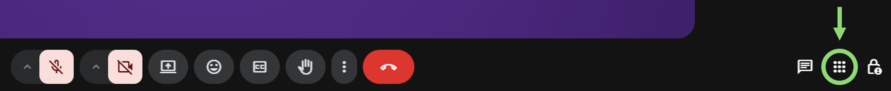
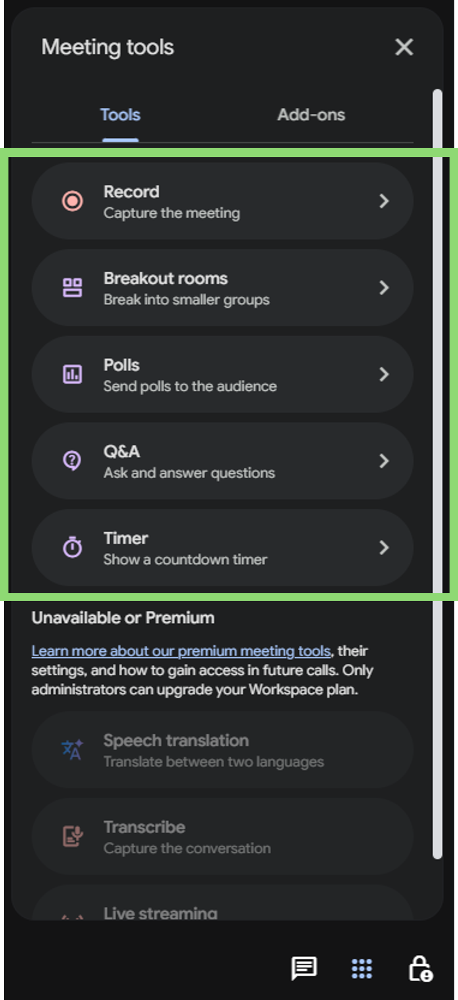
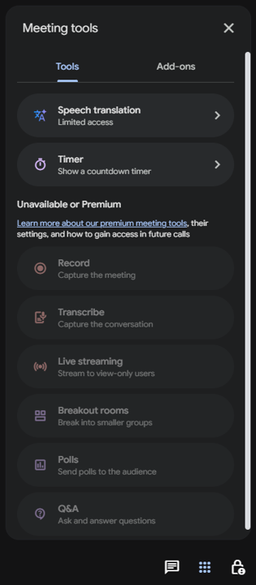

## Overview
{:#overview}

The University of Tokyo has a contract for Google Workspace for Education Plus licenses. This contract was established to increase the storage capacity of the entire university in response to the storage limits introduced in Google Workspace for Education (ECCS Cloud Email).

In addition to increasing university-wide storage capacity and providing enhanced features for administrators, assigning a Google Workspace for Education Plus license to an individual user enhances their ECCS Cloud Email functionality with the following features:

- Availability of large-group meetings, live streaming, and recording capabilities in Google Meet.
- Relaxed limits on originality reports in Google Classroom and Google Assignment.
- Availability of AppSheet.
- [Access to Gemini features within Google Docs, Google Slides, and Google Forms.(in Japanese)](/notice/2026/0302-gemini-gws/)．

For other differences in features, please refer to [the official comparison of Google Workspace for Education editions](https://edu.google.com/intl/ALL_us/workspace-for-education/editions/compare-editions/).

Please note that Google Workspace for Education Plus has different license types for students and faculty/staff, resulting in some functional differences such as the availability of the live streaming feature.

## License Application and Assignment
{:#apply-and-grant}

Google Workspace for Education Plus licenses are assigned to ECCS Cloud Email accounts based on individual applications from users (Note: Starting November 2, 2026, licenses are scheduled to be provisioned automatically to all users without requiring an application).

- Users who wish to have a license assigned should submit the application form via the link below.
    - On the application form, please ensure that you enter your name correctly and select your appropriate status (Student or Faculty/Staff).
    - If you accidentally submit the application form with an incorrect status selection, or if your affiliation status changes (e.g., between student and faculty/staff), please submit the application form again with the updated information.
    - Once the application form is submitted, the license will be assigned automatically within a few minutes, and a confirmation email will be sent to you.
- Even if you no longer require the Google Workspace for Education Plus license, there is no need to request a cancellation.
    - As long as the assigned license corresponds to your current status, you may continue to use it without any issues.
<b class="box center"><a href="https://docs.google.com/forms/d/e/1FAIpQLSd2rXNIL_grmiDU_XG5uFMCNNfWhoqDpK5iemvFUsBN2RUeaA/viewform?usp=sf_link">Google Workspace for Education Plus License Application Form</a></b>

## How to Verify Your License
{:#check-grant}

You can check whether the license has been successfully assigned by verifying the availability of the "Activities" feature in [Google Meet](../../meet/). The Activities feature is available for both student and faculty/staff licenses.

### Verification Steps

1. Go to the Google Meet homepage and [create a new meeting](../../meet/#create_meeting_from_meet_page).
2. Click the "Activities" icon located at the bottom right corner of the screen.
   {:.medium}
3. Verify the availability of features:
    - If the license is assigned: Features such as Q&A, Polls, and Breakout Rooms will be available.
      {:.small}
    - If the license is not assigned: Features like Q&A, Polls, and Breakout Rooms will be inaccessible.
      {:.small}

## Supplementary Information & Important Notes
{:#notes}

- Correction of Affiliation Status: If you mistakenly applied with the wrong status (Faculty/Staff or Student), you can change it to the correct license by submitting a new application through the same form and selecting your proper status.
- License Restrictions: Licenses differ between students and faculty/staff. It is not permitted for a student to apply for a faculty/staff license solely to use features like live streaming. (Although the form currently lacks a real-time validation mechanism and allows submission, if a status discrepancy is discovered during subsequent audits, the license will be revoked).
- No Cancellation Required: Once a license is granted, you do not need to cancel it even if it becomes unnecessary. Since having a license assigned carries no disadvantages, no cancellation request form is provided.
- Contract Renewal Policy: Regarding the policy of "renewing the contract annually for the foreseeable future," Google Workspace for Education Plus is contracted primarily to expand the overall university storage capacity. Therefore, if major shifts occur—such as the university's total storage usage dropping to about one-fourth of its current level, or the free storage capacity provided by Google increasing by approximately four times—the contract will be re-evaluated. Barring such significant changes, we plan to renew the contract every year.
