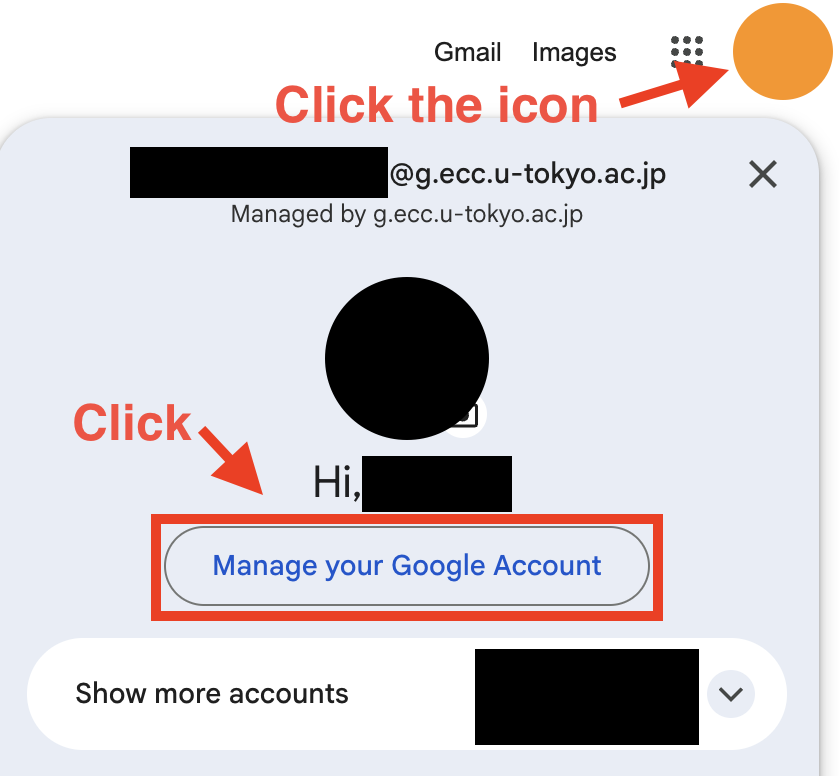
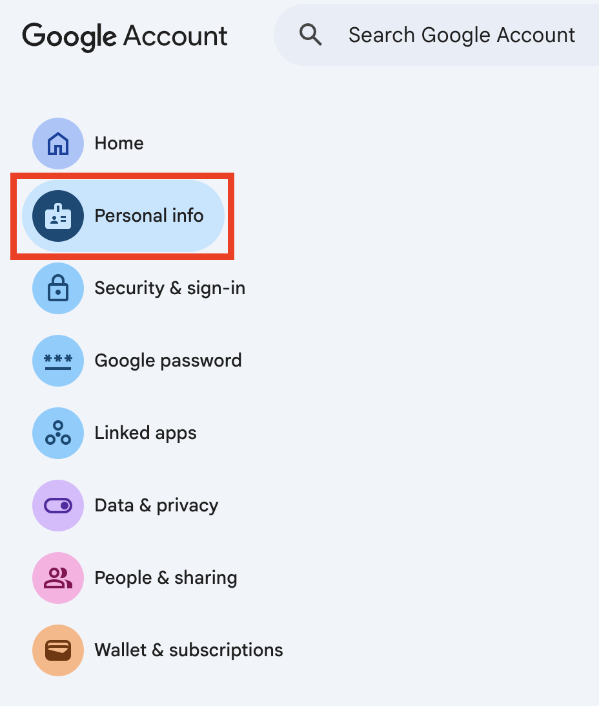
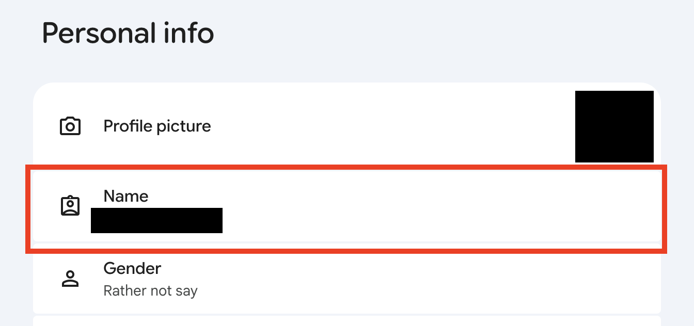
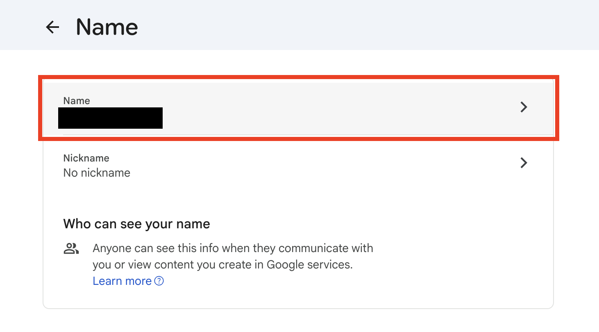
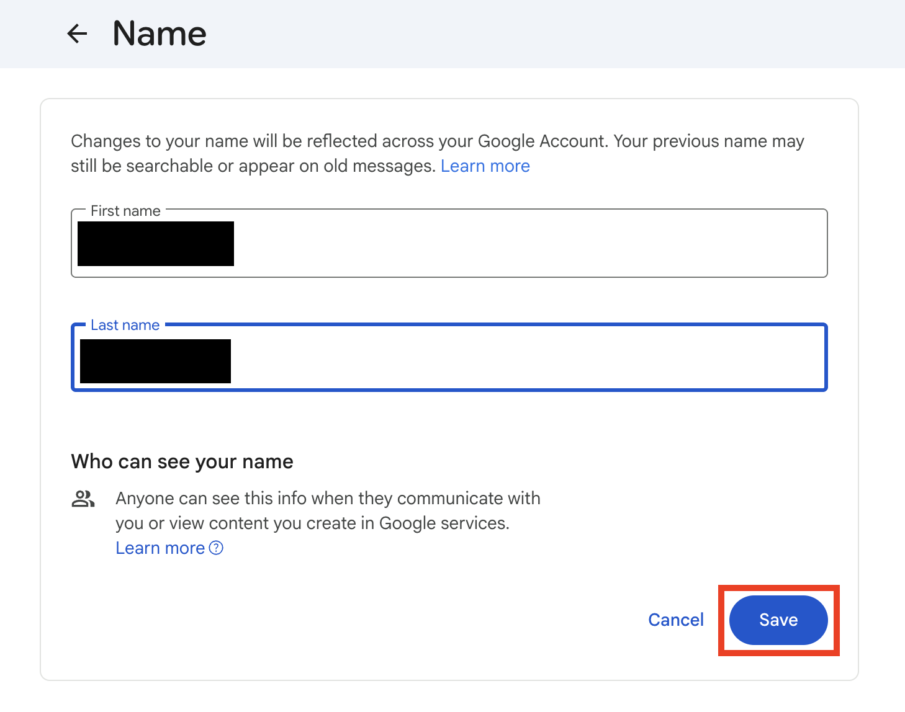
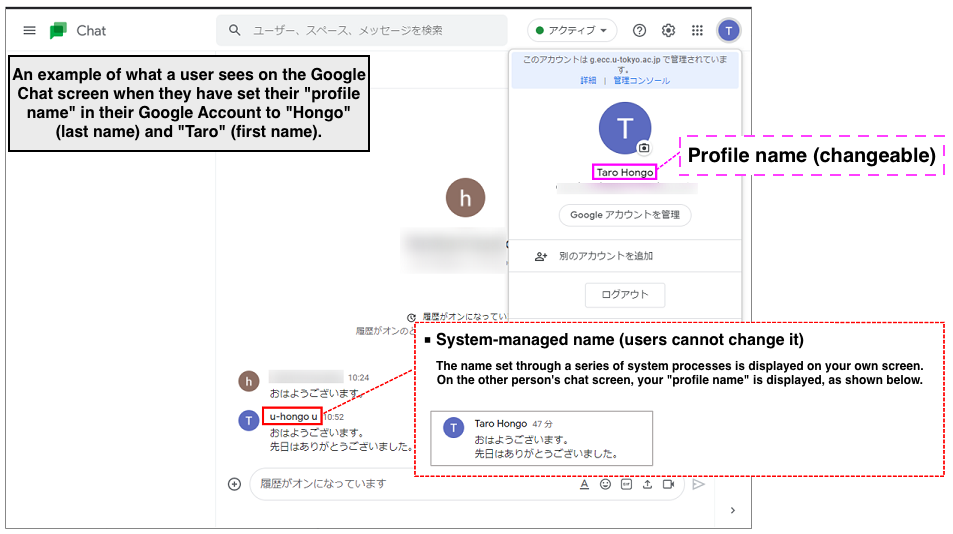

import ExcuseForAccuracy from "@components/en/ExcuseForAccuracy.mdx";

<ExcuseForAccuracy />

## Overview
{:#overview}

- The “profile name” of your ECCS Cloud Email account (shown as “Name” on the screen) is automatically created through linkage from the system, but you can change it yourself.
- In some systems, the [“system-managed name” may be displayed instead of your profile name](#system-name-issue). Note that users cannot change their “system-managed name”.

## How to change your profile’s first and last name
{:#edit-name}

1. In your browser, [log in to ECCS Cloud Email](/google/#login).
2. Click the icon at the top right to open the menu, then click “Manage your Google Account”.
   {:.small .border}
3. Open the “Personal info” tab.
   {:.small .border}
4. Under “Personal info”, click “Name”.
   {:.small .border}
5. The items “Name” and “Nickname” appear. Click “Name”.
   {:.small .border}
6. Enter your name (first and last), then click “Save”.
   {:.small .border}

## The “profile name” and the “system-managed name”
{:#profile-and-system-name}

ECCS Cloud Email accounts have two names: the “profile name”, which users can change themselves, and the “system-managed name”, which is registered in advance through system processing.

### Profile name
{:#profile-name}

- This is the name shown to others when using Google Chat, or when sharing files or Google Calendar events.
- You can [change it](#edit-name) yourself.

#### Nickname
{:#nickname}

- A “nickname” is a name you can set separately from your “profile name”. Even if you set one, it is not displayed on its own; it is always shown together with your “profile name”.
- You can change it from the “Nickname” item on the “Name” settings screen.
- <b>However, a nickname does not replace your “profile name”. If you want to change the name shown to others, change your [“profile name”](#edit-name) rather than the nickname.</b>

### System-managed name
{:#system-name}

- This is the name automatically set through a series of system processes when an ECCS Cloud Email user account is created.
- Users cannot change this name themselves.

#### Cases where the system-managed name is displayed
{:#system-name-issue}

In some systems, the name displayed may unexpectedly be the “system-managed name” rather than the one you set.

As of May 2022, this issue has only been confirmed in Google Chat. In Google Chat, your own screen displays your “system-managed name”, while the other person’s screen displays your “profile name”. Although it may be confusing that the name differs between your screen and the other person’s screen, there is no real harm, since others see your correct “profile name”.

Note that, as of July 2026, we have confirmed that this behavior does not occur in some environments. It may have been improved, but we have not confirmed that it has been resolved in all environments.

## Related pages

- [Google Account Help: How do I change information like my Google Account photo or name?](https://support.google.com/accounts/answer/27442)
