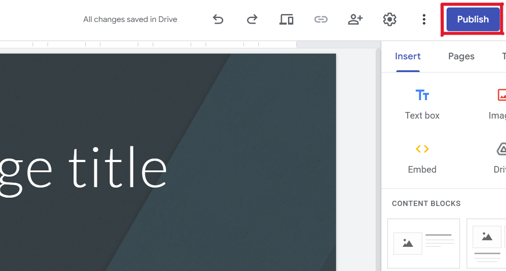
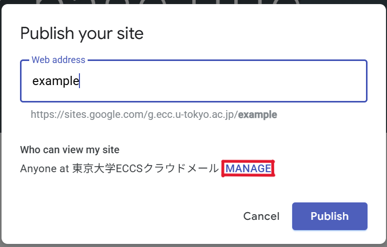
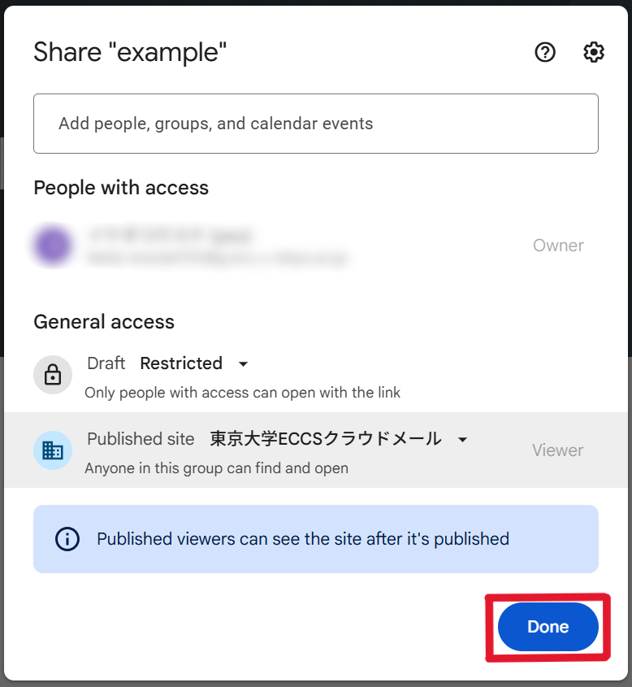
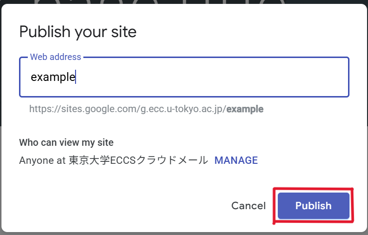

## Google Sites

Google Sites is a service that allows users to create and publish websites directly in a browser. It has the following features:

- Build websites easily through intuitive low-code tools.
- As it is provided as a cloud service, there is no need to prepare or manage a server yourself (serverless).
- Since ready-made templates are available, there is no need to design the composition and layout from scratch.
- Multiple people can collaborate on the editing.
- It is easy to integrate with other Google services.
- The publication range can be restricted to specific users (Google Accounts).
- However, there are limitations on design flexibility and the creation of dynamic contents.

### Using Google Sites with a UTokyo Account
{:#with-utac}

Members of the University of Tokyo can create Google Sites using their [ECCS Cloud Email](/en/google/) account. When created this way, it differs from creating a site with a general Google Account in the following aspects.

- You can set the access to be limited only to accounts under ECCS Cloud Email.
- URLに[Mail Hosting Service (Japanese page - machine translation available)](https://mh.ecc.u-tokyo.ac.jp/service/) in the URL. If you wish to do this, apply for the [Google Sites Custom Domain Setting Service (Trial Operation) (Japanese page - machine translation available)](https://mh.ecc.u-tokyo.ac.jp/googlesites-customdomain/). However, only the domain administrator of the Mail Hosting Service may apply.

### Examples of Use

Google sites are suitable for one-way dissemination of structured information within seminars or research groups. For easy information sharing, [Google Docs (in Japanese)](../document/) or [Google Drive](../drive/) may also be suitable. However, it is difficult to compile various types of information, such as tables and images, in an easy-to-understand format using Google Docs. Organizing information by splitting it into multiple files on Google Drive makes it harder to access the necessary information. In such cases, sharing the information as a website using Google Sites allows various types of information to be gathered in an easily accessible format.

In small clubs or clubs with a rapid turnover of members, there may be a lack of people familiar with website creation. Since Google Sites is intuitive to operate, editing is simple, making creation and maintenance relatively easy even for such clubs.

For organizations composed only of UTokyo students, they might consider communicating information only to those within the university when recruiting new members. In this case, creating a recruitment site using Google Sites allows the site to be published only to university members.

## Basic Usage

The following describes the basic operations such as site creation, editing, and publishing.

### Site Creation and Editing

Please refer to the official Google Help for [How to use Google Sites](https://support.google.com/sites/answer/6372878?hl=en). However, if you plan to use the [Custom Domain Setting Service](#with-utac) mentioned above, complete that procedure first.

### Site Publishing

1. In the editing screen of the site you want to publish, click “Publish” in the upper right.
{:.medium .border}
2. Check the users who can view the site.
    - If no changes are needed, proceed to step 3.
    - If you wish to make changes, follow the steps below.
        1. Click “Manage”.
            {:.small}
        2. Select the publication range from “Restricted”, “The University of Tokyo ECCS Cloud Email”, or “Public”.
            - If you select “Restricted”, only users with access permission will be able to view the site. Access permission can be granted by the site’s “Owner” to individual users or Google Groups. (For more details on Google Groups, please refer to the Google Groups page.)
            - If you select “The University of Tokyo ECCS Cloud Email”, only ECCS Cloud Email users will be able to view the site. Select this option if you want to limit the publication range to university members.
            - If you select “Public”, anyone on the Internet will be able to view the site. Be cautious about including content that should not be publicly exposed.
            - Note: It is not possible to set different publication range for different page within the same site. If you wish to publish pages with different publication ranges, you must create a separate site.
        3. Click “Done”.
            {:.small}
3. Enter a web address of your choice in the  address field, then click “Publish”.
   - If you are not using the [Custom Domain Setting Service](#with-utac), the URL will be in the format: `https://sites.google.com/g.ecc.u-tokyo.ac.jp/xxx`.

    {:.small}

