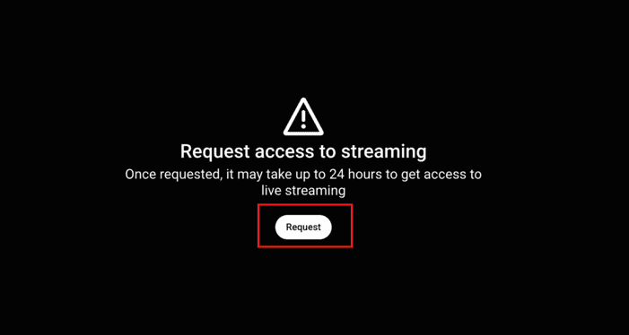
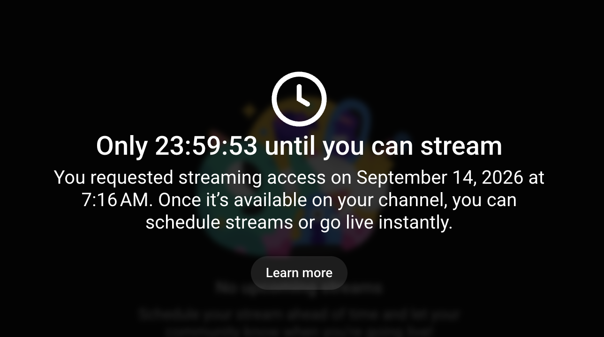

If screens such as "Request access to live streaming" or "Only ... until you can stream"

[YouTube live streaming may not yet have been enabled.](/en/google/youtube/live/#enable-live) has not been completed. Check whether "Live streaming" (part of "Intermediate features") is enabled on the "[Feature eligibility](https://www.youtube.com/features)" page.

<figure class="gallery">

</figure>

