

Published September 23, 2026

This page explains how to use YouTube Live with an ECCS Cloud Email account, focusing on how to enable live streaming and start a live stream. Please refer to this guide when you need to live stream university events.

If you want to stream a Zoom meeting or webinar on YouTube, please refer to "[Stream Zoom Meetings or Webinars on YouTube](./streaming/zoom/)". For instructions on configuring visibility settings (such as restricting access exclusively to the University of Tokyo members), refer to "[Set YouTube Video Visibility (in Japanese)](/google/youtube/sharing/)".

**When live streaming, pay close attention to whether the visibility is set to "Public" or "Unlisted". If set to "Public", anyone can view the stream on YouTube. If set to "Unlisted", only people with the unique URL generated for that specific stream will be able to view it. If you do not want the stream to be publicly available, please use "Unlisted".**

## Important Notes

* The URL for an unlisted live stream changes every time you stream. Please share the link with the intended viewers once the stream has started.
* To prepare for unforeseen circumstances, we recommend enabling live streaming on multiple accounts in advance.
* Make sure you select the correct visibility setting, "Public" or "Unlisted,", when starting your live stream.
* We recommend conducting a test stream one to two weeks prior to the actual event, using the same location, equipment, and environment as the actual event.
* Viewers may experience playback issues depending on their individual network connection or device. Additionally, if an outage occurs within YouTube's streaming system, the service may become unavailable.

## Live Stream Setup

The environment used to test the procedures on this page is as follows:

* Operating system：macOS 26.6.2 (25G83)
* Web browser：Google Chrome 153.0.8010.37 (Official Build) (arm64)

### How to Enable Live Streaming
{:#enable-live}

It may take approximately 24 hours after creating a YouTube channel before live streaming becomes available, so please allow sufficient time.

You must create a YouTube channel using your ECCS Cloud Email account in advance. For instructions on creating a channel, see "[Create a Channel (in Japanese)](/google/youtube/#create-channel)". Once the channel has been created, enable live streaming by following the steps below:

1. Open the YouTube home page and click the "+ Create" button in the upper right corner of the screen.
    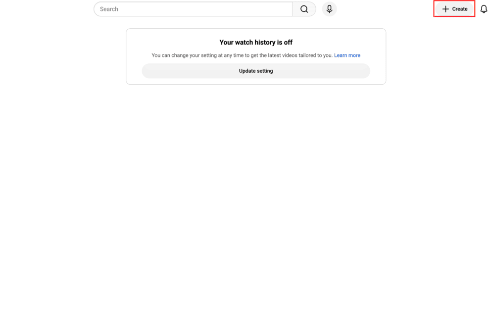{:.large.border}
2. Select "Go live".
    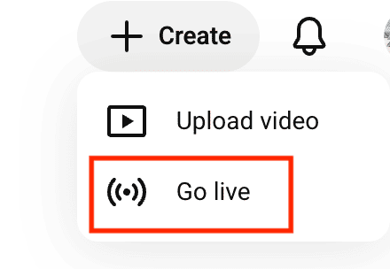{:.small.border}
3. When the "Request access to streaming" screen appears, click the "Request" button.
    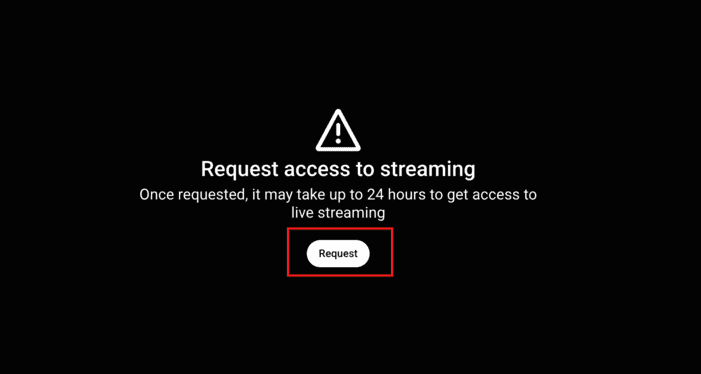{:.small}
4. [Vertify your YouTube account](https://support.google.com/youtube/answer/171664).
    1. Click the "Verify" button.
        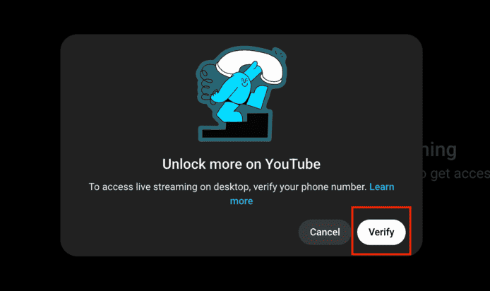{:.small}
    1. Check the icon on the right side of the screen to confirm that you are signed into the account you want to use for live streaming.
    1. Select a verification method. You can choose either an automated voice message or a text message (SMS).
        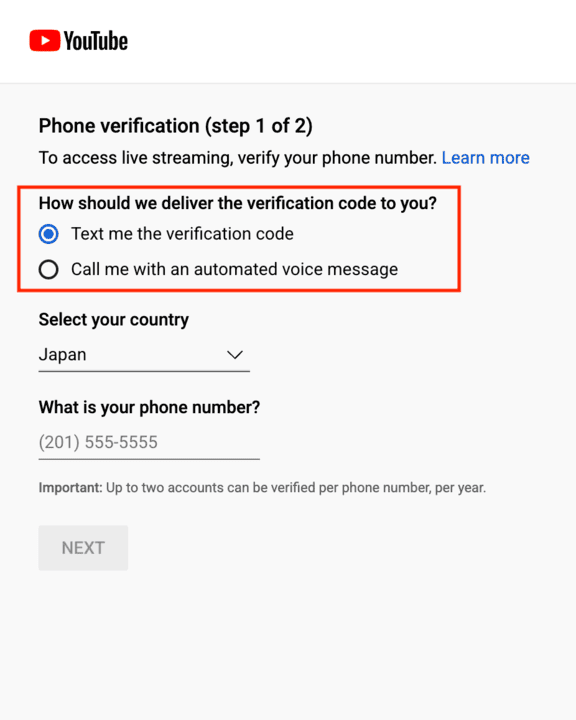{:.small.border}
    1. Make sure the correct country for your phone number is selected, then enter your phone number.
        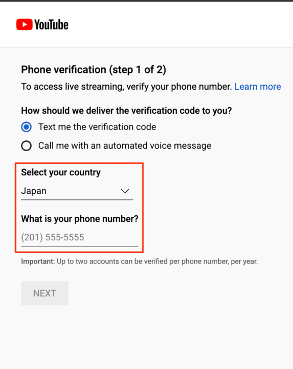{:.small.border}
    1. Enter the 6-digit code you received.
        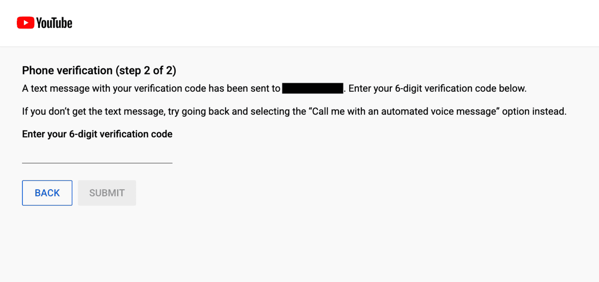{:.medium.border}
    1. Once your account has been successfully verified, return to the original page.
        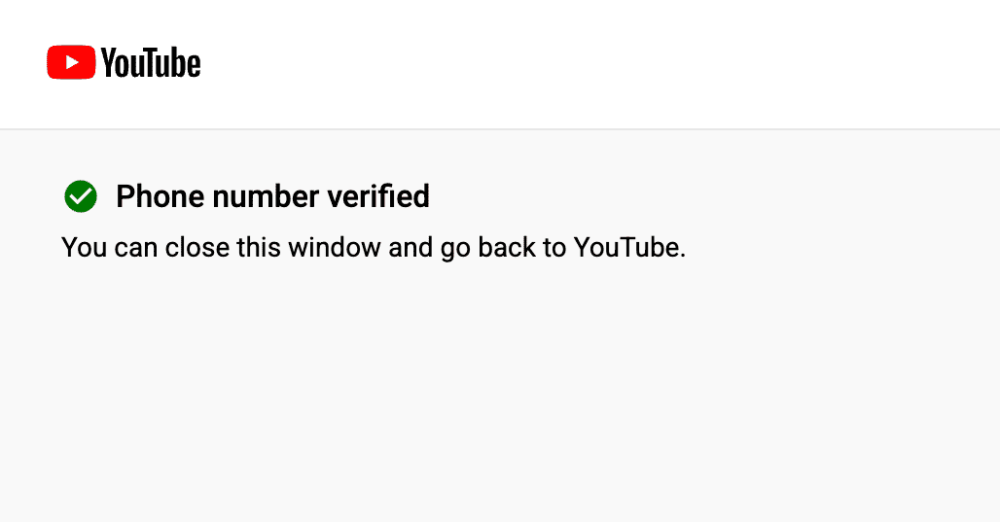{:.small.border}
5. Wait approximately 24 hours for live streaming to be activated.
    {:.small}

### Starting a Live Stream
{:#start-live}

Proceed with the following steps after live streaming has been enabled.

1. Open the YouTube home page, click the "+ Create" button in the upper right corner of the screen, and select "Go live".
    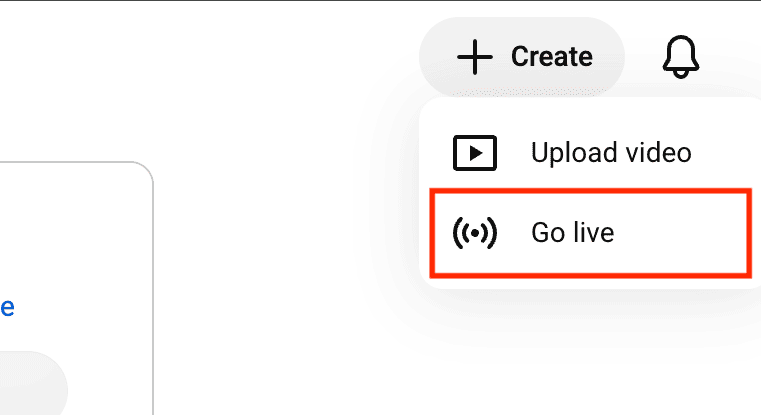{:.small}
1. Click "Webcam".
    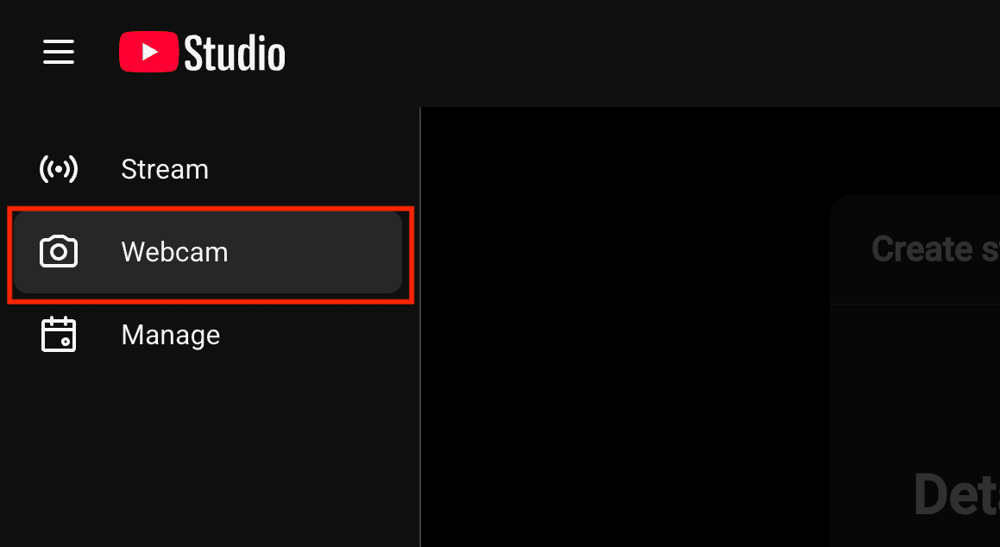{:.small}
1. Enter the live stream details.
    * Stream Title
      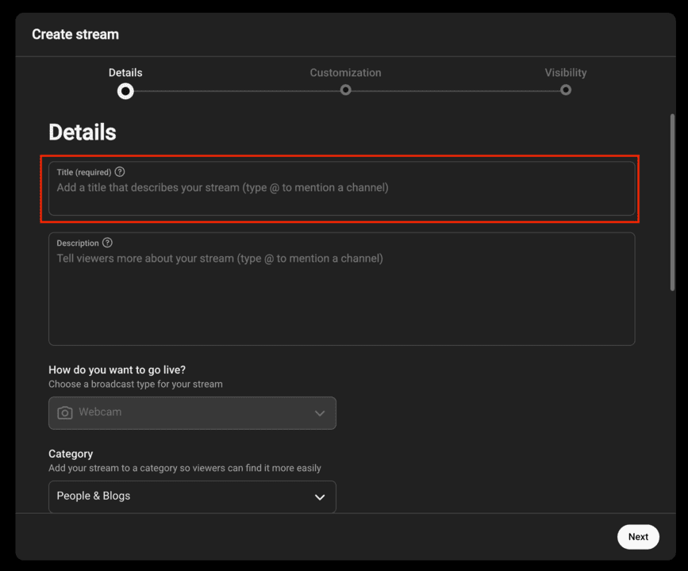{:.small}
    * Audience and Age Restriction
        * Set audience and age restrictions as needed. For "Is this video made for kids?", you should normally select "No, it's not made for kids".
        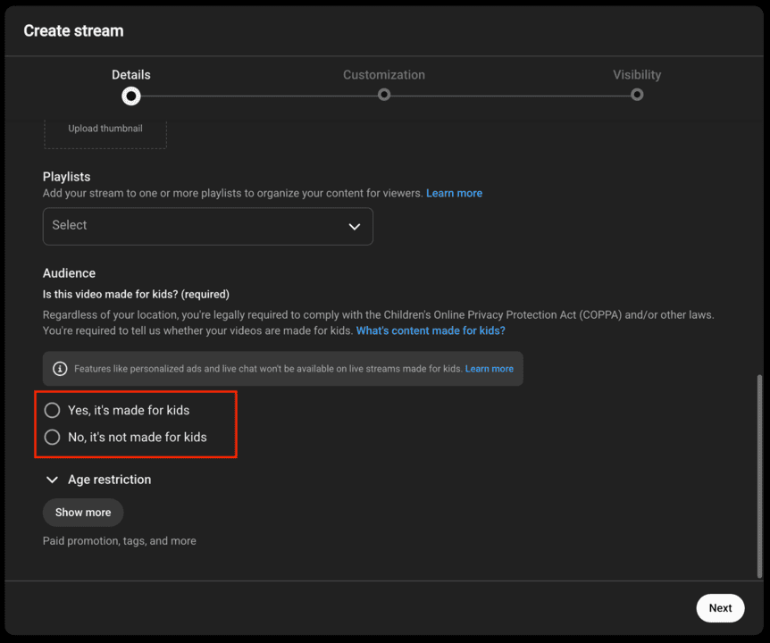{:.small}
1. Select whether to enable or disable live chat.
    * Under "Customization", you can enable or disable live chat.
    * Live chat is enabled by default. If needed, clear the checkbox to disable it.
    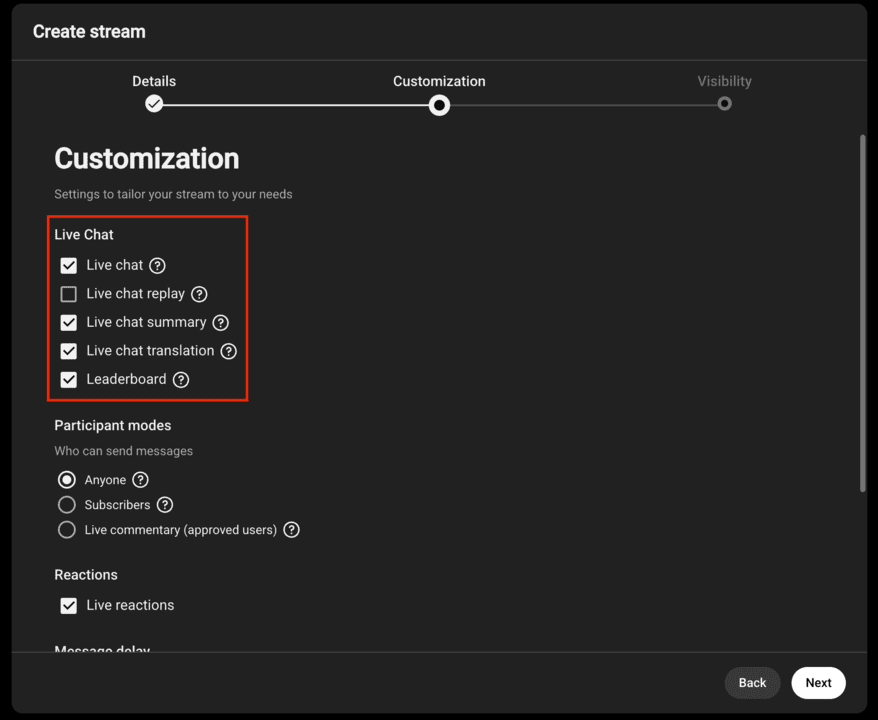{:.small}
1. Select the visibility setting.
    * Select the appropriate setting from "Public", "Unlisted", or "Private".
    * Please note that setting it to "Public" makes the stream visible to anyone on YouTube.
    * Setting it to "Unlisted" allows anyone with the live stream URL to watch it.

    \* The following instructions assume that "Unlisted" is selected.
    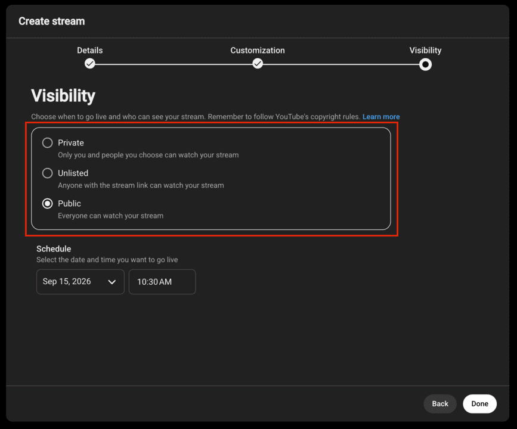{:.small}
1. Set up your camera and microphone, then check the stream preview.
    * Select your camera under "Video" and your microphone under "Audio".
        * You can choose USB cameras and microphones in addition to built-in ones.
    * Check the camera preview, camera and microphone settings, and visibility setting ("Privacy"), then click "Go Live".
    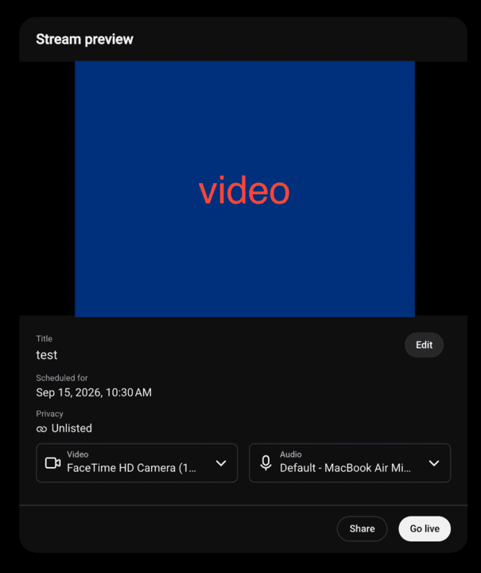{:.small}
1. The live stream will begin.
    * The live video feed will be displayed.
    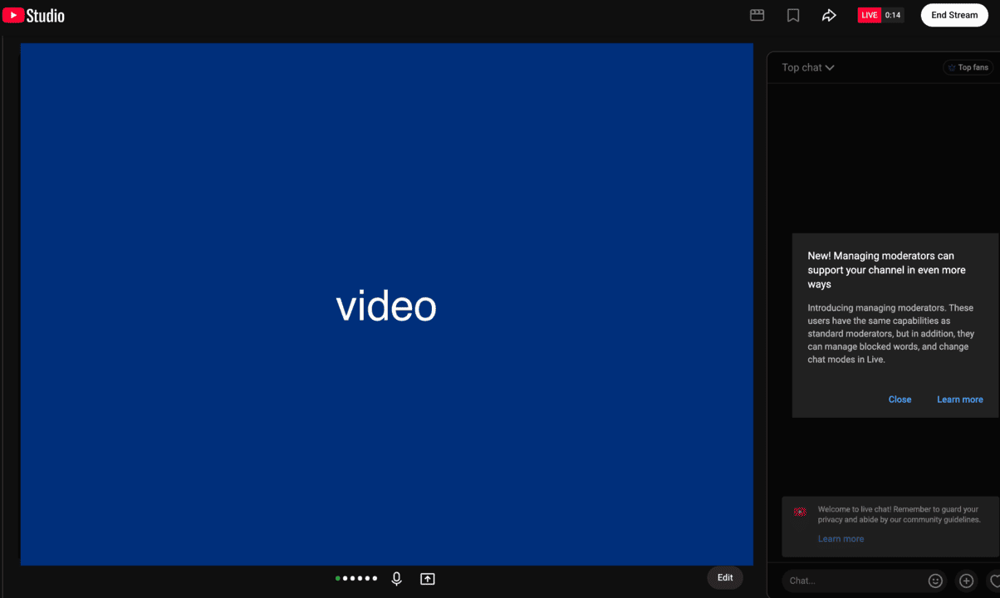{:.small}
    * Click the arrow button in the upper right corner of the screen to display the sharing URL for the unlisted stream.
        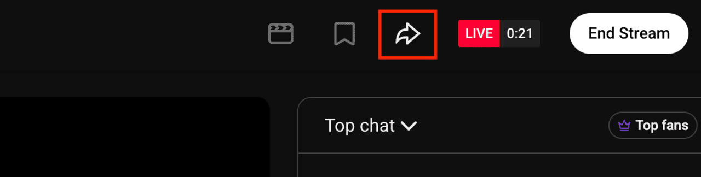{:.small}
        * Copy the URL and share it with intended viewers by email or another method.
        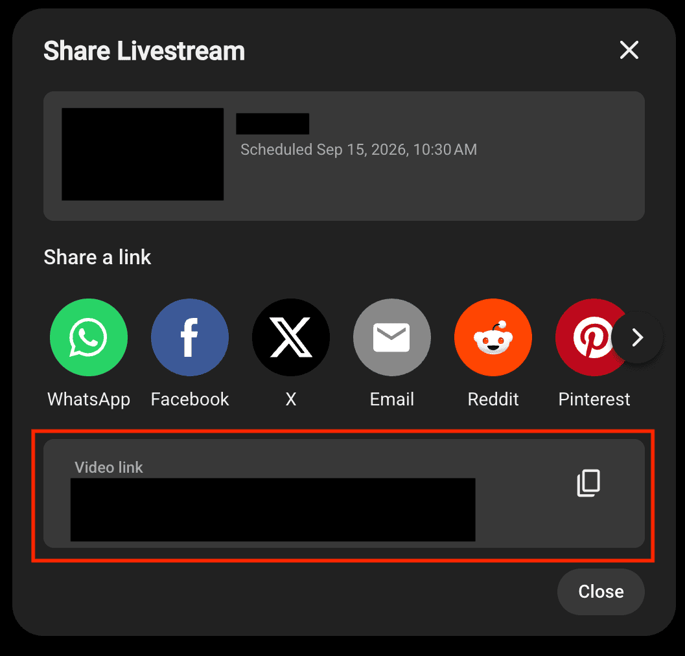{:.small}
1. To end the stream, click "End Stream" in the upper right corner of the screen.
    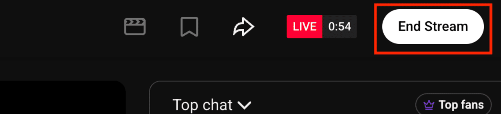{:.small}

## References

When live streaming, please refer to the following official YouTube Help resources as needed.

* Get started with live streaming：https://support.google.com/youtube/answer/2474026
* Create a YouTube live stream with an encoder：https://support.google.com/youtube/answer/9227510
