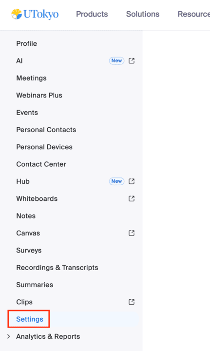
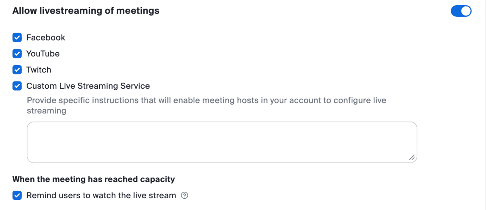
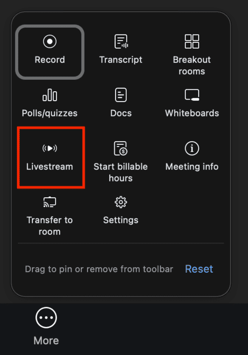
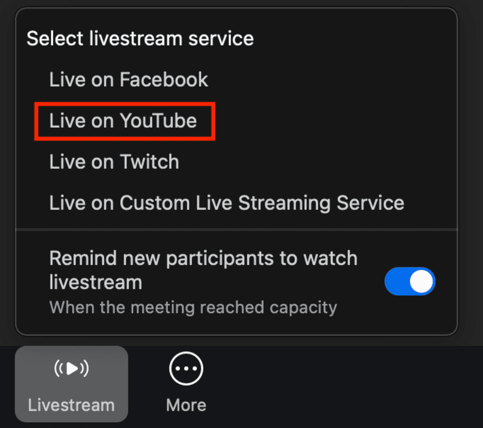
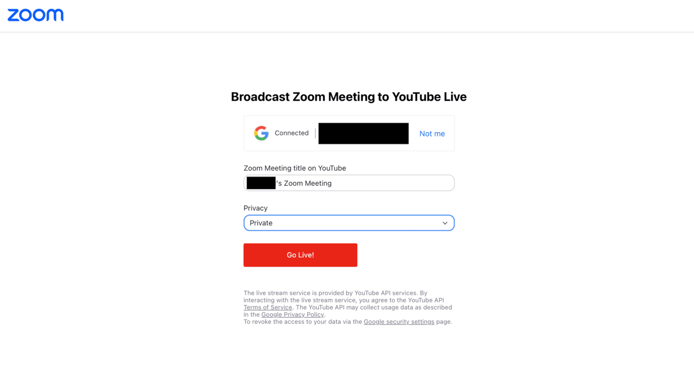
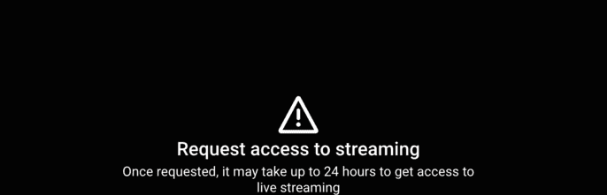
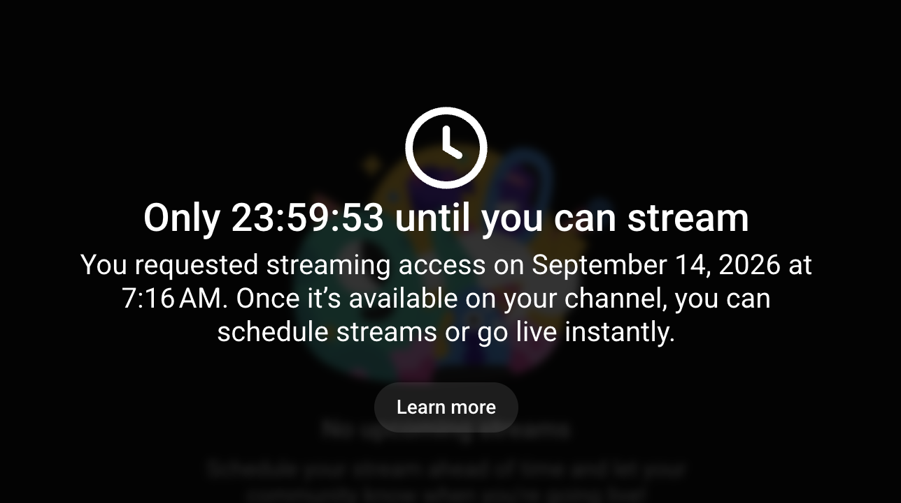
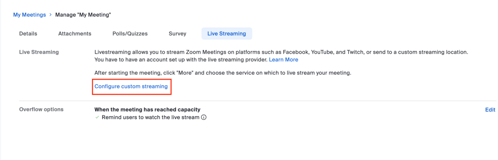
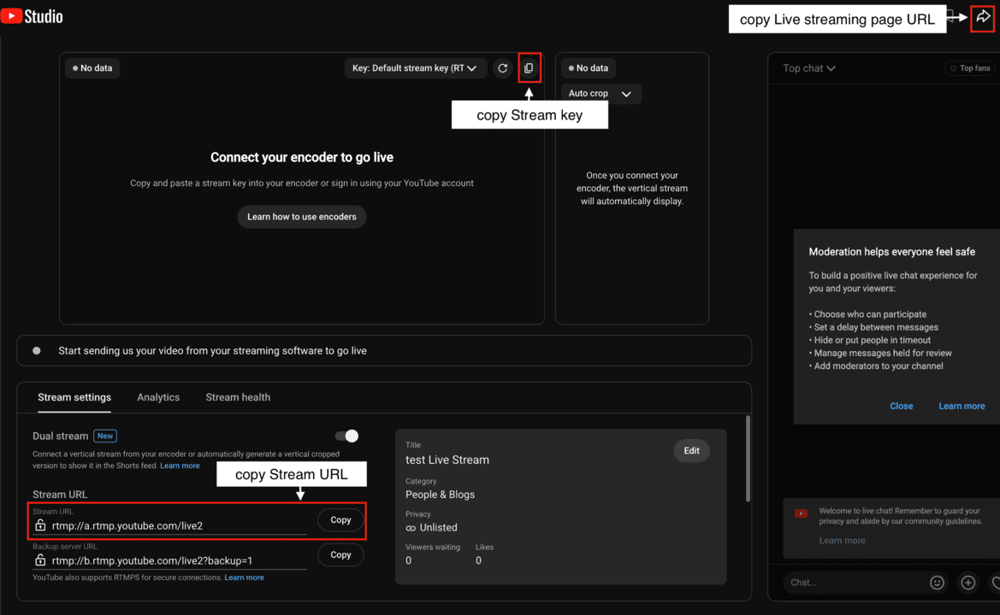
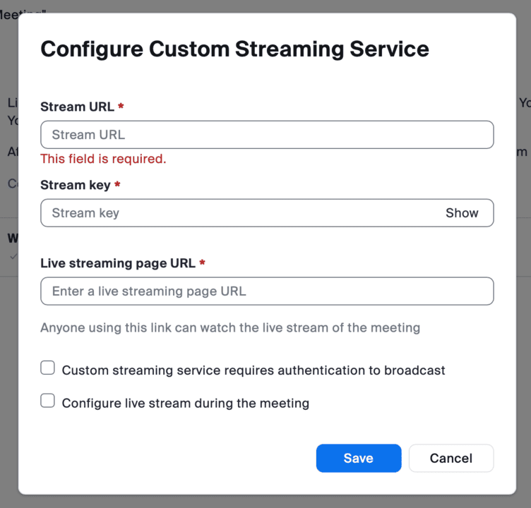

This page guides you through the process of streaming Zoom meetings and webinars on YouTube using a University of Tokyo [Zoom](/en/zoom/) account.

By using a UTokyo [ECCS Cloud Email](/en/google/) account (`xxxx@g.ecc.u-tokyo.ac.jp`) for your YouTube account, you can also restrict viewing of YouTube contents (including live streams) exclusively to members of the University of Tokyo.

Note that the live stream is delayed by approximately 20 seconds relative to the actual Zoom meeting or webinar.

For instructions on how to restrict access to a live stream to members of the University of Tokyo, refer to "[Set YouTube Video Visibility (in Japanese)](/google/youtube/sharing/#utokyo-only)". The same page also provides instructions if you wish to make the content public rather than restricting it solely to the members of the University of Tokyo. In particular, please note that while YouTube channels can be created either as a "Brand Account" or a personal account, **channels created with a Brand Account cannot restrict visibility exclusively to the members of the University of Tokyo**. Therefore, if you wish to stream exclusively to the members of the University of Tokyo, you must use a channel created with your personal ECCS Cloud Email account rather than a Brand Account. (For details, please refer to "[About Channels and Accounts (in Japanese)](/google/youtube/#channel)".)

## Prerequisites: Enable YouTube Live Streaming
{:#enable-live}

You must enable the YouTube live streaming feature in advance using the ECCS Cloud Email account you intend to stream from. For instructions on enabling live streaming, refer to "[How to Live Stream on YouTube with a Cloud Email Account](../../#enable-live)".

Please note that **it may take up to 24 hours for live streaming to be activated for the first time**, so please enable it well in advance.

## Prerequisites: Allow Live Streaming in Zoom
{:#allow-livestreaming}

To stream from Zoom to YouTube, you need to allow live streaming in Zoom before starting your Zoom meeting or webinar. (It is enabled by default, but please confirm in advance that this setting is enabled by following the steps below.)

1. [Sign in](/en/zoom/signin/) to the [Zoom Web Portal](https://u-tokyo-ac-jp.zoom.us/profile) and go to "Settings".
    {:.small.border}
2. Under "Meeting" > "In Meeting (Advanced)", enable "Allow livestreaming of meetings", and select either "YouTube" or "Custom Live Streaming Service" as described below.
    - **YouTube**: Select this when [streaming directly from a Zoom meeting or webinar](#direct).
    - **Custom Live Streaming Service**: Select this when [streaming a Zoom meeting or webinar to a scheduled YouTube event](#scheduled).

    {:.medium.border}

## Start Live Streaming
{:#start-streaming}

There are two ways to stream: [directly from Zoom](#direct), or [to a YouTube event set up in advance](#scheduled).

### Streaming Directly from Zoom
{:#direct}

1. Start your meeting or webinar.
2. Click "More" in the meeting controls and select "Livestream".
    {:.small}
3. Select "Live on YouTube".
    {:.small}
4. Sign in to YouTube using your ECCS Cloud Email (`xxxx@g.ecc.u-tokyo.ac.jp`) account.
    - Please note that if screens such as "Google will allow Zoom to access this info about you" or "Zoom wants to access your Google Account" appear, you may need to grant the requested permissions in order to stream.
.
6. On the "Broadcast Zoom Meeting to YouTube Live" page, configure the following settings:
    - **Zoom Meeting Title on YouTube**: The topic of the Zoom meeting/webinar is automatically entered. Change it in the text box if necessary.
    - **Privacy**: Select "Private".
    {:.medium.border}
7. Click the "Go Live!" button.
    

    
If an error message "The user is not enabled for live streaming..." appears

    It is possible that [enabling YouTube live streaming](../../#enable-live) has not been completed. Check whether "live streaming" (part of "Intermediate features") is enabled on the "[Feature eligibility](https://www.youtube.com/features)" page.
    

### Streaming to a Scheduled YouTube Event
{:#scheduled}

Use this method if you want to obtain and share the live stream link with participants in advance.

1. Sign in to YouTube.
2. Click the “Create” icon in the upper-right corner and select “Go live.

If screens such as "Request access to live streaming" or "Only ... until you can stream"

[YouTube live streaming may not yet have been enabled.](/en/google/youtube/live/#enable-live) has not been completed. Check whether "Live streaming" (part of "Intermediate features") is enabled on the "[Feature eligibility](https://www.youtube.com/features)" page.

<figure class="gallery">
{:small.border}
{:.small.border}
</figure>

3. Select "Stream".
4. Click "Edit" to set and save the title, description, visibility, etc.
    - The settings are the same as those described in "[Starting a Live Stream](../../#start-live)".
5. Open a new tab and sign in to the [Zoom Web Portal](https://u-tokyo-ac-jp.zoom.us/profile).
6. Schedule and save your meeting/webinar. If it is already scheduled, go to "Meetings (/Webinars Plus)" > "Upcoming" and select the topic.
7. In the "Live Streaming" tab, select "Configure custom streaming".
    {:.medium.border}
8. Copy the "Stream URL", "Stream key", and "Live streaming page URL" from the YouTube live stream settings page, and paste them into the corresponding fields under "Configure custom streaming service" for the meeting or webinar.
    -  You can copy the live streaming page URL by clicking the arrow-shapedShare icon on YouTube.

    {:.medium.border}
    {:.medium.border}
9. When you are ready to begin the event, start your Zoom meeting or webinar.
10. Click "More" in the meeting controls and select "Live on Custom Live Streaming Service".

Reference: Zoom Official Help Center, ["Livestreaming meetings or webinars on a custom site"](https://support.zoom.com/hc/en/article?id=zm_kb&sysparm_article=KB0064210)
