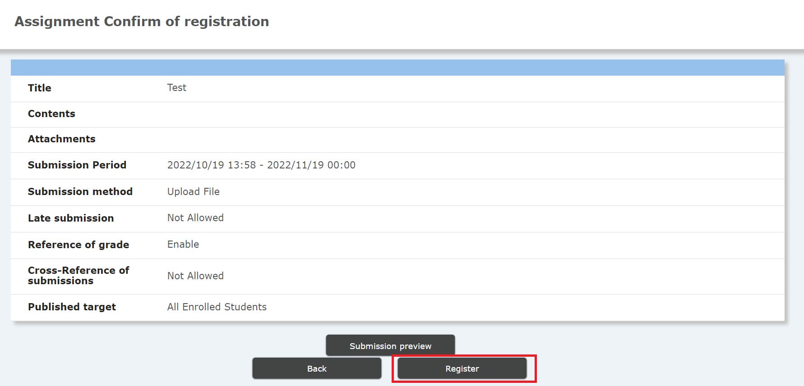

## Overview

- In "Assignment", you can set a deadline for submission and students can submit their papers.
  - You can select a file (report, image, program, etc.) or directly text entry.
- You can allow students to submit after the deadline by setting.
  - Papers that are overdue can be distinguished on the system, so you can take measures toward these papers such as deducting points.

## How to Make Assignments

1. Click the ⊕ button at the bottom left of the “Assignment”, which is the third from the top of the “Course Summary” screen.

   - Create a new "Assignment"

   

2. You will move to the page of "Registration new registration." Set the following contents.

   1. 「In "Title", enter the title of the assignment.
   2. In “Contents”, enter the contents of the assignment.
   3. In “Submission Period”, set the period during which students can submit their assignment.
      - For example, the setting such as from the start of the class to the start of the next class can be considered.
   4. In "Submission method", select the submission method.
      - "File Upload" allows students to upload multiple files up to 100MB.
        - Instructors can later download all the files submitted in zip format at once.
      - In "Text Direct Input", students can directly input text up to 10,000 characters from the browser.
   5. In "Submission after period", specify whether to allow submission after the period.
      - It is safer to set "OK" because trouble may occur on the system just before the deadline.
      - You can take measures for students who submit late such as deducting points.
   6. "Referral of evaluation" specifies whether or not students can refer to the evaluation results of teachers.
      - This function can be used for feedback to students.
   7. Finally, press the "Proceed to confirmation screen" button.

   

3. Check the contents and register.

   - Check "Preview of Submission Screen" if necessary.
   - Please check the submission period carefully.
     - The start date and time and the end date and time cannot be changed after that the submission period starts / ends.
   - Click the "Register" button.

   

## References

* <a href="https://www.ecc.u-tokyo.ac.jp/en/itc-lms/faq.html">FAQ (ITC-LMS)</a>
