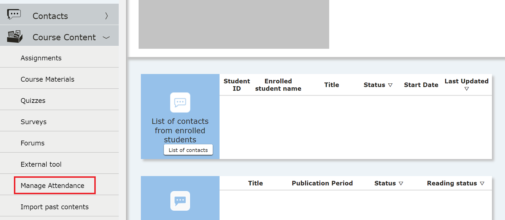
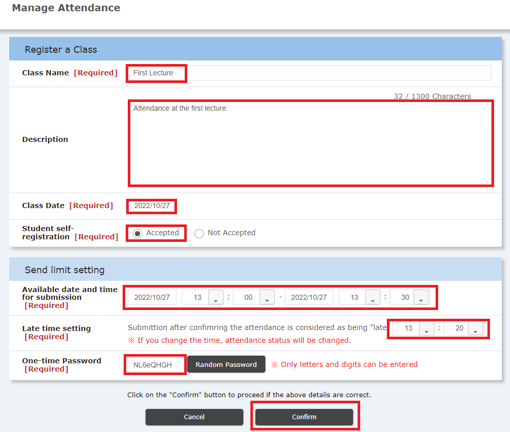
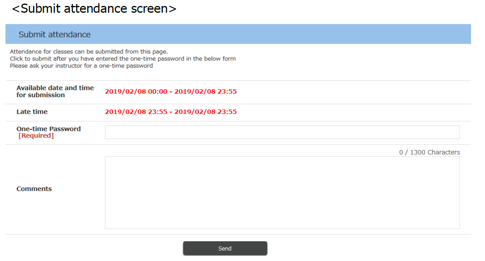

## Overview

In online classes, you can set “check the attendance” on ITC-LMS. You can use as follows:

* The teacher set the time zone (you can set on minutes) and the students select a given course from ITC-LMS. Click "submit attendance"  and the teacher also confirm that the students enter one-time password.
* The teachers show one-time password at the online class, by voice, or chat comment. If the teachers show the password on the online chat, the teachers can check whether students take the course or not．
* Students cannot know in advance what time the teacher will be taking attendance in class. Therefore, students are more likely to participate in all classes to assure attendance.

On the other hand, there are problems when you check the attendance at the online class.

* Some students may not submit attendance because of their network environment or server environment.  
* To check the students' attendance, the teacher needs to stop the class. If the teacher wants to check the students' understanding, tests may be applicable.
* If a student share their one-time password with other students through SNS, other students can confirm attendance without watching the class.

Some faculty asks the teachers to avoid reflecting the quizzes and class attendance to the final grade. Therefore, if the teacher want to give the students feedback,  the teacher must consider to use online poll system.

## Class registration

If you want to check  the attendance in class, you will need to stop the class. We recommended to consider this time when planning the course.

1. Select the "three lines" icon on the top left of the screen and open the menu.

2. Click "course content"，and select "Manage Attendance".

3. In the "attendance management list" screen, click on "+".

4. Select "send limit setting".

   * Name is required but only teachers can see it.
   * Description is not a mandatory field. 
   * Class date is a required field. Please fill in the class date.
   * Press "Yes" after "Student registration". If you select "No",  teachers should register attendance application other than ICT-LMS such as card reader.
   * In "Available day and time" you can designate the period of time for accepting submitions. If you record the lecture and broadcasting video clips after the class, please consider to set the attendance submission date (e.g. two or three days after the class).
   * "Late time setting" aims to check wthether the students attend on time or not. Students are notified for being late.
   * One-time password is required from the students to submit their attendance. You should not use the same password all the time. You must consider different one-time password on each class and notify students by class monitors, voice, comment and chat. If you find it difficult to consider password on each class,  select automatic generation.
5. Click "Register"

[Procedure](https://youtu.be/QHTF-pG886w)

## Let your students know the code for attendance (TBA)

1. After the start time of “Date and time for submission” set in <a href="prepare_attendances" target="">Preparations for taking attendance during class</a>, the "Submit Attendance" button will appear when the student logs in to ITC-LMS and displays the “Course TOP” screen of the course.

   * If the student has already logged in and displayed the "Course TOP" screen, instruct the student to reload the browser. The "Submit Attendance" button does not necessarily appear at the class start time.
   * The teacher's ITC-LMS screen will not change. You can check the class start time by editing the class on the "Attendance Management" list screen of <a href="prepare_attendances" target="">Preparations for taking attendance During Class</a>.[Procedure](https://youtu.be/uKfoTtTSuUU)
2. When students press the "Submit Attendance" button, they will be asked to enter a one-time password as shown below. Tell your students taking the class the one-time password that you set in <a href="prepare_attendances" target="">Preparations for taking attendance During Class</a>. If you have forgotten the one-time password set by the teacher, you can view it by editing the class on the "Attendance Management" list screen of <a href="prepare_attendances" target="">Preparations for taking attendance During Class</a>. There is also a commenting area on students' screens. If you want the students to comment, tell them to do so here.

   * It is recommended that you make a slide with the one-time password written in large letters in advance. Depending on the environment of students taking the course online, small letters may be difficult to see.
   * If a one-time password is sent in chat on the video conferencing system, typing errors can be reduced because students can copy and paste. However, students cannot see what was written in the chat before they participate in the class; if a network failure causes a student to leave the video conferencing system, he or she will not be able to see the password written in the chat after re-entering the class.

## Confirm attendance

After asking the student to press the "Send Attendance" button and to enter a one-time password, follow the instructions below to check their status.

1. On the course screen, select the three line icon at the top left to bring up the menu.

2. Expand "Course Content" and select "Attendance Management".

3. Make sure that the "Attendance" of the relevant class day is 0 or more. To update, "reload" the browser.

4. To check the attendance status of each student, select “Registration” from “Operation” on the relevant class day on the attendance management screen.

5. At the bottom of the "Attendance Registration" screen, you can check the attendance status (attendance date, update date and time) of each student. If you have students write comments, you can also check on this screen.

## References
* <a href="https://www.ecc.u-tokyo.ac.jp/en/itc-lms/faq.html">FAQ (ITC-LMS)</a>
  * <a href="https://www.ecc.u-tokyo.ac.jp/en/announcement/2019/06/24_2983.html">How to check the attendance on ITC-LMS (for instructors)</a>
  * <a href="https://www.ecc.u-tokyo.ac.jp/en/announcement/2019/06/24_2964.html">Importance notice on ITC-LMS attendance checking system (for instructors).</a>
  * <a href="https://www.ecc.u-tokyo.ac.jp/en/announcement/2019/06/24_2983.html">How to confirm attendance in ITC-LMS (for instructors)</a>
  * <a href="https://www.ecc.u-tokyo.ac.jp/en/announcement/2019/06/24_2985.html">There is no "Submit Attendance" button on ITC-LMS (for students)</a>

