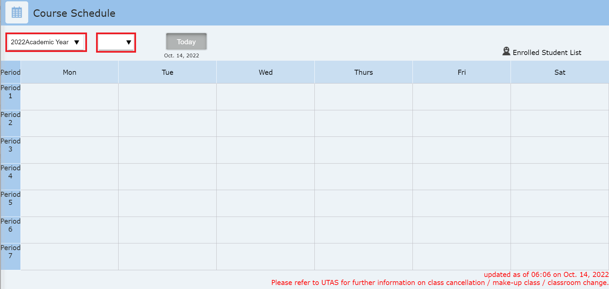

ITC-LMSではタームやセメスター単位で開講される科目のことを「コース」と呼びます．
ITC-LMSを使う際には，殆どの場合において，コース機能を使用することになります．

授業で使う場合，UTASに登録されている科目は，自動的にITC-LMSにコースとして登録されています．
また，UTASに登録されていない授業やセミナー等でITC-LMSをご利用になる場合は、[広報サイト](https://www.ecc.u-tokyo.ac.jp/itc-lms/) の説明に従って利用申請をして下さい．

## コースを確認する

ログインすると，以下のような出講表が表示されます．

これは，2020年3月にアクセスしたものですが，アクセス時点での出講表が表示され，春休み中のため該当授業がありません．図中の赤い四角のプルダウンメニューで「年度」で「2020年度」，「開講区分」で「S1」を選択すると，2020年度Sセメスターに開講予定の授業を確認できます．「開講区分」はターム単位で指定しますが，Sセメスターの授業の場合は「S1」か「S2」のどちらかを指定しても同じものが表示されます．[手順動画](https://youtu.be/V-FN5muQw_Q)

「年度」と「開講区分」を選択すると上の画面のようにUTASに登録されている授業が表示されます．火曜2限の授業と，木曜4限の授業が表示されます．それぞれクリックすると，該当するコースにコンテンツを登録したり，設定をおこなうことができます．

### 同じ時限に自分の授業が複数ある時
火曜日2限には，同じ枠内に2つのコースが見えます．複数の組織で別の名前で開講される授業などでは，このようなことがあります．「コースグループ登録」機能により同一のコースグループに登録すると，一つのコースのように扱うことができます(コースグループ登録後も同じ枠内に2つのコースが見えるのは変わりません)．

「コースグループ登録」の方法に関しては，画面の赤い四角の「Manual」リンクで表示されるページから「ITC-LMS_教員向けマニュアル」というPDFファイルをダウンロードして，「11.1 コースグループ登録」を参照してください．[手順動画](https://youtu.be/HJyOrTdT0l4)
*  コースグループの登録は，使い始める前(コンテンツが存在しない時)におこなってください．使い始めた場合は，「全コンテンツ削除」機能でコンテンツを削除する必要があります．
* マニュアルには，「複数看板科目については自動的にグルーピングされているため、以下の操作は不要です。」とありますが，UTAS上の設定の関係で自動的にグルーピングされないことはしばしばあります．
* コースグループ登録後も出講表にの同じ枠内に複数のコースが見えますが，そのうちのどれをクリックしても同じです．

### 出講表の該当時限に自分の授業がないとき
出講表に表示されない場合の原因と対応方法を以下にまとめます．

* 授業開始よりもかなり前なので，まだシステムに登録されていない．
  * UTAS上でも授業が登録されていないケースもありますが，UTAS上で登録されていても授業の属するターム(セメスター)の開始1ヶ月前まではITC-LMSに登録されないので，ご注意ください．
* 複数人で担当する授業だが，UTAS上では自分が担当として登録されていない．
  * 担当者になっている先生に，ITC-LMSで自分のアカウントを「担当教員」の権限でユーザ登録してもらうと，出講表に表示されるようになります．担当者の先生は，登録するユーザを氏名で検索して指定することもできますが，同姓同名の人がいる場合は共通IDで検索することも可能です．
* 曜日時間が決まっている授業だが，UTAS上では時限が登録されていない．
  * 出講表の下の方にある「集中コース等」にコースが含まれてないかどうか確認してください．

## コース機能を使う

以下のページでは，ITC-LMSのコース機能について，教員向けに最低限の使用法を説明しています．
不明な点が現れたらまずはITC-LMSにログイン後にダウンロードできる教員用マニュアルを参照してください．

### 機能一覧

- [教材を登録する](/itc_lms/lecturers/materials/)
- [テストを行う](/itc_lms/lecturers/quizzes/)
- [課題を作成する](/itc_lms/lecturers/assignments/)
- [出席を管理する](/itc_lms/lecturers/attendances/)
<!-- - [アンケート](/itc_lms/lecturers/surveys/) -->
<!-- - [掲示板](/itc_lms/lecturers/forums/) -->
<!-- - [メッセージ](/itc_lms/lecturers/messages/) -->

### コースの設定

- [コース設定](/itc_lms/lecturers/settings/)
  - [コース参加者登録](/itc_lms/lecturers/settings/course_participants/)
  - [ユーザグループ設定](/itc_lms/lecturers/settings/user_groups/)
  - [コースグループ登録・解除](/itc_lms/lecturers/settings/course_group/)

## 参考情報
* <a href="https://www.ecc.u-tokyo.ac.jp/itc-lms/faq.html">FAQ: よくある質問 (ITC-LMS)</a>
  * <a href="https://www.ecc.u-tokyo.ac.jp/announcement/2014/03/12_1822.html">ITC-LMSを利用するにはどうしたら良いですか？（教員）</a>
  * <a href="https://www.ecc.u-tokyo.ac.jp/announcement/2014/09/03_1946.html">ITC-LMS で前学期の時間割を表示したい (学生・教員)</a>
  * <a href="https://www.ecc.u-tokyo.ac.jp/announcement/2014/08/22_1942.html">ITC-LMS のコース登録時期について</a>
  * <a href="https://www.ecc.u-tokyo.ac.jp/announcement/2015/03/30_2026.html">ITC-LMS のコース登録について (学務システムとの自動連携機能)</a>
