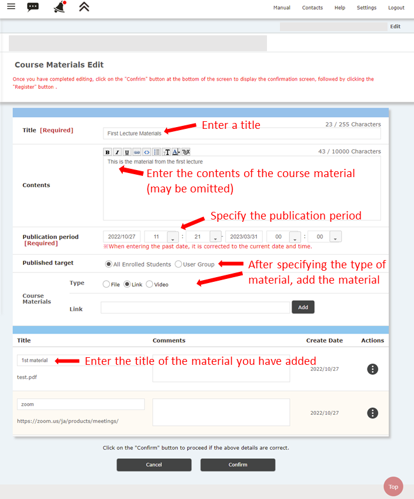

## Summary
* In "Teaching Materials", you can upload the "Teaching Materials" and  describe the "Contents of Teaching Materials." 
* You can set the publication period of "Teaching Materials".
    * To avoid busy access to ITC-LMS, please ensure that students have enough time to download the "learning materials" before the class start time (the day before, etc.).
* The types of "Teaching material" include "file", "link", and "video".
    * It can be used to notify the Zoom URL in advance or provide a link to a PDF file.
    * To avoid busy access to ITC-LMS, limit the file size to as small as possible. If the file size is large, show the link on an external site (such as Google Drive). Please do not use videos, if possible.
* Multiple materials can be placed on one page of "Teaching material".
    * "Teaching materials" can be created for each lesson, and materials such as Zoom URLs, slides, and supplementary sources used in the lectures can be uploaded altogether.

## How to upload teaching materials

1. Click the ⊕ button at the lower left of the “Teaching Materials” tab (fourth from the top.)
    * Create a new "Teaching Material".
    
    
    
    
1. In the "Editing materials" page, fill in the following information.
   
    * Title
        * It is recommended to write the title indicating the class in which the material was used, e.g. "Week 1 Lecture Material (4/6)" 
    * Contents of teaching materials (optional)
        * Describe the contents of the teaching materials.
    * Release period
        * For example, specify a period from the day before the class to the end of the first semester.
        * To avoid busy access to the ITC-LMS, please do not set the start time of class to the last minute of class start time.
    * Publish target
        * Usually, "All students" should be fine.
    * Teaching materials
        * Select the material type (file, link, video) and press the "Add" button.
        * When you add the material, the file name and URL of the material will be added at the bottom, so enter the title of the material separately.
        * You can add multiple materials by repeating this operation.
        * If you want to delete the added teaching material, press the  "Operation" button at the right.
    
    
    
    
    
1. Click "Go to confirmation page" button.

    

    

1. The "Teaching material contents registration" page will come up. Check the contents and click the "Register" button.

    

## References
* <a href="https://www.ecc.u-tokyo.ac.jp/en/itc-lms/faq.html">FAQ (ITC-LMS)</a>
  * <a href="https://www.ecc.u-tokyo.ac.jp/en/announcement/2016/08/08_2280.html">How to upload multiple files (for instructors/ students)</a>
  * <a href="https://www.ecc.u-tokyo.ac.jp/en/announcement/2019/06/26_3017.html">How to change the publication period for course materials on ITC-LMS (for instructors)</a>
