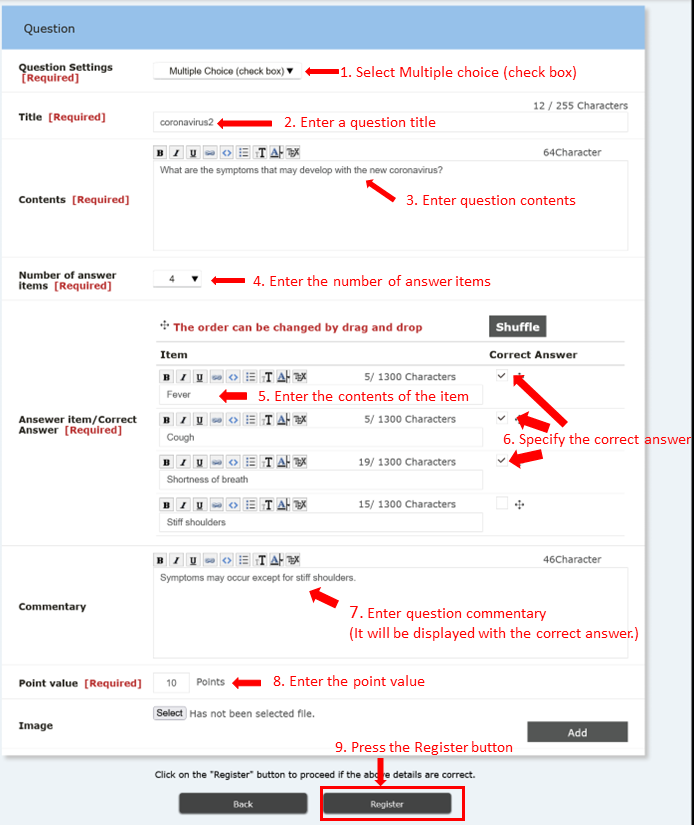
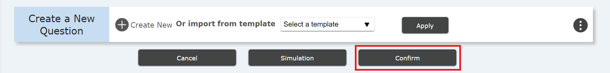
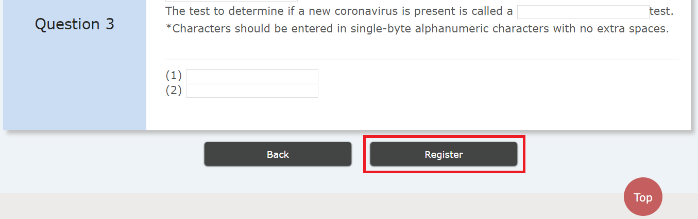

## Overview

* In the "quiz" menu, you can ask questions in a question-and-answer format.
  * This function can be used to check whether students have listened to the class properly and how much students have understood.
    * Due to cheating issues, you need to be careful about how to apply the results of the quiz to your grades.
    * We suppose it is more suitable for casual use such as using it instead of attendance confirmation.
  * It is necessary to decide in advance how to deal with troubles such as not being able to submit answers to a quiz.
    * Various cases are envisioned, such as when a student is unfamiliar with the operation or when the system is overloaded.
    * It is safer not to treat scores strictly until both teachers and students are used to the system.
  * Since various conditions can be set, it is necessary to carefully consider the nature of the quiz before creating it.
    * For students to study on their own, to check their understanding during class, to give grades, etc.
  * Unlike "Assignment", students cannot submit after the deadline.
    * For example, if you want students who did not make it to the deadline to do a quiz with a penalty point, you need to create another quiz with another deadline.

## How to create quizzes

1. Click the ⊕ button at the bottom left of the "quiz," the fifth section from the top of the "Course Summary" screen.
   - Create a new "quiz".

   

2. On the "Test new registration" page, set the following contents.

   1. In "Title", enter the title of the quiz.
   2. In "Quiz content", enter a description of the content of the quiz. It can be omitted.
   3. In the "Answer period", set the period during which students can answer the quiz.
      - If you set "OK" or "OK until reaching the passing score" to "Retake", students can take the quiz as many times they want during this period.
      - If "Retake" is disabled, students can take the quiz only once during this period.
      - For example, you can set the answer period to (1) only during class hours, or (2) until the next class starts, etc.
      - You cannot withdraw the quiz once the answer period starts. Set the start time carefully.
   4. "Time limit" allows you to set the answer time for the entire quiz.
      - In case you choose "Yes", the answer is forcibly terminated when students go over the time limit and the answer at that time will be submitted.
   5. In "Waiting Time", you can set the time to wait before starting the answer.
      - You can use this setting when you want students to read the explanation before starting the quiz.
      - You don’t necessarily have to use this function.
   6. If you choose "Yes" to "Random questions" and select a specific number of questions to ask, the number of questions will randomly be selected from the questions you have prepared in advance.
      - You can use this setting when you want students to take the quiz repeatedly and want to prevent them from using cheating methods such as memorizing the answers in order.
   7. If you choose “Yes” to "Passing Grade", students will take the exam repeatedly until they reach the passing score.
   8. In the "Referring of the scoring result," you set whether or not students are able to refer to their own score after answering, and when they can check the score.
      - You can select from “not possible” (students cannot check their own scores), “at the time of submission” (for automatic scoring), “after scoring” (for manual scoring), or “at the end of the answer period” (after all students have answered).
   9. "Refer to correct answer" allows you to set whether or not students should refer to the correct answer and commentary, and when to refer to it.
      - You can select from “not possible” (students cannot check the correct answers), “at the time of submission” (before scoring in the case of manual scoring), “after scoring”, or “at the end of the answer period” (after all members have answered).
      - When students can refer to the correct answer, the answer may be known to other students who have not / are taking the exam, so please set it appropriately.
   10. In "Automatic scoring", set whether the system will grade automatically when students finish answering the questions, or whether the teacher will grade manually.
       - In order to perform automatic scoring, it is necessary to make all the questions closed questions or a fill-in-the-blank style whose answers should be unique strings of characters (note orthographic variants, such as a difference between full-width and half-width).
   11. In "Retake", set whether students can take the quiz more than once.
       - If the purpose of the quiz is self-improvement, it is a good idea to set the retake as "OK" or "OK until the passing score is reached".
       - If you want to reflect the result of the quiz on students’ grades, it is better to set the quiz retake as "not possible".

   

3. Add as many questions as you need in "⊕ Create New" in "Create Question".

   1. There are four formats available for setting quizzes.
      - Single selection format quiz (radio button)
      - Multiple selection format quiz (check box)
      - free text format quiz (text area)
      - Fill-in-the-blank quiz
   2. <u>How to make a single selection format quiz (radio button)</u>
      1. Select "Single selection format (radio button)" in "Question setting".
      2. Enter a "Title".
      	 - This is the title for specific questions (such as Question 1), not the question itself.
      3. Enter the actual questions in "Question".
      4. Select the number of answer items (number of choices).
      5. Enter answer items (answer choices).
      6. Check the box of the correct answer item.
      7. Enter a commentary. Students can refer after submitting, scoring, and after the answer period ends.
      8. Enter the allocation of marks. Allocate according to the total number of questions, the passing score, and the importance of each question.
      	 - Check in advance how many points the full score should be.
      9. Press the "Register" button.

      
   
   3. <u>How to make multiple selection format quiz (check box)</u>
   　 <b>※正解が複数あるだけで、ラジオボタンとほとんど同じです。</b>
      1. Select "Multiple selection format (check box)" in "Question setting".
      2. Enter a "Title".
      	 - This is the title for specific questions (such as Question 1), not the question itself.
      3. Enter the actual questions in "Question".
      4. Select the number of answer items (number of choices).
      5. <b>Enter answer items (answer choices).</b>
      6. <b>Check all the checkboxes of the correct answer items.</b>
      7. Enter a commentary. Students can refer after submitting, scoring, and after the answer period ends.
      8. Enter the allocation of marks. Allocate according to the total number of questions, the passing score, and the importance of each question.
      	 - Check in advance how many points the full score should be.
      9. Press the "Register" button.

      
   
   4. <u>How to make free text format quiz (text area)</u>
   　 <b>※It is almost the same as a radio button or checkbox, except that the correct answer is a written sentence. Automatic scoring is not possible.</b>
      1. Select "Free text format (text area)" in "Question setting".
      2. Enter a "title".
      	 - This is the title for specific questions (such as Question 1), not the question itself.
      3. Enter the actual questions in "Question".
      4. <b>Enter an answer sentence.</b>
      5. Enter a commentary. Students can refer after submitting, scoring, and after the answer period ends.
      6. Enter the allocation of marks. Allocate according to the total number of questions, the passing score, and the importance of each question.
      	 - Check in advance how many points the full score should be.
      7. Press the "Register" button.

      
   
   4. <u>How to make a fill-in-the-blank quiz</u>
   　 <b>※Some settings are different here from other formats, such as how to set up questions and select the automatic scoring.</b>
      1. Select "Fill-in-the-blank" in "Question setting".
      2. Enter a "title".
      	 - This is the title of question 1 and not the question itself.
      3. <b>Enter the actual questions in "Question".</b>
         - Click the "Add tag" button where you want to insert the answer field (blank). (The character string “[fb]” will be inserted.)
      4. <b>Specify the number of answer items (the number of blanks).</b>
      5. <b>Enter the correct strings of characters.</b>
         - Pay attention to make the questions mean unique and clear. 
      6. <b>Select the automatic scoring method.</b>
         - You can change the method of scoring when there is an incorrect answer.
      7. Enter a description. Students can refer after submitting, scoring, and at the end of the answer period.
      8. Enter the score. Decide according to the total number of questions, the passing score, and the importance.
      	 - Check in advance how many points you will have.
      9. Press the "Register" button.

      

4. Take a quiz simulation.
   - Click the "Simulation" button on the "New Quiz Registration" screen.
   - Take the quiz and check the contents.
   

5. Proceed to the confirmation screen.
   - Press the "Proceed to confirmation screen" button on the "Quiz new registration" screen.
   

6. Confirm and register the quiz.
   - Click the "Confirm" button.
   

## References

* <a href="https://www.ecc.u-tokyo.ac.jp/en/itc-lms/faq.html">FAQ (ITC-LMS)</a>
  * <a href="https://www.ecc.u-tokyo.ac.jp/en/announcement/2019/06/24_2990.html">How to use the ITC-LMS template for different courses or different accounts (for instructors)</a>
  * <a href="https://www.ecc.u-tokyo.ac.jp/en/announcement/2019/06/24_2987.html">How to check the quiz created in ITC-LMS (for instructors)</a>
  * <a href="https://www.ecc.u-tokyo.ac.jp/announcement/2014/04/23_1889.html">Characters that can be used in ITC-LMS quiz and task evaluations (for instructors)</a> (in Japanese only)
  * <a href="https://www.ecc.u-tokyo.ac.jp/en/announcement/2019/06/24_2973.html">How to create a question with multiple fill-in holes in ITC-LMS test (for instructors)</a>
  * <a href="https://www.ecc.u-tokyo.ac.jp/en/announcement/2019/06/24_2981.html">How to display the allocation of the score when students answering in the ITC-LMS quiz (for instructors)</a>
