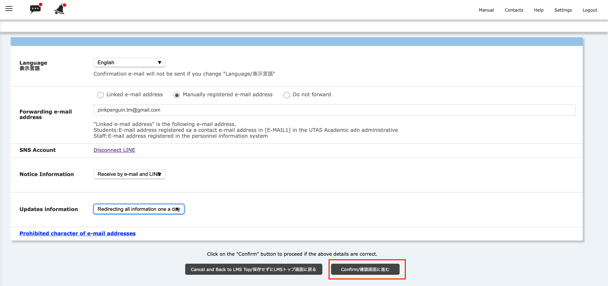

import NotifiationHelp from '@components/en/systems/itc_lms/NotifiationHelp.mdx'

When you log into ITC-LMS, you can see students’ activity (e.g. message to teachers,  or  whether a student submits a homework or not) as a “Notification".  In addition, you can accept the notification by email or LINE application.  Here we introduce how to set the information.

## Set the notifications

1.You can see timetable on ITC-LMS．Click `Settings` button on top right.

2. The screen shows the settings (See below), you can set notifications from LINE or email on ITC-LMS.

{/* 
学務システム UTAS に登録された連絡先（`[E-Mail1]`）を通知先に使いたい場合には，`連絡メールアドレス`を指定してください．それ以外のアドレスを使いたい場合には，`手動登録メールアドレス`を指定し，直下のボックス（以下の図では表示されていない）にメールアドレスを入力してください．
*/}

|option|effect|
|---|---|
|`Linked e-mail address`|[Students:]E-mail address registered as a contact e-mail address in [E-MAIL1] in the UTAS Academic adn administrative .[Staff:]E-mail address registered in the personnel information system.|
|`Manually registered e-mail address`|E-mail address registered in the box below.|
|`Do not forward`|Do not forward via E-mail. **Note: Do not choose this option unless you connect with LINE.**|

<NotifiationHelp />

4. If you want to notify by LINE app, select `Connect LINE` .
**（Caution） Some smartphone, such as iPhone or other iOS device cannot set this settings. In this case, you must use PC（Windows or macOS）instead. **

Like this, you will see LINE log in window. Fill in your mail address and click，`Log in`.

In the next screen, select `1-on-1 chat with LINE Notify` and click `Agree and connect`.

When the screen shows "finished setup", go back to `Back to LMS top`. Then please try to check your settings.

5. In the two hop-up menu below, select notification and update notification. In the notification, you may receive important notification. **DO NOT SELECT "Do not receive"．**

6. Click `Confirm`.

7. Click `Submit`.

8.You see "Setup completed", and click `Back to LMS Top`.

[Procedures](https://youtu.be/xAur5zar5Sc)

## References
* <a href="https://www.ecc.u-tokyo.ac.jp/itc-lms/faq.html">FAQ (ITC-LMS)</a>
  * <a href="https://www.ecc.u-tokyo.ac.jp/announcement/2014/04/21_1886.html"> How to receive notificartions in English from ITC-LMS  (for instructors/ students)</a>
