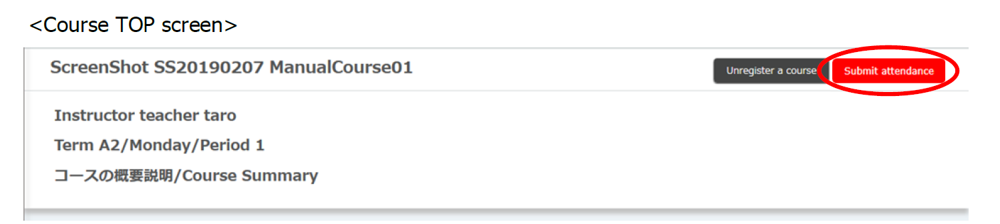

1. After the start time of “Date and time for submission” set in <a href="prepare_attendances" target="">Preparations for taking attendance during class</a>, the "Submit Attendance" button will appear when the student logs in to ITC-LMS and displays the “Course TOP” screen of the course.

   * If the student has already logged in and displayed the "Course TOP" screen, instruct the student to reload the browser. The "Submit Attendance" button does not necessarily appear at the class start time.
   * The teacher's ITC-LMS screen will not change. You can check the class start time by editing the class on the "Attendance Management" list screen of <a href="prepare_attendances" target="">Preparations for taking attendance During Class</a>.[Procedure](https://youtu.be/uKfoTtTSuUU)
2. When students press the "Submit Attendance" button, they will be asked to enter a one-time password as shown below. Tell your students taking the class the one-time password that you set in <a href="prepare_attendances" target="">Preparations for taking attendance During Class</a>. If you have forgotten the one-time password set by the teacher, you can view it by editing the class on the "Attendance Management" list screen of <a href="prepare_attendances" target="">Preparations for taking attendance During Class</a>. There is also a commenting area on students' screens. If you want the students to comment, tell them to do so here.

   * It is recommended that you make a slide with the one-time password written in large letters in advance. Depending on the environment of students taking the course online, small letters may be difficult to see.
   * If a one-time password is sent in chat on the video conferencing system, typing errors can be reduced because students can copy and paste. However, students cannot see what was written in the chat before they participate in the class; if a network failure causes a student to leave the video conferencing system, he or she will not be able to see the password written in the chat after re-entering the class.

## References
* <a href="https://www.ecc.u-tokyo.ac.jp/en/itc-lms/faq.html">FAQ (ITC-LMS)</a>
  * <a href="https://www.ecc.u-tokyo.ac.jp/en/announcement/2019/06/24_2985.html">There is no "Submit Attendance" button on ITC-LMS (for students)</a>
