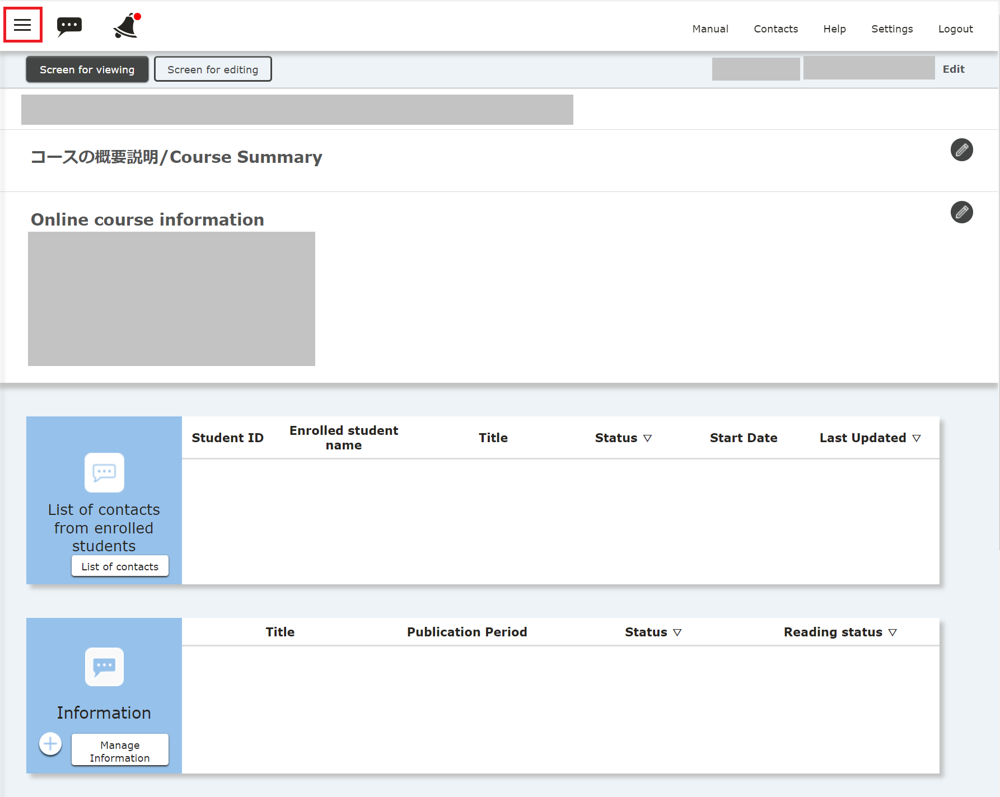
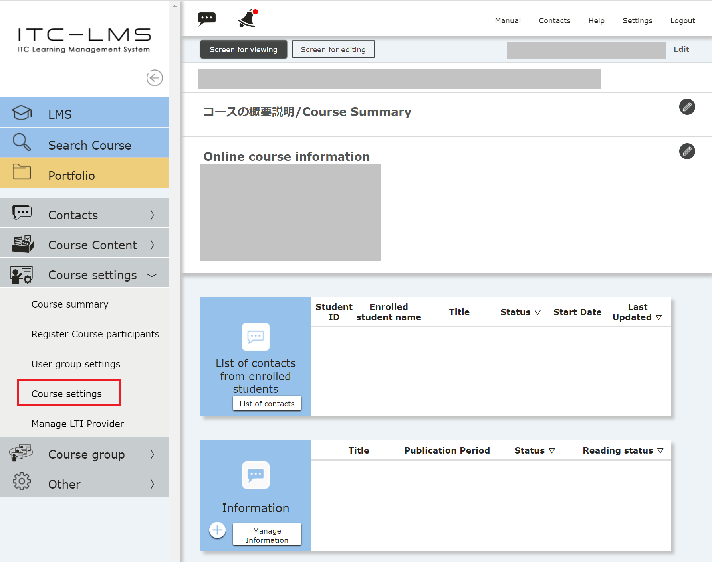
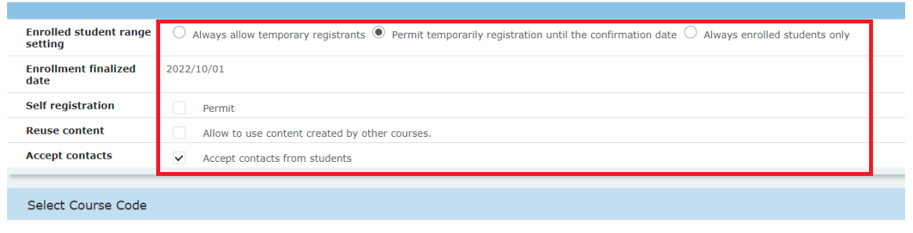
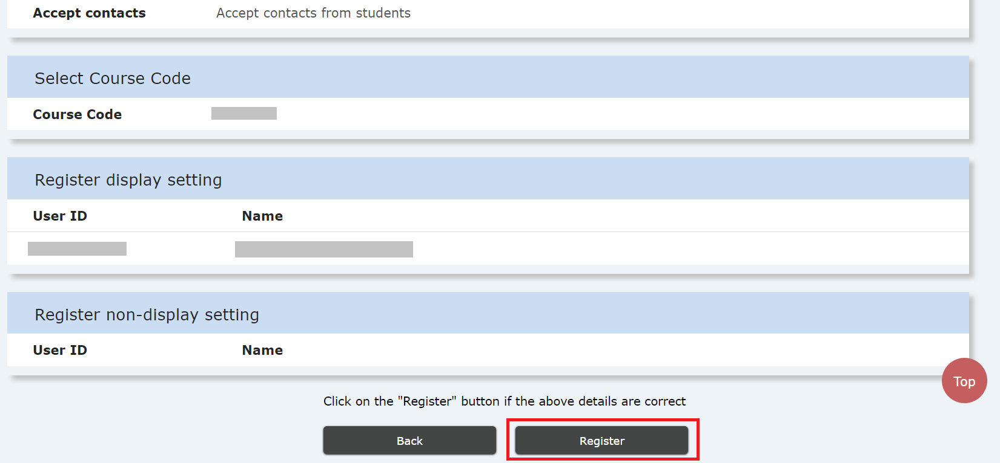
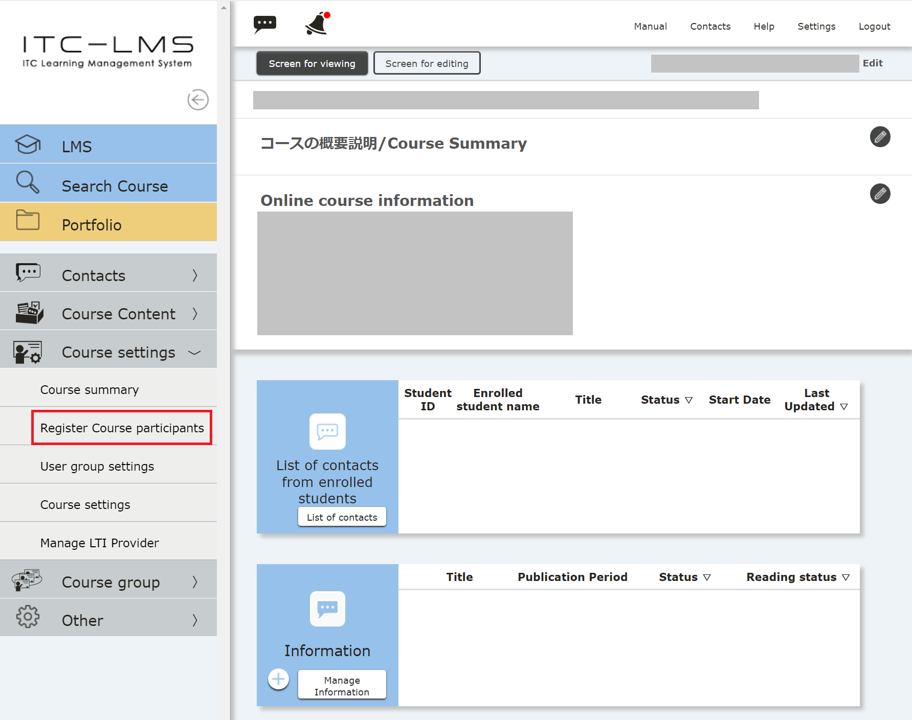
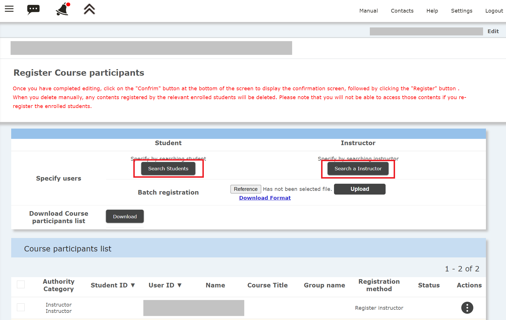
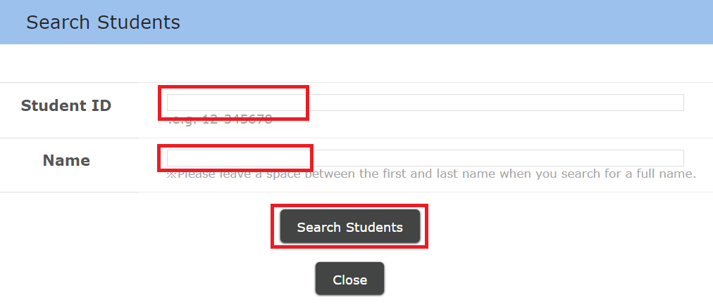
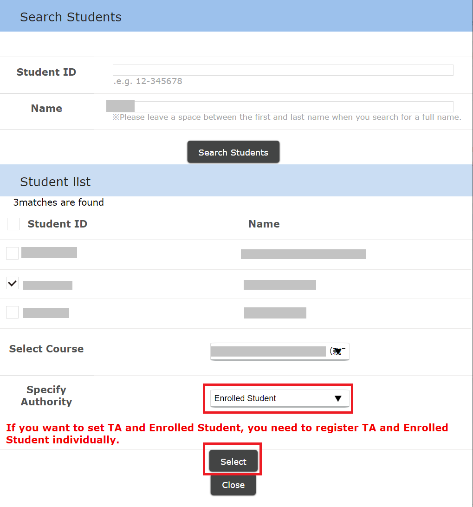
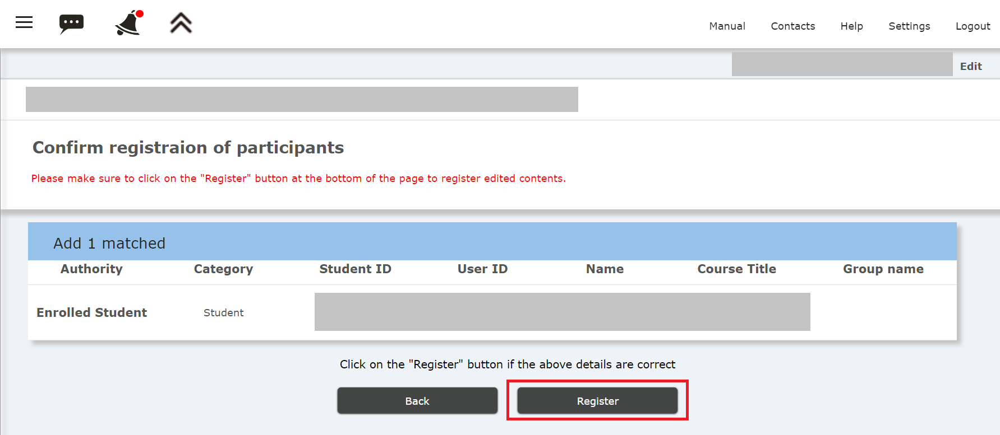

In ITC-LMS, lectures offered in terms and semesters are called "Courses". First, set up the course according to your subject.

## Course Summary

You can set a document to be displayed on the top screen when a student searches for a course on the ITC-LMS, or select it from the timetable.

* It is a good idea to write down the basic information you want to tell your students here.
* As an exception, URLs for online courses should be listed in the "Online course information" field.
  * By entering the information in the "Online class information" field, students can check the information from other systems even if they cannot access the ITC-LMS.
  * Reference Link：[How to Announce Online Class URL (for Faculty Members)](/faculty_members/url#use-online-class-info-in-general)

1. On the course screen, select the three line icon at the top left to bring out the menu options.

2. Expand "Course Settings" and select "Course Summary".

3. Write the course description in "Contents" and select "Go to confirmation screen". In addition to writing text, you can change the font, list items, links, etc.

4. After confirming how the summary is displayed, select "Register".

[手順動画](https://youtu.be/Sdqtw2m1j48)

## Setting for course registration, message usage

The default setting for this message function has been change to "Accept contact from students" after December 22, 2021. If you do not wish to receive messages from students, please change the setting by unchecking the check box for "Accept contacts from students".

Students who register for courses (or add to favorites) on UTAS are automatically enrolled in the corresponding ITC-LMS course. However, some courses are restricted to students who register for them by themselves. Therefore, if you wish to use ITC-LMS courses from the first few classes, you will need to set the default settings that allow students to register for courses on their own.

1. On the course screen, select the three line icon at the top left to bring out the menu options.

2. Expand "Course Settings" and select "Course settings". 

3. The screen below shows the default settings. We will explain the basic functions.
   * Enrolled student range setting is "Permit temporarily registration until the confirmation date". With this setting, in addition to students who have registered for courses (or add to favorites) in UTAS, students who have registered only through the ITC-LMS (temporary enrollment registration) can also participate in courses. 
   After the enrollment finalized date is displayed on the screen, the enrolled student range setting will automatically change to "Always enrolled students only" and temporary enrollment registration students will not be able to access the course.
   * Self registration is "Permit". In this setting, students can access the course by themselves and register for the course as a temporary enrollment registration.
   * Accept contacts is set to "Accept contacts from students." In this setting, you can receive and reply to messages (questions, etc.) from students who are enrolled in the course. Students in online classes do not have the opportunity to communicate directly with instructors in the classroom, so this feature allows you to communicate with students on the ITC-LMS without giving out your email address.

  * You can change the enrolled student range setting at any time, including after the enrollment finalized date. After the enrollment finalized date, you cannot change the setting to "Permit temporarily registration until the confirmation date".
  * When the enrolled student range setting is set to "Always enrolled students only", Self registration is automatically set to "Not Permit".
4. Select "Go to confirmation page." 

5. Select "Register."

<!-- 
コース設定 -> コース設定で編集する
「履修者範囲設定」，「自己登録」，「履修確定以降」，「メッセージ利用」についてお勧め設定と，変更するとどうなるかの説明をする
-->

## Participant registration by the instructor
To enroll a teacher or TA who is co-teaching a course (not registered in UTAS), you must register the course participants. You may also enroll students not enrolled to participate in the course.

1. On the course screen, select the three line icon at the top left to bring out the menu options.

2. Expand "Course Settings" and select "Course Summary".

3. Select "Search Student" or "Search Instructor" on the "Course Participant Registration" screen.

4. If you select "Search Student", you can search by either "Student ID Number" or "Name". Here, we have searched by the student's name.

5. The student is displayed. Select the check box of the applicable student (note that there may be multiple students with the same name), and select “Authority” out of “Teacher”, “TA”, or “Student” and click “Confirm”. 

7. Select "Go to confirmation page".

8. Select "Register."

[Procedure](https://youtu.be/TYCXBRzPpAA)

* When searching for faculty members, search by the "Common ID" instead of "Student ID number".
* You can also use batch registration using Excel files.
* When searching for a faculty member, a "User ID" with the same name but a number other than 10 digits may come up. This is left to refer to the contents of the old ITC-LMS.  Instructors can no longer login to the old UTAS, so if you want the instructor to participate in the course, register the  10 digit number for the user ID.
* Do not use the search function for students or faculty members unless you really need it.

<!-- 
コース参加者登録で何ができるか．TAや他の担当教員の登録．
自己登録を許さない場合での手動登録などの説明
-->

## References
* <a href="https://www.ecc.u-tokyo.ac.jp/en/itc-lms/faq.html">FAQ (ITC-LMS)</a>
  * <a href="https://www.ecc.u-tokyo.ac.jp/en/announcement/2017/05/17_2521.html">What is "Enrollee Range Setting?" (for instructors)</a>
  * <a href="https://www.ecc.u-tokyo.ac.jp/en/announcement/2019/06/26_3014.html">Settings for Self-registration on ITC-LMS (for instructors)</a>
  * <a href="https://www.ecc.u-tokyo.ac.jp/en/announcement/2016/08/08_2282.html">How to add staff or students to a course on ITC-LMS (for instructors) </a>
  * <a href="https://www.ecc.u-tokyo.ac.jp/en/announcement/2016/08/10_2288.html">What is "Temporary Enrollment Registration" on ITC-LMS? </a>
  * <a href="https://www.ecc.u-tokyo.ac.jp/en/announcement/2019/06/26_3010.html">Automatic enrollment of students on ITC-LMS and the Academic Affairs System</a>
   * <a href="https://www.ecc.u-tokyo.ac.jp/en/announcement/2021/06/15_3342.html">I wish to grant access to course contents to auditing students who have not registered for the course through UTAS (for instructors)</a>