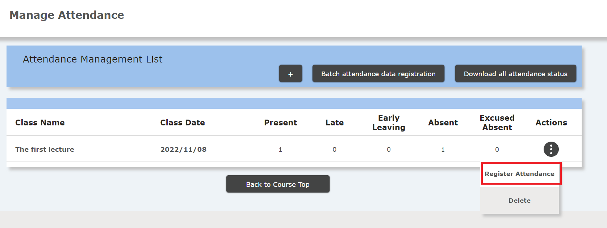
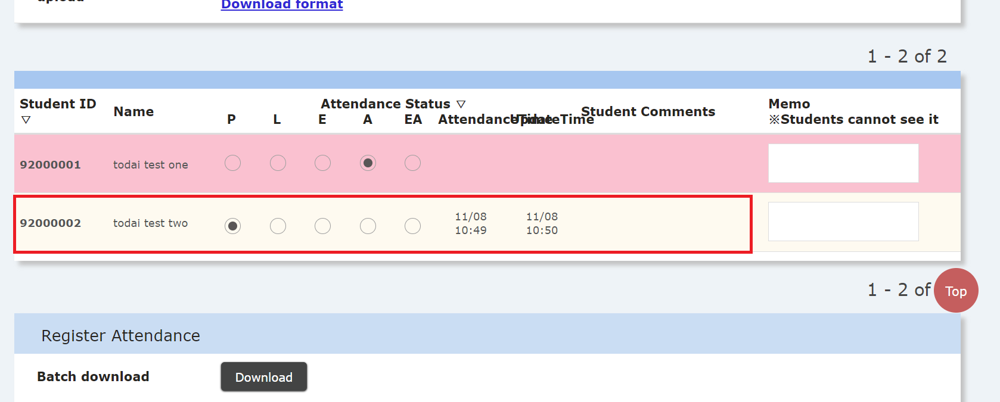

After asking the student to press the "Send Attendance" button and to enter a one-time password, follow the instructions below to check their status.

1. On the course screen, select the three line icon at the top left to bring up the menu.

2. Expand "Course Content" and select "Attendance Management".

3. Make sure that the "Attendance" of the relevant class day is 0 or more. To update, "reload" the browser.

4. To check the attendance status of each student, select “Registration” from “Operation” on the relevant class day on the attendance management screen.

5. At the bottom of the "Attendance Registration" screen, you can check the attendance status (attendance date, update date and time) of each student. If you have students write comments, you can also check on this screen.

## References
* <a href="https://www.ecc.u-tokyo.ac.jp/en/itc-lms/faq.html">FAQ (ITC-LMS)</a>
  * <a href="https://www.ecc.u-tokyo.ac.jp/en/announcement/2019/06/24_2983.html">How to confirm attendance in ITC-LMS (for instructors)</a>
