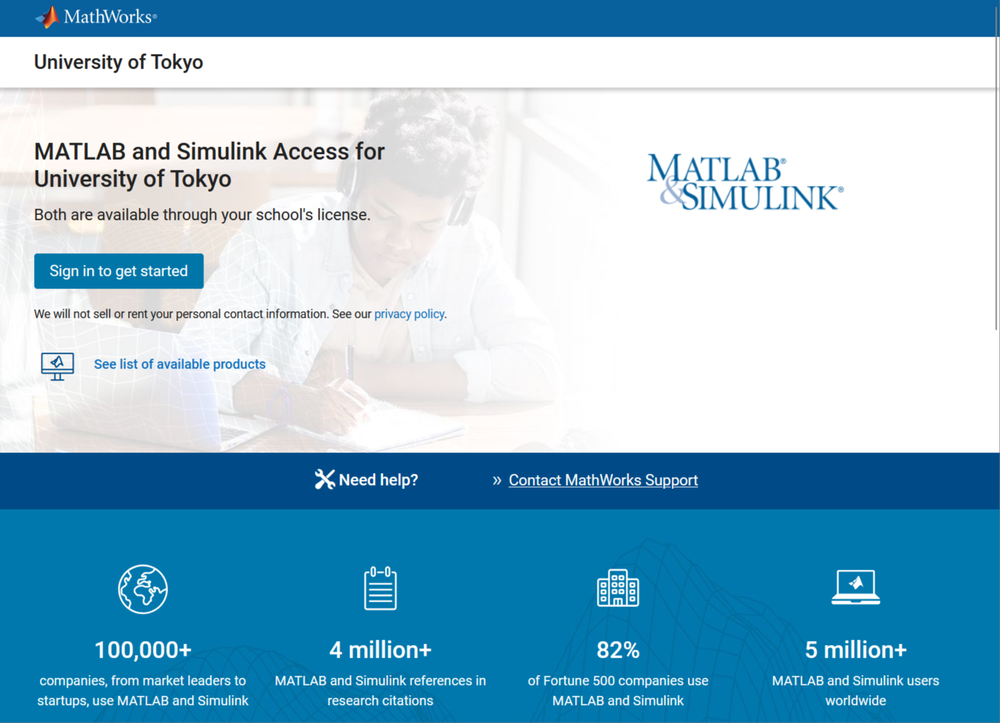
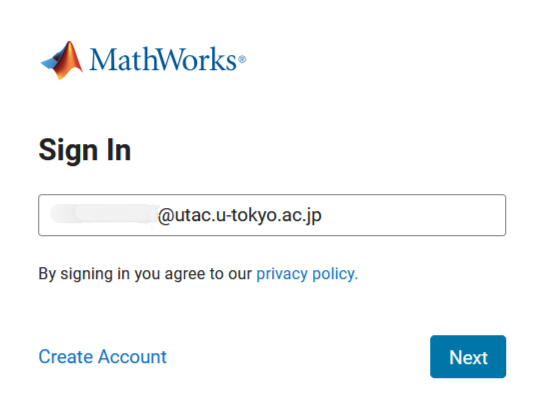
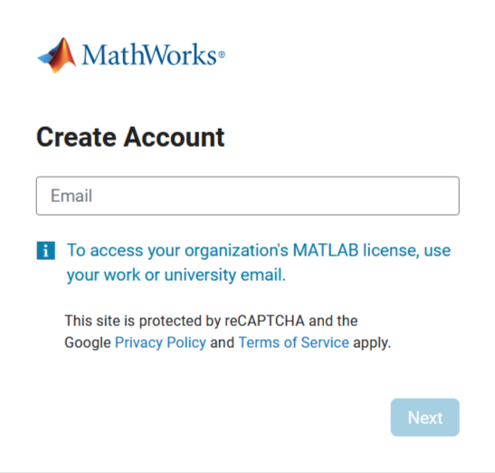

## Introduction
The University of Tokyo has introduced the software "[MATLAB](https://www.mathworks.com/products/matlab.html)" provided by MathWorks, and supports its use on individual terminals, on shared terminals for education and research, and on [the supercomputer system](https://www.cc.u-tokyo.ac.jp/guide/application/introduction-matlab.php) (in Japanese) provided by the Information Technology Center.

## About MATLAB
[MATLAB](https://www.mathworks.com/products/matlab.html) is a programming language and a numerical computation / computer algebra software developed for scientific and technical computing. MATLAB can be used for various purposes, including mathematical processing of algebra, geometry and analysis, machine learning, statistical analysis, data visualization, control simulation, and its implementation on hardware. Since the software can be operated using GUI without writing a code, it can be easily introduced not only for research use in specialized fields such as engineering and science, but also for basic education for beginners in programming, and data analysis in the humanities and social sciences.

The University of Tokyo has a comprehensive license agreement that allows **all members of the university** to use the following functions from their individual devices without additional costs. The number of functions provided may increase or decrease depending on the university's situation and the terms of the contract.

- Installing and using MATLAB
- Unlimited use of MATLAB Online
    - This is an online version of MATLAB that can be used from a PC browser.
- Unlimited use of MATLAB Mobile
    - This application is available for smartphones and tablets.
- MATLAB Toolbox
    -  You can use the related optional products listed in the "List of Available Products" on the [University of Tokyo's Comprehensive License Page](https://www.mathworks.com/academia/tah-portal/university-of-tokyo-40790257.html).
- MATLAB Drive storage capacity (20 GB)
    - This is a cloud service for storing data of MATLAB Online and others.
- Taking online tutorial courses
- Use of MATLAB Grader
    - This service allows you to create programming assignments, distribute problems, and automatically grade and evaluate them all at once.

The purpose of use is limited to educational and research activities and related work. The use of the service for commercial purposes is not permitted. If you are considering commercial use, please contact MathWorks.

Also, please refer to "[Precautions for using external services managed and operated by Division for Information and Communication Systems](/en/docs/dics-terms/)".

## How to start using MATLAB
When using MATLAB under the University of Tokyo’s campus-wide license, your UTokyo Account is used as your MathWorks account.
Please note that even if you created a MathWorks account before December 2024 using the previously provided format (i.e., a University of Tokyo email address ending with u-tokyo.ac.jp rather than a UTokyo Account), you can still sign in using your UTokyo Account.
1. Access the [University of Tokyo's comprehensive license introduction page](https://www.mathworks.com/academia/tah-portal/university-of-tokyo-40790257.html) provided by MathWorks, and click “Sign In to Get Started” located in the middle of the page.

{:.medium.center.border}

2. When the MATLAB sign-in screen appears, enter your UTokyo Account (e.g., 0123456789@utac.u-tokyo.ac.jp) in the “Email” field, as illustrated below, and then click “Next".

{:.medium.center.border}

3. Unless you are already signed in with your UTokyo Account, the UTokyo Account sign-in page will be displayed. Please sign in accordingly.
### If you have not created a MathWorks account yet
To use your UTokyo Account as a MathWorks account, please complete the initial setup by following the steps below.
1. Access the  [University of Tokyo's comprehensive license introduction page](https://www.mathworks.com/academia/tah-portal/university-of-tokyo-40790257.html) provided by MathWorks, and click “Sign In to Get Started” located in the middle of the page.

{:.medium.center.border}

2. When the MATLAB sign-in screen appears, enter your UTokyo Account (e.g., `0123456789@utac.u-tokyo.ac.jp`) in the “Email” field, and click “Create Account.”
3. The “Create Account” screen, as illustrated below, will be displayed. Enter your UTokyo Account (e.g., `0123456789@utac.u-tokyo.ac.jp`) again in the “Email Address” field, and click “Next.”

{:.medium.center.border}

4. Unless you are already signed in with your UTokyo Account, the UTokyo Account sign-in page will be displayed. Please sign in accordingly.
5. When the “Verify Email Address” screen appears, enter the verification code. The verification code will be sent to your mailbox in [ECCS Cloud Email](/en/google/#login).
6. The “Create MathWorks Account” screen will be displayed. Enter your name and other required information. This will complete the creation of your MathWorks account.
7. Please confirm that the University of Tokyo campus-wide license has been applied to the MathWorks account created through the above procedure. Access the [MathWorks account page](https://jp.mathworks.com/mwaccount/), and verify that `40790257 MATLAB (Individual)` is displayed in the Software Licenses section.

If you encounter any issues with this procedure, please contact MathWorks Support(service@mathworks.co.jp) for assistance.

## How to Use MATLAB Basically
To use the full functionality of MATLAB, it is recommended to install the software version on your computer, which is required to have a processor with sufficient performance and enough storage space. Internet communication is also required during installation.

see: [System Requirements and Supported Compilers](https://www.mathworks.com/support/requirements/previous-releases.html)

Many of the functions provided in the software version are also available in the online version, so you do not necessarily need to install the software version when you get started.

### Installing the software version
Internet connection is required for downloading and installation. Please visit the [Download Center](https://www.mathworks.com/downloads/web_downloads) and download the latest software release.

Detailed instructions are in preparation.

### Using the online version
MATLAB Online allows you to access online resources from your browser and use MATLAB in the same way as the software version. While the software version saves and reads data in your computer, the online version saves and reads data in the MATLAB Drive. The recommended browser is Google Chrome.

#### Access to MATLAB Online
1. Access [MATLAB Online](https://matlab.mathworks.com/) and sign in.
2. Click "Open MATLAB Online".

#### Access to MATLAB Drive
- Access [MATLAB Drive Online](https://drive.matlab.com/files) and sign in.
- Install [MATLAB Drive Connecter](https://www.mathworks.com/products/matlab-drive.html) in your computer to mount a drive synchronized with MATLAB Drive data.

### Learning how to operate
Online training courses are available in tutorial format, covering everything from basic operation to advanced features for different purposes.
- You can choose the course that suits you best from the [Online Course List](https://matlabacademy.mathworks.com/).
- Several times a year, the "UTokyo MATLAB Ambassadors" hold training sessions. The courses currently available for registration are listed on the [Ambassadors Portal Site](https://sites.google.com/view/ut-matlab-amb/Event) (in Japanese).

## Information on using MATLAB in the classroom

At "**[University-Wide Symposium to Promote the Educational Use of MATLAB](/events/2022-12-20-matlab/)**" (in Japanese) held on December 20, 2022, they introduced examples of education conducted in the university using MATLAB.

Examples of MATLAB use in the classroom are available on the [MathWorks website](https://www.mathworks.com/academia/courseware.html), so please refer to this page as well.

### File sharing with MATLAB Drive

When faculty members distribute MATLAB sample files to students, they can use [MATLAB Drive](https://www.mathworks.com/products/matlab-drive.html) or [File Exchange](https://www.mathworks.com/matlabcentral/fileexchange) to make it easier to receive files and execute programs.

Detailed instructions are in preparation.

### Using MATLAB Grader

When assigning students to write script code, MATLAB Grader can be used to automatically grade, evaluate, and provide feedback on submitted scripts.

## Advanced licenses

The following advanced licenses are available upon individual request.

- [Concurrent license](https://www.mathworks.com/help/install/license/concurrent-licenses.html)
    - This is a form of license activation that can be applied when you want to use the software on PCs that are centrally controlled in a laboratory or such.
- [Parallel Server](https://www.mathworks.com/help/matlab-parallel-server/index.html)
    - This is a license to perform parallel computing by configuring a cluster with multiple PCs or cloud computing.
    - Parallel Server is not required for normal parallel computing on a single multi-core PC, as the [Parallel Computing Toolbox](https://www.mathworks.com/help/parallel-computing/index.html) can be used for that purpose.

If you need these licenses, please contact [the Support Desk via the email form](/en/support/#email-form) with specific information on the purpose and form of use.

## References

### User Community (UTokyo Slack)
This is an open forum where you can get information about MATLAB product updates and consultation on MATLAB use. All members of the University of Tokyo can participate and exchange information with MathWorks engineers and other users in the university.

A workspace named "**東京大学MATLABユーザコミュニティ (University of Tokyo MATLAB User Community)**" is available in [UTokyo Slack](/en/slack/). Please refer to the following page to join.

see: **[Joining an open workspace in UTokyo Slack](/en/slack/join/)**

### UTokyo MATLAB Ambassadors
"UTokyo MATLAB Ambassadors" is a student team who hold workshops on how to use MATLAB and events for interaction among users in the university. They also provide consultation services via email and Zoom. Please refer to [**Ambassador Portal Site**](https://sites.google.com/view/ut-matlab-amb/) (in Japanese) for details.

### MathWorks Technical Support Desk
Inquiries about technical specifications of the product should be sent to MathWorks from the following page.

[MathWorks Technical Support Desk (MathWorks website)](https://www.mathworks.com/support/contact_us.html)
