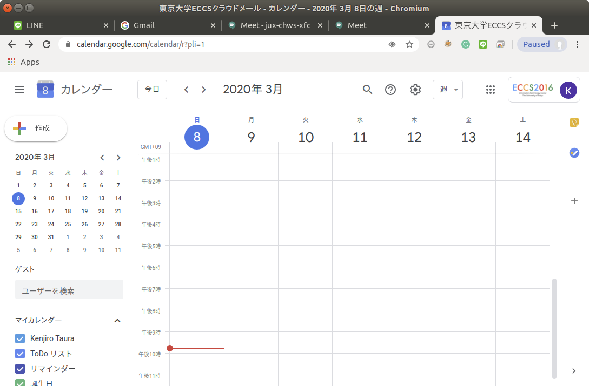

## Introduction

* Any UTokyo account holder (i.e., student or teacher) can use <a href="https://workspace.google.com/intl/en/products/meet/" target="_blank">Google Hangout Meet</a> as follows.
  * Video Conference: interactive video communication,  audio communication, showing handouts on screens. If one starts the conference, others join to the session. Organizers need to have UTokyo account, while attendees do not need an UTokyo account.  
  * Live Broadcast: Organizers can send video clips, voice and handouts to the other participants. However, participants cannot send files to organizers.
  * Record Broadcasting: Organizers record their video clip in advance and share the clip on Google drive or broadcast on YouTube. 

* You need a valid <a href="https://www.ecc.u-tokyo.ac.jp/announcement/2016/02/08_2116.html" target="_blank">G Suite for Education (本学では「ECCS Cloud Mail」)</a>.
* Necessary items:
  * PC + www browser.
  * If you share one PC with many people or if you snapshot the speaker, we strongly recommend to use  External USB camera and microphone.
  * There is a dedicated app for smartphone users (organizers are recommended to use PC.).
  * You can watch anywhere as long as you can connect to the internet. 
* <a href="https://support.google.com/meet/" target="_blank">Need help?

## Video Conference

Video conference enables organizers and participants to share video clip, voice and handouts (data) interactively. this function is called "Meeting"in Hangouts Meet.

### Organize a Video Conference

One should be the organizer at the conference. The organizers arrange the meeting as follows.

1. Organizers need to  have valid  <a href="https://www.ecc.u-tokyo.ac.jp/announcement/2016/02/08_2116.html" target="_blank">ECCS Cloud Mail  (G Suite for Education) </a>  account. Please create the account <a href="https://utacm.adm.u-tokyo.ac.jp/webmtn/LoginServlet" target="_blank">here</a>  (<a href="https://hwb.ecc.u-tokyo.ac.jp/wp/literacy/email/initialize/" target="_blank">details</a>).  If you already have the university's mail address (i.e., xxxx@g.ecc.u-tokyo.ac.jp ), you can use ECCS Cloud Mail. Student organizers must take <a href="https://www.ecc.u-tokyo.ac.jp/onlineseminar.html" target="_blank">Online Training Session</a>.	
1. If you obtain valid ECCS Cloud Mail account, please be wait for one hour until the server register for your account.
1. After you obtain valid ECCS Cloud Mail account, access to the top page of <a href="https://meet.google.com/" target="_blank">meet</a> Please click "login" on the top or click "Sign in" on ECCS Cloud Mail account (xxxx@g.ecc.u-tokyo.ac.jp) .
1. After you log in, the screen appears " participate or start the meeting". You can set the meeting here.
   <blockquote>
     <a href="img/meet_start.png" target="_blank"></a>
   </blockquote>
  * Caution 1: if the screen shows "You’re not logged in with an account that can start a meeting," please switch to a G suite account (xxxx@g.ecc.u-tokyo.ac.jp) on top right. 
   <blockquote>
     <a href="img/meet_no_login.png" target="_blank"></a>
   </blockquote>
  * Caution 2: If the screen shows " this account can participate in the meeting only" then you check your accont. You may log in your private account (i.e. xxxx@gmail.com). Please switch your account to  G Suite account (xxxx@g.ecc.u-tokyo.ac.jp)." You can switch account on top right button (See below) or you re-enter  G Suite account.
   <blockquote>
     <a href="img/meet_participate_only.png" target="_blank"></a>
   </blockquote>
1. Click "participate or start the meeting". You permit to access to camera and microphone and then you are ready to start the meeting.
   <blockquote>
     <a href="https://www.ecc.u-tokyo.ac.jp/files/2020/03/04/meet_ready2.png" target="_blank"></a>
   </blockquote>
1. After you click "start the meeting", you can see this screen below. Fill in the meeting name, if needed (no name is fine). Click " continue".
   <blockquote>
     <a href="img/meet_name.png" target="_blank"></a>
   </blockquote>
1. You see the screen above. You notify URL (e.g.   (<a href="https://meet.google.com/xxx-xxxx-xxx" target="_blank">https://meet.google.com/xxx-xxxx-xxx</a>)  to your participants by email. You can copy the URL and paste directly onto the email. 
   <blockquote>
      <a href="img/meet_copy.png" target="_blank"></a>
   </blockquote>

### Join a meeting

1. Participants acquire URL from organizers (see below) and click on it.
    <blockquote>
      <a href="https://www.ecc.u-tokyo.ac.jp/files/2020/03/04/meet_mail3.png" target="_blank"></a>
    </blockquote>
1. Click URL and participate in the meeting. 
  * If participants log into ECCS Cloud Mail account (xxx@g.ecc.u-tokyo.ac.jp) , you immediately join the meeting.
  * Otherwise, you need the organizer's permission. After you are allowed to enter the meeting by the organizer, you join the meeting. However, if the organizer do not permit for a long time, your screen shows an error message. Please try again.
  * To skip the organizer's permission step, all participants are recommended to enter by ECCS Cloud mail. By doing so, those who enter the meeting are only UTokyo students / teachers plus someone who are allowed to join the meeting by the organizer.

### Share the handouts on screens

At the meeting, click "share now" on the bottom right. You can share the screen with the participants.  You can choose full-screen mode or a given window.  This enable us to share the presentation screen or handouts.

### Recording

At the meeting, click "record the meeting" and then you can record the screen and voice. The recording data are available on Google drive. 

## Live Broadcasting 

Live broadcasting can send the participants to video clip, voice and handouts and hence, live broadcasting is one direction media (one organizer to many participants).  Comparing to the video conference,  live broadcasting is applicable to send information to many participants. This is called "live streaming" in this Hangout Meet. However, the participants on live streaming cannot send video clips, voices and so on. In addition, the image may have 15 second delay from organizers to the participants. 

### Organize live broadcasting

Organizers should prepare for broadcasting as follows.

1. Organizers need to  have valid <a href="https://www.ecc.u-tokyo.ac.jp/announcement/2016/02/08_2116.html" target="_blank"> ECCS Cloud Mail  (G Suite for Education)</a>. Please create the account <a href="https://utacm.adm.u-tokyo.ac.jp/webmtn/LoginServlet" target="_blank">here</a>.(<a href="https://hwb.ecc.u-tokyo.ac.jp/wp/literacy/email/initialize/" target="_blank">details</a>). If you already have the university's mail address (i.e., xxxx@g.ecc.u-tokyo.ac.jp ), you can use ECCS Cloud Mail. Student organizers must take <a href="https://www.ecc.u-tokyo.ac.jp/onlineseminar.html" target="_blank">Online Training Session</a>.
1. If you obtain valid ECCS Cloud Mail account, please wait for one hour until the server register for your account.
1. After you obtain valid ECCS Cloud Mail account, go on to
    <a href="https://calendar.google.com/" target="_blank">
      Google Calendar
    </a> page.
  * Caution 1: If you see the screen below, please log into Google account by ECCS Cloud Mail (xxxx@g.ecc.u-tokyo.ac.jp).
     <blockquote>
       
     </blockquote>
  * Caution 2: If you use your private account, please log out your account and then you log into ECCS Cloud Mail account (xxxx@g.ecc.u-tokyo.ac.jp) . If you success to enter your ECCS account, you can see the mark on the right top (See below).

    <blockquote>
      
    </blockquote>

    Details are <a href="https://support.google.com/meet/answer/9308681" target="_blank">here</a>.
1. Please left-click the given day of  Google calendar to schedule the event (you can broadcast independently of the event day and even if you schedule  the event, the broadcasting do not start automatically).
    <blockquote>
      
    </blockquote>
1. Select "other options".
    <blockquote>
      
    </blockquote>
1. Select "add video conference".
    <blockquote>
      
    </blockquote>
1. "Add video conference" -&gt; 「Hangouts Meet」
    <blockquote>
      
    </blockquote>
1. Click   -&gt; "Add live stream"
    <blockquote>
      
    </blockquote>
1. Click "Save". You are read preparing the meeting.
1. <b>Start broadcasting:</b> open your calendar and click " Join Hangouts Meet."
    <blockquote>
      
    </blockquote>
1."Join Meeting"
    <blockquote>
      
    </blockquote>
1. Here you see "This meeting is scheduled to live stream by the organizer" on the screen. If you want to start immediately, select "start live streaming".
    <blockquote>
      
    </blockquote>
1. In case the live stream do not start, close the browser and click "start live streaming".
    <blockquote>
      
    </blockquote>
1. <b>Direction to attendees:</b> Click  button for "copy streaming information".
    <blockquote>
      
    </blockquote>

    By doing so, URL has been copied onto the clipboard. You now can paste on the information in the given email. You can use ICT-LMS to let students know the URL. Switch on "Mail and LINE notification" on "nofitication", and then only class participants will obtain URL.
1. <font color="red">Only ECCS Cloud Mail holders (e.g. xxxx@g.ecc.u-tokyo.ac.jp) can see live streaming.</font> Below is an example of the invitation (HTML versiton). 

```
      Invitation of Live streaming: 「◯◯◯◯◯」
      
      If you want to watch or hear this class, log into ECCS Cloud Mail account(xxxx@g.ecc.u-tokyo.ac.jp) on Google and click the link below.
      https://stream.meet.google.com/stream/e91f3dd7-xxxx-xxxx-xxxx-7d47c54c1660

      Caution 1: Those who do not use ECCS
      <a href="https://www.ecc.u-tokyo.ac.jp/announcement/2016/02/08_2116.html" target="_blank">
        https://www.ecc.u-tokyo.ac.jp/announcement/2016/02/08_2116.html
      </a>please access to be activate the account (You need to wait for updating account up to 1 hour).
      
      Caution 2: Student(or not lecture)organizers must take ECCS online training.
      (<a href="https://www.ecc.u-tokyo.ac.jp/onlineseminar.html" target="_blank">
        https://www.ecc.u-tokyo.ac.jp/onlineseminar.html</a>)
      
```


### Watch Live streaming

1. To watch live streaming, you obtain URL from the organizer and just click URL.
1. If you did not activate yet your <a href="https://www.ecc.u-tokyo.ac.jp/announcement/2016/02/08_2116.html" target="_blank"> ECCS Cloud Mail (G Suite for Education)</a>, you can do it at <a href="https://utacm.adm.u-tokyo.ac.jp/webmtn/LoginServlet" target="_blank">UTokyo Account User Menu</a>  (<a href="https://hwb.ecc.u-tokyo.ac.jp/wp/literacy/email/initialize/" target="_blank">details</a>). The service is already validated for "xxxx@g.ecc.u-tokyo.ac.jp" email address users. Student organizers must take <a href="https://www.ecc.u-tokyo.ac.jp/onlineseminar.html" target="_blank">Online Training Session</a>.
1. If you obtain valid ECCS Cloud Mail account, please wait for one hour until the server register for your account.

