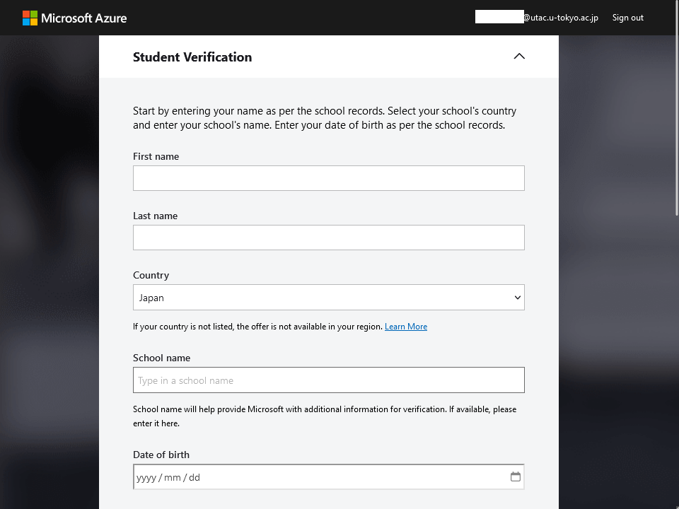
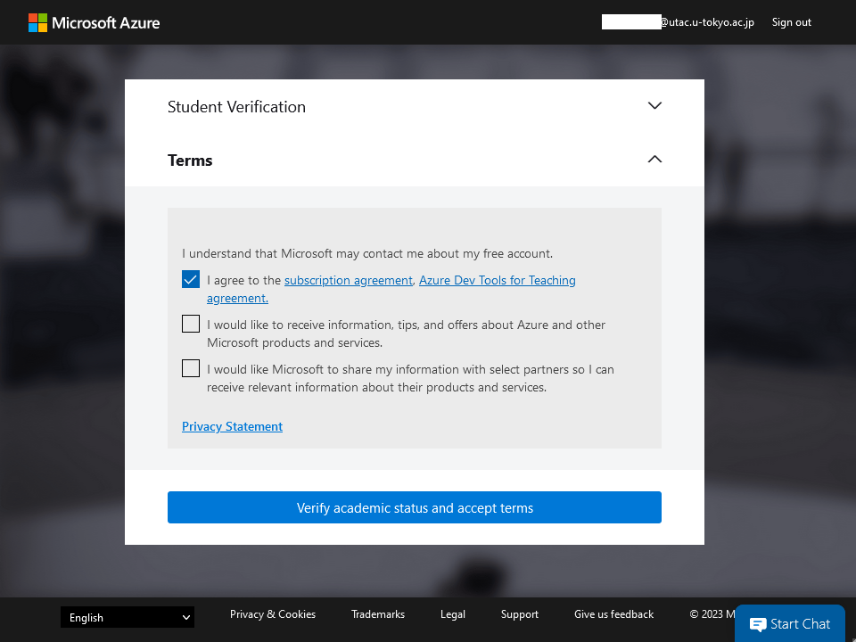
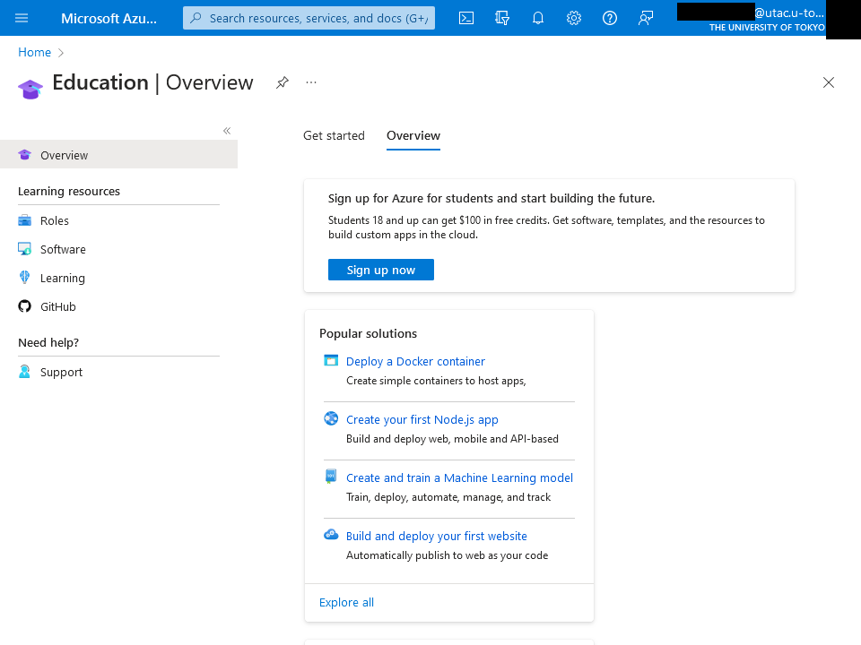
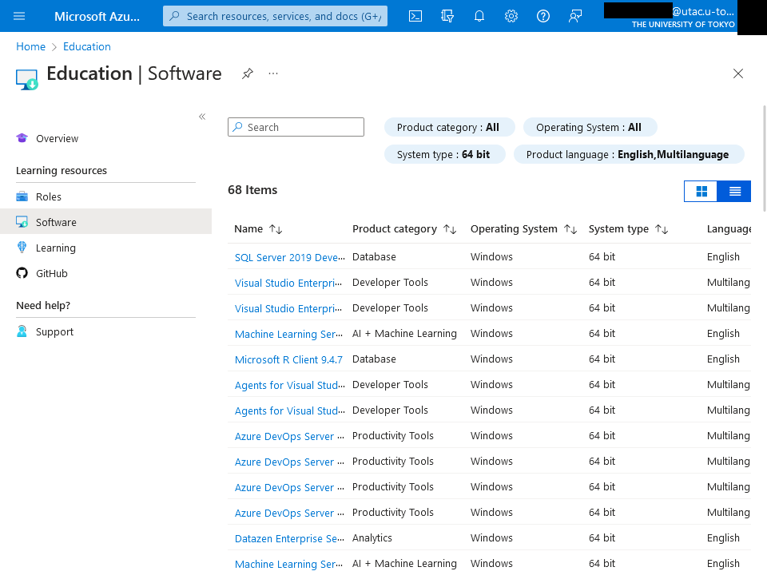

## Overview

"Azure Dev Tools for Teaching" is software for developers offered by Microsoft for educational institutions. It is available at the University of Tokyo based on the contract of [UTokyo Microsoft License](/en/microsoft/). Users are required to comply with the terms by Microsoft.

### Scope of use

- The software can be used only for **development purposes in education and research**.
    - **It cannot be used for administrative or business purposes**. Even for educational/research activities, use for non-development purposes, such as for general PC use, is not permitted.
- Even for educational/research activities, **it is not allowed if the use is considered as commercial purpose**.
- **Students of the University of Tokyo** are eligible to use this service. **Faculty and staff members of the University of Tokyo** who are directly engaged in educational and research activities are also eligible to use this service.
    - No matter which faculty or graduate school you belong to.

## Initial Procedure for Use

1. Access the following Azure Dev Tools for Teaching page below.
    <b class="box center"><a href="https://aka.ms/devtoolsforteaching/">Azure Dev Tools for Teaching</a></b>
1. Press the "Sign In" button.
    {:.border.medium}
1. The sign-in screen will appear if you are not already signed in. Enter your 10-digit Common ID (UTokyo Account username) followed by `@utac.u-tokyo.ac.jp` to indicate your affiliation with UTokyo (e.g., `0123456789@utac.u-tokyo.ac.jp`).
1. After signing in, you will be taken to the "Student Verification" and "Terms" screens sequentially. Follow the instructions on the screen to proceed.
    <figure class="gallery"></figure>
1. Once you reach the "Microsoft Azure" screen, open "Software" from the menu on the left side of the "Education" screen. * If the "Education" screen is not displayed, search it from the search box at the top of the screen.
    {:.border.medium}
1. A list of software will be displayed, so download the software you wish to use.
    {:.border.medium}

## Others

- Inquiries about initial procedure (signing in, downloading, etc.) are accepted at the [Support Desk](/en/support/).
    - The Support Desk cannot provide assistance on how to use the software for developers. Users are expected to solve problems on their own. The help pages of Microsoft may be useful for reference.
- The contents of the service (e.g., the lineup of software for developers) are subject to change according to the contents of the Microsoft service and the contract at the University of Tokyo.
- Azure Dev Tools for Teaching is now available through UTokyo Account from June 2023. You no longer need to create an account using your ECCS Cloud Email address (`@g.ecc.u-tokyo.ac.jp`), which was previously required. Please use your UTokyo Account from now on.
- Microsoft Imagine Premium provided by the Graduate School of Engineering and Graduate School of Information Science and Technology has been transferred to this service along with the launch of this service in April 2019. Please use this service instead.
