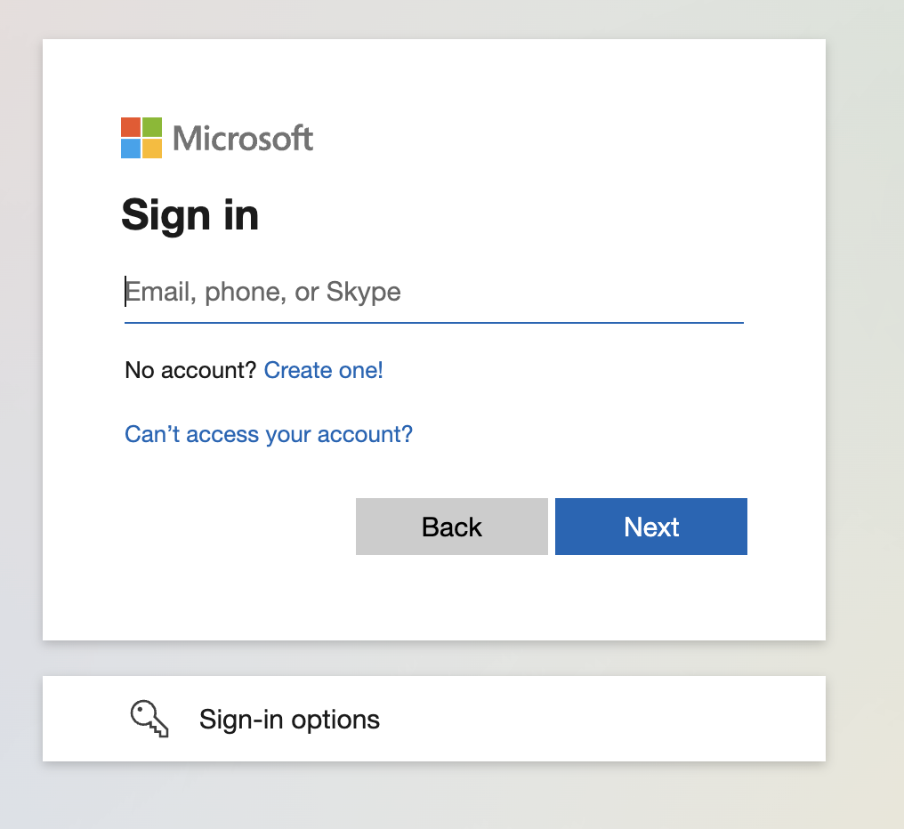

## What is UTokyo Microsoft License?
{:#about}

"UTokyo Microsoft License" provides Microsoft services to UTokyo members. It includes Office software that can be installed on your device, such as Word, Excel, and PowerPoint. For more information, please refer to the [main systems available](#systems).

## Target Users
{:#users}

UTokyo Microsoft License is available to UTokyo members (students and faculty) with a UTokyo Account. However, the specific systems available through UTokyo Microsoft License vary depending on the student's enrollment or faculty registration. Some [main available systems](#systems) are restricted to a limited number of users, and the target users are clearly stated in each section. Conversely, systems that are not specifically mentioned in terms of target users are available to all UTokyo Account holders.

### Cautions in case of leaving or changing affiliation
{:#expire}

If your UTokyo Account expires due to graduation or resignation, you will no longer be able to use the UTokyo Microsoft License systems. As a result, all related data, such as data stored in [OneDrive](#onedrive), will be lost. In addition, due to change in affiliation, you may no longer be able to use some functions that differ depending on your affiliation, such as Office apps. Before graduation, resignation, or change of affiliation, please refer to "[Notice on Account Revocation due to Graduation, Resignation or Change of Affiliation](/en/systems/leave/)" and back up your data.

## Main Systems Available
{:#systems}

Many systems available through UTokyo Microsoft License can be accessed via the following link.

**[Microsoft 365](https://m365.cloud.microsoft/apps/?auth=2)**{:.box.center}

Systems not listed here

Microsoft provides systems other than those listed below, and it is possible to sign in and use them with your UTokyo Account. While we **do not guarantee continuous use** of these systems, we do not prevent their use under **your own responsibility**. Specific risks include the possibility that **a system that was previously available may suddenly become unavailable** due to changes in Microsoft's provision policy. In addition, we **may be unable to provide support** for these systems. Please keep these points in mind when using these systems. If you feel that a particular system is **especially** necessary for education, research, or work, please contact us using the [email form of the utelecon support desk](/en/support/#email-form).

### Microsoft Office applications
{:#office_apps}

**Available only to students and faculty employed by the University of Tokyo**

Office applications that are installed on your device, such as Word, Excel, and PowerPoint. You can use only the latest version of each application. For instructions on how to get started, please refer to the following.

**[Installing Office Applications with UTokyo Microsoft License](./install/)**{:.box.center}

### OneDrive
{:#onedrive}

An online storage service provided by Microsoft. For instructions on how to use it, please refer to the following.

**[OneDrive](./onedrive/)**{:.box.center}

#### Microsoft Office Web Apps
{:#office_web}

To edit files on OneDrive in a web browser, you can use Microsoft Office Web Apps. Word, Excel, PowerPoint, etc. are available, but they do not have as many functions as the installed Office apps.

Possible use cases include the following:
- When minor editing of files on OneDrive is done entirely in the browser
- When someone who is not a [Microsoft Office applications](#office_apps) user uses Office
- When the Office app cannot be installed on the device due to permissions or other reasons

For information on how to create and edit files on OneDrive using Microsoft Office Web Apps, please see **[Basic usage of OneDrive](./onedrive/basic/)**.

### Teams
{:#teams}

**Available only to faculty and staff**

Teams is an application that is used for chats, video meetings and so on. For the instruction of usage, please refer to **[UTokyo Microsoft Teams User Manual (written in only Japanese)](https://univtokyo.sharepoint.com/sites/utokyoportal/wiki/SiteAssets/d/Useful_Tools/%E3%80%8C%E6%9D%B1%E4%BA%AC%E5%A4%A7%E5%AD%A6%E7%89%88_Microsoft_Teams%E5%88%A9%E7%94%A8%E3%83%9E%E3%83%8B%E3%83%A5%E3%82%A2%E3%83%AB%EF%BC%8820210311%EF%BC%89%E3%80%8D.pdf)** (accessible only to faculty and staff).

#### "Team" Function
{:#team_function}

In November 2022, as part of our efforts to "utilize IT tools," in addition to the traditional "teams" based on the hierarchical structure of administrative organizations, it will become possible to use "teams" that can be composed of any members (application required). For manuals, please see below (accessible only to faculty and staff and written in only Japanese).
- **[Teams Administrator Manual](https://univtokyo.sharepoint.com/sites/utokyoportal/wiki/SiteAssets/d/Useful_Tools/Teams%E7%AE%A1%E7%90%86%E8%80%85%E3%83%9E%E3%83%8B%E3%83%A5%E3%82%A2%E3%83%AB.pdf)** (Manual for team administrators, including an explanation of the position of the "team" function at the UTokyo)
- **[About creating and operating Teams](https://univtokyo.sharepoint.com/sites/utokyoportal/wiki/d/IT_Tool_020.aspx )**
- **[About Teams team folders](https://univtokyo.sharepoint.com/sites/utokyoportal/wiki/d/Share_Teams_files.aspx )**
- **[About the Teams Team Folder Storage Capacity Change App](https://univtokyo.sharepoint.com/sites/utokyoportal/wiki/d/Teams_Change_Storage_Limit.aspx)**

### Email System for Staff

{:#email}

**Available only to faculty and staff**

An email account with the domain `@mail.u-tokyo.ac.jp` is provided as a "staff email" (application required). For an explanation of the usage procedure, including how to apply, please see the **[Email System for Staff](https://univtokyo.sharepoint.com/sites/utokyoportal/wiki/d/Email_system_for_staff.aspx)** page on the UTokyo Portal (accessible only to faculty and staff and written in only Japanese).

### Other systems provided by Microsoft
{:#misc}

#### Microsoft Forms
{:#forms}

Microsoft Forms is a system that allows you to create online forms. You can also create forms that are only available to people with a UTokyo Account. For instructions on how to use it, please see **[Microsoft Forms Quick Start](https://support.microsoft.com/ja-jp/office/620daa7a-3e03-4013-8f92-5cce86210ef6)**.

## Sign in to Microsoft systems with UTokyo Account
{:#signin}

To use the systems provided by UTokyo Microsoft License, you need to sign in with your UTokyo Account as a Microsoft account.

If you are asked to sign in as shown in the image below, enter your UTokyo Account (10-digit Common ID + `@utac.u-tokyo.ac.jp`) in the input field and follow the on-screen instructions.

{:.small.center.border}

For detailed instructions and how to distinguish between other Microsoft accounts, please refer to **[Signing in with UTokyo Account](./signin/)**.

## Other licenses provided by Microsoft
{:#related_licenses}

The following introduces licenses related to Microsoft systems available within the University of Tokyo, other than UTokyo Microsoft License.

### UTokyo Microsoft Windows 10 for students
{:#windows}

**Available only to students**

This is a license to upgrade Windows to the Education edition. For instructions on how to use it, please refer to **[Windows Education for students](./windows_education_for_students/)**.

### Microsoft License for shared PCs, etc.
{:#shared_pc}

This is a license for Office and Windows that is operated to cover usage that cannot be covered by the normal provision of Office under UTokyo Microsoft License, such as when you want to use Office apps on a PC that is shared by multiple people rather than being used exclusively by a specific individual. It is mainly intended for use on shared PCs set up in departments, majors, laboratories, etc. For instructions on how to use it, please refer to the **[Microsoft License for shared PCs, etc.](https://univtokyo.sharepoint.com/sites/utokyoaccount/SitePages/Microsoft-license-for-shared-PC.aspx)** page (sign-in with UTokyo Account is required to view).

### UTokyo Microsoft Azure Dev Tools for Teaching
{:#adt4t}

it is a Microsoft developer software license for educational institutions. For instructions on how to use it, please check the **[UTokyo Microsoft Azure Dev Tools for Teaching](adt4t/)** page.
