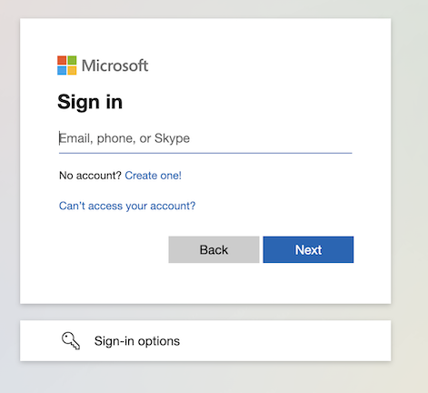

import Microsoft from "@components/en/systems/microsoft/index.mdx";

## はじめに
{:#about}

UTokyo Microsoft Licenseとは，Microsoftの提供するシステムをUTokyo Accountで利用することのできるライセンスです．具体的には，Word，Excel，PowerPointのような，機器にインストールして利用するOfficeソフトウェアなどが含まれます．詳細は[利用可能な主なシステム](#systems)をご覧ください．

## What is UTokyo Microsoft License?
{:#about}

"UTokyo Microsoft License" provides Microsoft services to UTokyo members.

The main features available are listed below.

- Microsoft Office applications such as **Word** and **Excel**
- Office for the web (web version of Microsoft Office)
- **OneDrive**: File storage
- **Microsoft Forms**: Form creation service

For more information, please refer to the [main systems available](#systems).

## 利用対象者
{:#users}

UTokyo Microsoft Licenseは，UTokyo Accountを持つ東京大学の構成員（学生および教職員）に付与されます．ただし，UTokyo Microsoft Licenseで具体的に利用可能なシステムは学籍や人事上の登録によって異なります．[利用可能な主なシステム](#systems)のうち，利用対象者が限定されているシステムについてはそれぞれの節で対象者を明示しています．逆に，挙げられているシステムのうち対象者についての記載がないものは，UTokyo Accountを持つ全員が使えるシステムです．

## Target Users
{:#users}

UTokyo Microsoft License is available to UTokyo members (students and faculty) with a UTokyo Account. However, the specific systems available through UTokyo Microsoft License vary depending on the student's enrollment or faculty registration. For [available systems](#systems) with limited users, the target users are clearly stated in each section. Conversely, systems that are not specifically mentioned in terms of target users are available to all UTokyo Account holders.

### UTokyo Accountが失効した場合
{:#expire}

離籍や所属変更によって UTokyo Account が失効した場合，UTokyo Microsoft Licenseのシステムは利用できなくなります．これに伴い，[OneDrive](#onedrive)に保存されたデータなどの関連するデータはすべて失われます．離籍や所属変更の前には，[卒業・退職や所属変更によるアカウント失効についての注意](/systems/leave/)を確認のうえデータのバックアップを取ってください．

### When UTokyo Account Expires
{:#expire}

If your UTokyo Account expires due to graduation, withdrawal, or change of affiliation, you will no longer be able to use the UTokyo Microsoft License systems. As a result, all related data, such as data stored in [OneDrive](#onedrive), will be lost. Before graduation, withdrawal, or change of affiliation, please refer to [Important Notes on Account Expiration Due to Graduation, Withdrawal, or Change of Affiliation](/systems/leave/) and back up your data.

## 利用可能な主なシステム
{:#systems}

UTokyo Microsoft Licenseで利用可能なシステムの多くは，以下のリンクからアクセスすることができます．

**[Microsoft 365](https://www.microsoft365.com/login)**{:.box.center}

以下では，UTokyo Microsoft Licenseにより利用可能な個別のシステムについて説明します．

ここに掲載されていないシステムについて

Microsoftは下記以外のシステムも提供しており，それらについてUTokyo Accountでサインインして利用できるようになっていることがあります．このようなシステムについて，**継続的な利用を保証することはしていない**ものの，**各自の責任の下**での利用を妨げるような取り扱いはしていません．具体的なリスクとしては，Microsoftによる提供ポリシーの変更により**今まで使えていたシステムが突然使えなくなる**可能性などが考えられます．また，このようなシステムについては**サポート窓口での対応をいたしかねる**場合があります．利用の際はこういったことを十分に念頭に置いてください．もし，教育・研究・業務上の必要性が**特に**高いと思われるシステムについて利用に関する相談をしたい場合，[サポート窓口のメールフォーム](/support/#email-form)にお越しください．

## Main Systems Available
{:#systems}

Many systems available through UTokyo Microsoft License can be accessed via the following link.

**[Microsoft 365](https://www.microsoft365.com/login)**{:.box.center}

Systems Not Listed Here

Microsoft provides systems other than those listed below, and it is possible to sign in and use them with your UTokyo Account. While we **do not guarantee continuous use** of these systems, we do not prevent their use under **your own responsibility**. Specific risks include the possibility that **a system that was previously available may suddenly become unavailable** due to changes in Microsoft's provision policy. In addition, we **may be unable to provide support** for these systems. Please keep these points in mind when using these systems. If you feel that a particular system is **especially** necessary for education, research, or work, please contact us using the [support form](/en/support/#email-form).

### Officeアプリ
{:#office_apps}

**学生および東京大学に雇用されている教職員のみが利用できます**

Word，Excel，PowerPointなど，機器にインストールして利用するOfficeアプリです．それぞれのアプリの最新版のみを利用することができます．利用開始の手順については以下をご覧ください．

**[UTokyo Microsoft LicenseでOfficeアプリをインストールする](install)**{:.box.center}

### Microsoft Office applications
{:#office_apps}

**Available only to students and faculty employed by the University of Tokyo**

Office applications that are installed on your device, such as Word, Excel, and PowerPoint. You can use only the latest version of each application. For instructions on how to get started, please refer to the following.

**[Installing Office Applications with UTokyo Microsoft License](install)**{:.box.center}

### OneDrive
{:#onedrive}

Microsoftが提供するオンラインストレージです．利用手順などの説明は以下をご覧ください．

### OneDrive
{:#onedrive}

An online storage service provided by Microsoft. For instructions on how to use it, please refer to the following.

**[OneDrive](./onedrive/)**{:.box.center}

#### Web版Office
{:#office_web}

Webブラウザ上でOneDrive上にあるファイルを編集するには，Web版Officeを使用します．Word，Excel，PowerPointなどが利用できますが，インストールして利用するOfficeアプリと比べると機能は多くありません．

ユースケースとしては，以下のようなものが考えられます．
- OneDrive上のファイルについて，軽微な編集をブラウザ上で完結させて行う場合
- [Officeアプリの利用対象者](#office_apps)でない方がOfficeを利用する場合
- 権限などの理由により，機器にOfficeアプリをインストールできない場合

Web版Officeを利用してOneDrive上でファイルを作成・編集する方法については**[OneDriveの基本的な使い方](onedrive/basic)**をご覧ください．

#### Office web apps

To edit files on OneDrive in a web browser, you can use Office web apps. Word, Excel, PowerPoint, etc. are available, but they do not have as many functions as the installed Office apps.

Possible use cases include the following:
- When minor editing of files on OneDrive is done entirely in the browser
- When someone who is not an [Office app user](#office_apps) uses Office
- When the Office app cannot be installed on the device due to permissions or other reasons

For information on how to create and edit files on OneDrive using Office web apps, please see **[Basic usage of OneDrive](onedrive/basic)**.

### Teams
{:#teams}

**教職員のみが利用できます**

チャットやビデオ会議などができるビジネスコミュニケーションツールです．利用手順などの説明は**[UTokyo Microsoft Teams User Manual (written in Japanese only)](https://univtokyo.sharepoint.com/sites/utokyoportal/wiki/SiteAssets/d/Useful_Tools/%E3%80%8C%E6%9D%B1%E4%BA%AC%E5%A4%A7%E5%AD%A6%E7%89%88_Microsoft_Teams%E5%88%A9%E7%94%A8%E3%83%9E%E3%83%8B%E3%83%A5%E3%82%A2%E3%83%AB%EF%BC%8820210311%EF%BC%89%E3%80%8D.pdf)**をご覧ください（教職員のみアクセス可）．

### Teams
{:#teams}

**Available only to faculty**

Teams is an application that is used for chats, video meetings and so on. For the instruction of usage, please refer to **[UTokyo Microsoft Teams User Manual (written in Japanese only)](https://univtokyo.sharepoint.com/sites/utokyoportal/wiki/SiteAssets/d/Useful_Tools/%E3%80%8C%E6%9D%B1%E4%BA%AC%E5%A4%A7%E5%AD%A6%E7%89%88_Microsoft_Teams%E5%88%A9%E7%94%A8%E3%83%9E%E3%83%8B%E3%83%A5%E3%82%A2%E3%83%AB%EF%BC%8820210311%EF%BC%89%E3%80%8D.pdf)** (accessible only to faculty and staff).

#### 「チーム」機能
{:#team_function}

2022年11月に，「ITツールの利活用」の取り組みの一環として，事務組織の階層構造に基づく従来までの「チーム」に加えて，任意のメンバーで構成可能な「チーム」の利用が可能になりました（要申請）．マニュアル類に関しては以下をご覧ください（教職員のみアクセス可）．
- **[Teams管理者マニュアル](https://univtokyo.sharepoint.com/sites/utokyoportal/wiki/SiteAssets/d/Useful_Tools/Teams%E7%AE%A1%E7%90%86%E8%80%85%E3%83%9E%E3%83%8B%E3%83%A5%E3%82%A2%E3%83%AB.pdf)**（東京大学における「チーム」機能の立ち位置に関する説明を含んだ，チームの管理者向けのマニュアル）
- **[Teamsチームの作成と運用について](https://univtokyo.sharepoint.com/sites/utokyoportal/wiki/d/IT_Tool_020.aspx )**
- **[Teamsチームフォルダについて](https://univtokyo.sharepoint.com/sites/utokyoportal/wiki/d/Share_Teams_files.aspx )**
- **[Teamsチームフォルダ　ストレージ容量変更アプリについて](https://univtokyo.sharepoint.com/sites/utokyoportal/wiki/d/Teams_Change_Storage_Limit.aspx)**

#### "Team" Function
{:#team_function}

In November 2022, as part of our efforts to "utilize IT tools," in addition to the traditional "teams" based on the hierarchical structure of administrative organizations, it will become possible to use "teams" that can be composed of any members (application required). For manuals, please see below (accessible only to faculty and staff).
- **[Teams Administrator Manual](https://univtokyo.sharepoint.com/sites/utokyoportal/wiki/SiteAssets/d/Useful_Tools/Teams%E7%AE%A1%E7%90%86%E8%80%85%E3%83%9E%E3%83%8B%E3%83%A5%E3%82%A2%E3%83%AB.pdf)** (Manual for team administrators, including an explanation of the position of the "team" function at the UTokyo)
- **[About creating and operating Teams](https://univtokyo.sharepoint.com/sites/utokyoportal/wiki/d/IT_Tool_020.aspx )**
- **[About Teams team folders](https://univtokyo.sharepoint.com/sites/utokyoportal/wiki/d/Share_Teams_files.aspx )**
- **[About the Teams Team Folder Storage Capacity Change App](https://univtokyo.sharepoint.com/sites/utokyoportal/wiki/d/Teams_Change_Storage_Limit.aspx)**

### 職員メール
{:#email}

**教職員のみが利用できます**

「職員メール」として，`@mail.u-tokyo.ac.jp`のドメインのメールアカウントが提供されています（要申請）．申請方法を含む利用手順などの説明はUTokyo Portalの**[職員メールシステム](https://univtokyo.sharepoint.com/sites/utokyoportal/wiki/d/Email_system_for_staff.aspx)**のページをご覧ください（教職員のみアクセス可）．

### Email System for Staff

{:#email}

**Available only to faculty**

An email account with the domain `@mail.u-tokyo.ac.jp` is provided as a "staff email" (application required). For an explanation of the usage procedure, including how to apply, please see the **[Email System for Staff](https://univtokyo.sharepoint.com/sites/utokyoportal/wiki/d/Email_system_for_staff.aspx)** page on the UTokyo Portal (accessible only to faculty and staff).

### Microsoftが提供するその他のシステム
{:#misc}

### Other systems provided by Microsoft
{:#misc}

#### Microsoft Forms
{:#forms}

オンラインフォームを作成することのできるシステムです．UTokyo Accountを持つ人限定に公開するフォームを作ることもできます．利用手順などの説明は**[Microsoft Forms クイック スタート](https://support.microsoft.com/en-us/office/sign-in-to-microsoft-forms-620daa7a-3e03-4013-8f92-5cce86210ef6)**をご覧ください．

#### Microsoft Forms
{:#forms}

Microsoft Forms is a system that allows you to create online forms. You can also create forms that are only available to people with a UTokyo Account. For instructions on how to use it, please see **[Microsoft Forms Quick Start](https://support.microsoft.com/ja-jp/office/620daa7a-3e03-4013-8f92-5cce86210ef6)**.

## UTokyo AccountでMicrosoftのシステムにサインインする
{:#signin}

UTokyo Microsoft Licenseで提供されるシステムを利用するには，UTokyo AccountをMicrosoftアカウントとして用いてサインインする必要があります．

以下の画像のようにサインインを要求された場合には，入力欄に「10桁の共通ID＋`@utac.u-tokyo.ac.jp`」を入力して，画面の指示に従って続けてください．

{:.small.center.border}

詳しい手順や，他のMicrosoftアカウントとの使い分けに関しては，「[UTokyo Accountを用いてMicrosoftのシステムにサインインする](signin)」を参照してください．

## Microsoftが提供するその他のライセンス
{:#related_licenses}

以下では，UTokyo Microsoft License以外の，学内で利用可能なMicrosoftのシステムに関わるライセンスを紹介しています．

### UTokyo Microsoft Windows 10 for students
{:#windows}

**学生のみが利用できます**

WindowsをEducationエディションにアップグレードするライセンスです．利用手順などの説明は**[Windows Education for students](windows_education_for_students)**のページをご覧ください．

### 共用PC等向けMicrosoftライセンス
{:#shared_pc}

特定の個人が専有して利用するPCではなく複数人で共用するPCでOfficeアプリを利用したい場合など，UTokyo Microsoft Licenseでの通常のOfficeの提供形態でカバーできない利用に対応するために運用しているOfficeおよびWindowsのライセンスです．主に学科・専攻や研究室等で整備した共用PCでの利用を想定しています．利用手順などの説明は**[共用PC等向けMicrosoftライセンス](https://univtokyo.sharepoint.com/sites/utokyoaccount/SitePages/Microsoft-license-for-shared-PC.aspx)**のページをご覧ください（閲覧にはUTokyo Accountでのサインインが必要です）．

### UTokyo Microsoft Azure Dev Tools for Teaching
{:#adt4t}

Microsoftの教育機関向けの開発者用ソフトウェアライセンスです．利用手順などの説明は**[UTokyo Microsoft Azure Dev Tools for Teaching](adt4t)**のページをご覧ください．

### UTokyo Microsoft Azure Dev Tools for Teaching
{:#adt4t}

it is a Microsoft developer software license for educational institutions. For instructions on how to use it, please check the **[UTokyo Microsoft Azure Dev Tools for Teaching](adt4t)** page.

By signing in as a member of UTokyo, you can set up sharing to be limited to UTokyo members, which is not possible with a regular Microsoft account. In order to access such pages, even those who already have a Microsoft account need to set up an account as a UTokyo member.

## Initial Setup Procedures

[UTokyo Account](/en/utokyo_account/) is required to use this service. If you have not yet set up your UTokyo Account, please check “[How to start using UTokyo Account](/en/utokyo_account/#procedures)” first.

<Microsoft variant="individual" />
