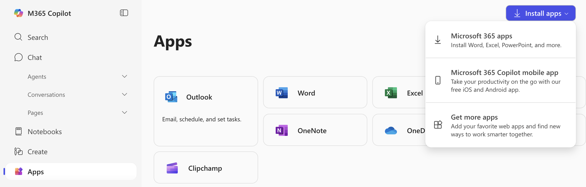
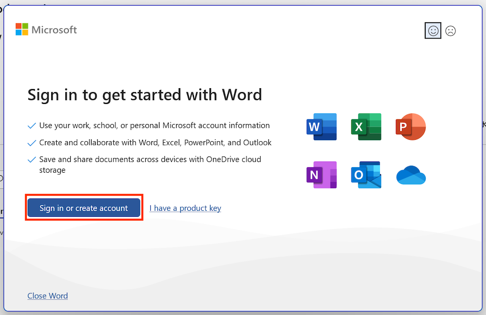
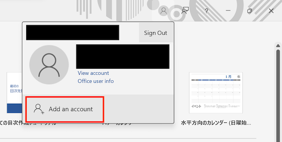
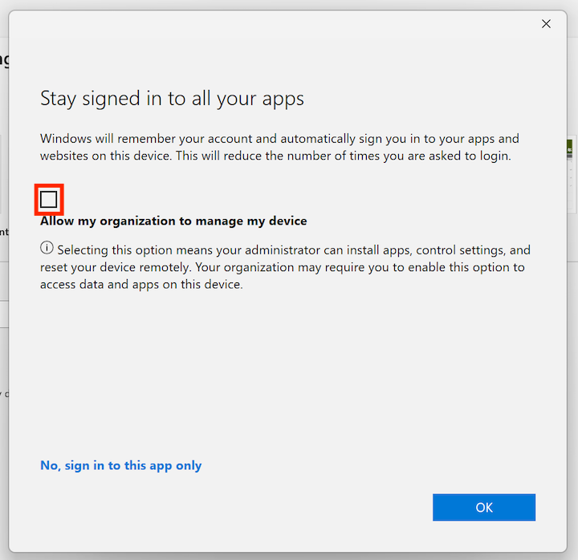
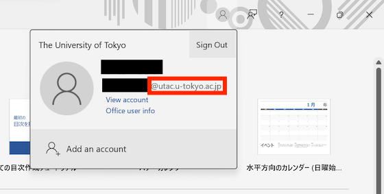

import HelpItem from "@components/utils/HelpItem.astro";

## About
{:#about}

This page explains how to install and use Office apps that are part of the UTokyo Microsoft License.

## Cautions
{:#caution}

- **Office apps that are installed on a PC can only be used by students and faculty members employed by the University of Tokyo**.
- You can install the apps on up to 5 PCs.
- You need to connect to the internet at least once every 30 days for license authentication. The license authentication is done automatically when you are connected to the internet, so you do not need to perform any special operations.

## Usage
{:#usage}

The following explains how to use Office apps. The procedure is divided into two parts: **[Installing the app on a PC](#install)** and **[Signing in with UTokyo Account](#signin)**. To start using the apps, you need to complete both of these steps.

### Install
{:#install}

1. Access the following Microsoft 365 Home and sign in with your UTokyo Account.
  **[Microsoft 365 Home](https://portal.office.com/?auth=2)**{:.box.center}
  For the sign-in procedure, see **[Signing in with UTokyo Account](#signin)**.
1. Click "Install and more" at the top right of Microsoft 365 Home and then click "Install Microsoft 365 Apps" in the menu that appears.
    <HelpItem lang="en" type={"details"}>
    <Fragment slot="problem">If "Install Microsoft 365 Apps" is not displayed</Fragment>
    <Fragment slot="solution">You are not a [target user](#caution). If you need to use Office, one alternative is to use [Microsoft Office Web Apps](./#office_web).
    If you believe you are a target user but "Microsoft 365 Apps" is not displayed, please check with the office of your faculty or department (students should contact the academic affairs office, and faculty and staff should contact the personnel office) to confirm that your student or personnel registration is correct.</Fragment>
    </HelpItem>
    

1. The subsequent steps may vary. The installation may proceed automatically, or you may need to press a confirmation button or open the downloaded file yourself.
1. Once the installation is complete, you are finished. Proceed to the next step "[Sign in](#signin)."

### Sign in
{:#signin}

1. Please select and launch one of the installed Office apps, such as Word, Excel, or PowerPoint. The following explains using Word as an example.
1. Please check the displayed screen and follow the instructions below.
    - If the following dialog is displayed
      {:.medium}
      You are not signed in with any Microsoft account in the Office app. Please click "Sign in or create an account."
    - If the above screen is not displayed and the normal editing screen is displayed
      You are signed in with a Microsoft account in the Office app. Click the person icon in the upper right and check the account you are currently signed in with. If you are signed in with a different account other than UTokyo Account, select "Add an account."
      {:.small}
1. The same sign-in screen as during [installation](#install) will be displayed, so please sign in.
1. If you are using a Windows device, you may see a dialog that says "Stay signed in to all apps." It has been confirmed that depending on the settings here, an error message may occur while using an Office app. To prevent this, please answer the following questions.
    **Uncheck the box** that says "Allow my organization to manage my device." Next, if you want to automatically sign in to Microsoft systems other than Office apps (such as OneDrive) with your UTokyo Account, select "OK." If you only want to sign in to Office apps with your UTokyo Account, select "No, sign in to this app only."
    <HelpItem lang="en" type={"details"}>
    <Fragment slot="problem">If you make a different choice than above</Fragment>
    <Fragment slot="solution">Error messages (error code: 80180018, etc.) may appear while using an Office app. This error occurs because the management settings for your UTokyo Account do not match the operation of the Office app, and does not have any negative effects on your device, other software, or saved data, so you can ignore it if you are able to use the Office app without any problems. On the other hand, if you find such error messages annoying, or if you are unable to use the Office app due to an error in the first place, you can follow the steps below to correct the settings above and prevent such errors from occurring.</Fragment>
    1. Please close all Office applications such as Word and Excel.
    1. Please open the "Settings" app on Windows (the gear icon in the lower left of the start menu).
    1. In the settings menu, select "Accounts" > "Access work or school."
    1. If "UTokyo Account" is displayed on the "Access work or school" screen, please open the pull-down menu and select "Disconnect."
    1. Please restart the Office app and sign in again.
    </HelpItem>
    {:.small}
1. Please click the person icon in the upper right and check that you are signed in with UTokyo Account.
    {:.small}
