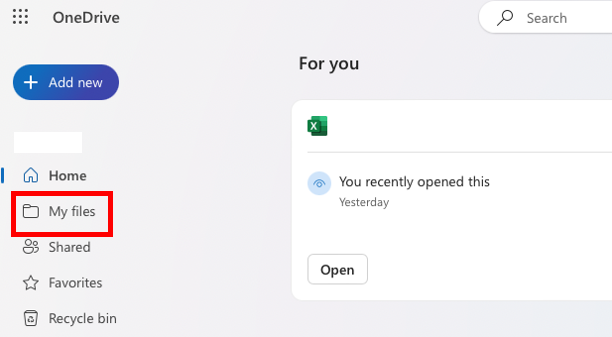
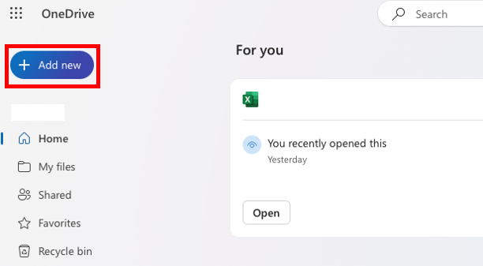
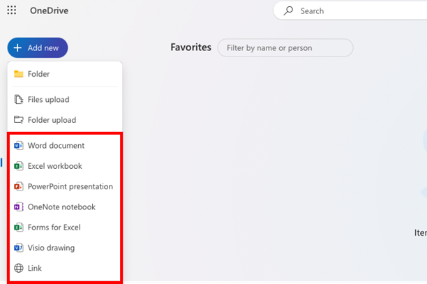
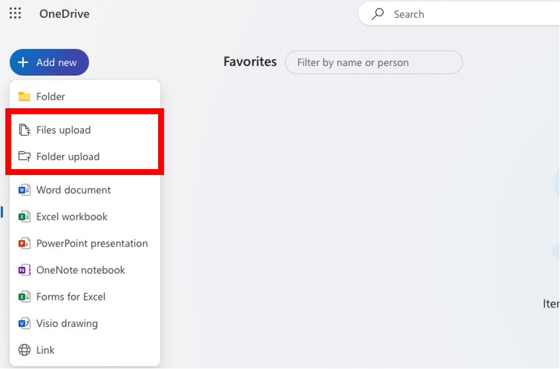
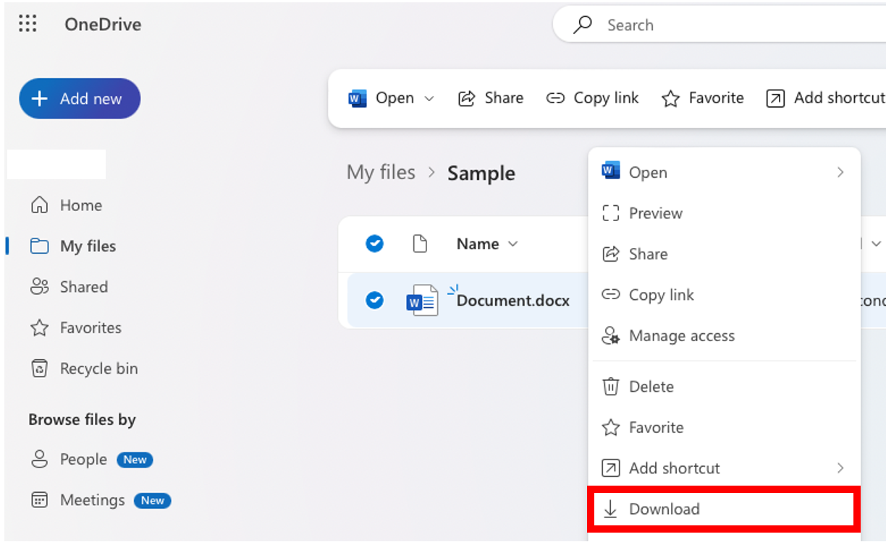
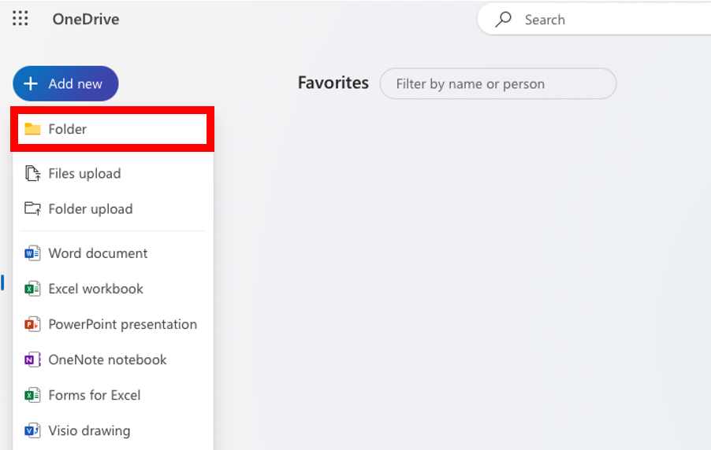
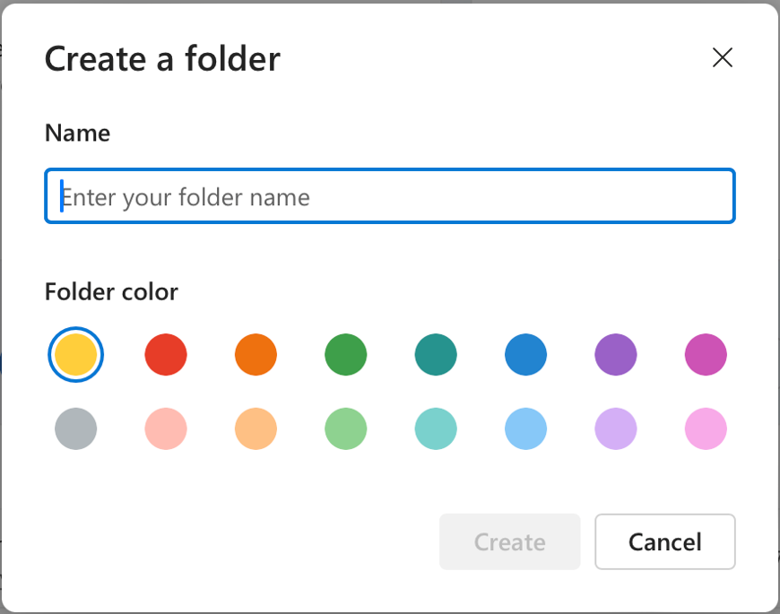
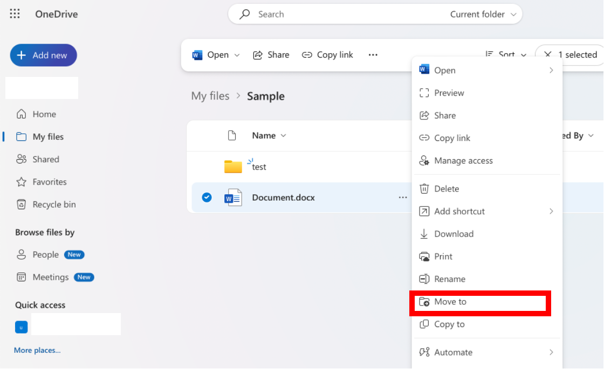
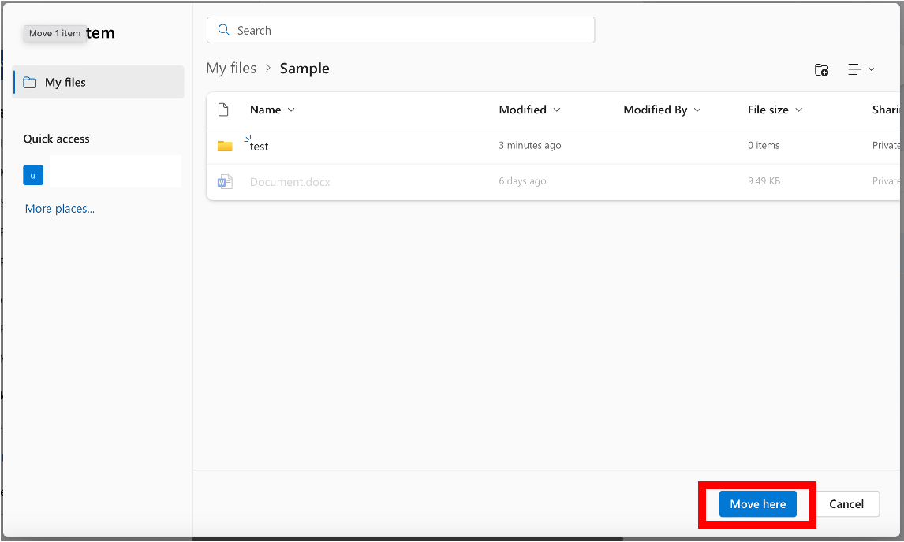

## Introduction 
On this page, the specific procedures for handling files stored in OneDrive will be explained. 

Furthermore, general information on how to use OneDrive can be found in [“OneDrive”](.././), and instructions on how to share files can be found in [“Sharing files with OneDrive” (an English translation is planned)](../share/). Please refer to them for more information. 

## How to access your files
In this section, we will explain how to access the folders in which files are stored on OneDrive. 

On the top page of OneDrive (the “Home” page), some of the files stored in OneDrive are displayed regardless of the folders they belong to and do not reflect the hierarchical structure of the folders. Therefore, to navigate to the desired file via folders, you need to follow the steps below. 

1. Please click the “My files” button in the menu on the left side of the screen. 
    - “My files” is the top-level folder in OneDrive. {:.medium.center}
1. Please move to the folder where the desired file is stored. 
    - To move to a folder within the folder that is currently displayed, please click on the corresponding folder name.
    - To move to a folder located in the level above the folder that is currently displayed, please click the folder name displayed in the breadcrumb list at the top of the screen. 

## How to create files
In this section, we will explain how to create files in OneDrive. 

Files that can be created in OneDrive are limited to those with the standard formats used in Office applications such as Word and Excel. The main file formats that can be created are the following:  

- Word documents (file extension `.docx`)
- Excel workbooks (file extension  `.xlsx`)
- PowerPoint presentations (file extension `.pptx`)

Created files can be edited using the web-based versions of the Office applications. 

The steps are as follows.  

1. Please move to the folder where you wish to create the files. 
1. Please click on the “Add new” button at the top of the screen. {:.medium.center}
1. A list of file formats is displayed. Please choose the file format you wish to create.{:.medium.center}
1. The file will be created, and the web-based Office application corresponding to the file format you chose will open as a new tab.
    - You can use the Office application that has opened to directly edit the file.

In addition, files created with the web-based Office applications will be automatically saved on OneDrive. With the help of this feature, you can directly create files using the web-based Office applications instead of OneDrive.

## How to edit files
In this section, we will explain how to edit files in OneDrive.

Files stored on OneDrive that are compatible with Office applications like Word and Excel can be edited using the web-based Office applications. 

1. Please move to the folder where the file you wish to edit is located. 
1. Please click on the name of the file that you wish to edit. The corresponding web-based Office application will be displayed as a new tab, where you will be able to edit the file.

## How to upload files
In this section, we will explain how to upload files to OneDrive. 

1. Please move to the folder where you wish to upload your files. 
1. Please click on the “Add new” button at the top of the screen.{:.medium.center}
1. Please choose “Files upload” if you wish to upload a single file. If you wish to upload all the files in a folder, please choose “Folder upload”. {:.medium.center}
1. A screen where you can select files will open. Please choose the file or folder you wish to upload. 
1. The file or folder will be uploaded. 

## How to download files 
In this section, we will explain how to download files from OneDrive. 

1. Please move to the folder containing the file you wish to download. 
1. Please right-click the file you wish to download and select “Download”.{:.medium.center}
    - You can also download multiple files in batches. Hover over the file you wish to download, then turn on the checkbox displayed on the left of the icon for each file. After that, please click “Download” at the top of the screen. (If the “Download” button is not visible, please click the three-dot icon at the top of the screen.) The files will be downloaded in a compressed `.zip` format. 
1. The files will be downloaded. In some cases, a screen may appear asking you to choose the destination folder for the download.

## How to create folders
In this section, we will explain how to create folders on OneDrive.

1. Please move to the folder where you wish to create a new folder.
1. Please click on the “Add new” button at the top of the screen and choose the “Folder” button.{:.medium.center}
1.A screen titled “Create a folder” will be displayed. Please enter the name for the new folder.{:.medium.center}
1. Please click on “Create” at the bottom of the screen. The new folder will be created. 

## How to move files 
In this section, we will explain how to change the folder where files are stored on OneDrive.

1. Please right-click the file you wish to move and select “Move to”. {:.medium.center}
    - You can also move multiple files in batches. Hover over the file you wish to move, then turn on the checkbox displayed on the left of the icon for each file. After that, please click “Move to” at the top of the screen. (If the “Move to” button is not visible, please click the three-dot icon at the top of the screen). 
1. A screen asking you to select a folder will be displayed. Please move to the folder to where you wish to move the file.
1. Please click “Move here” at the bottom of the screen. The file will be moved to the folder you chose. {:.medium.center}
