## Introduction
This page explains the specific procedures and settings for sharing files stored in OneDrive with others.

General information on using OneDrive can be found in “[OneDrive](../)”, and instructions on how to create, edit, upload, and download files can be found in “[Basic Usage of OneDrive](../basic/)”. Please refer to these pages as well.

In addition, please refer as necessary to “**[Recommended Usage for Sharing Files on OneDrive](../recommendation/)**”, which explains recommended ways to share files according to different cases, and “[Guideline For Sharing New Files on Cloud]( /articles/share-policy/) (in Japanese)”, which describes ways to improve productivity and security as a proposed file sharing policy.

## Sharing Files and Folders
You can share files with others by creating a **shared link** for a file or folder on OneDrive. In other words, by sending the shared link you created to the person you want to share the file with, that person can view or edit the file via the shared link.

In particular, if you create a shared link for a folder, all files and folders contained in that folder can be accessed via the link.

### Types of Shared Links That Can Be Created
{:#link-type}

In OneDrive, you can create several different shared links according to combinations of the “**range of users**” to be shared with and the type of “**access rights**”.

#### Range of Users
{:#target}

You can choose the range of users to be shared with from the following three types.

- **Anyone**

    - Anyone can access the file via this link. They do not need to be signed in to a Microsoft account when accessing the file.

    - You must set an **expiration date** for this link. After the expiration date of the shared link has passed, the file can no longer be accessed via this link.

- At the University of Tokyo, the maximum expiration date that can be set is 60 days later.
- You cannot create multiple shared links with different expiration dates.

- You can set a **password** for the shared link. For a shared link with a password, the file cannot be accessed unless the correct password is entered.

- You cannot create multiple shared links with different passwords.
- A shared link that requires a password and a shared link that does not require a password can exist at the same time. For example, even if you create a new shared link that requires a password while a shared link that does not require a password already exists, the latter remains valid.

- **People in The University of Tokyo**

- Only users who are signed in to Microsoft with their UTokyo Account can access the file via this link.
- You cannot set an expiration date or password.

- **People you choose**
- Only the people you specify can access the file via this link.
- You can specify the people to share with by either of the following methods.

- Specify an **internal Microsoft account**: If you specify the internal Microsoft account of the person you want to share with, that person will be asked to sign in to their Microsoft account when they access the link. You can search for Microsoft accounts by entering a name or an email address in the form of a UTokyo Account, which consists of a 10-digit Common ID followed by `@utac.u-tokyo.ac.jp`.
- You can also specify a Microsoft account by entering an email address ending in `@mail.u-tokyo.ac.jp`.
- Specify an **email address**: If you specify the email address of the person you want to share with or an external Microsoft account, a one-time passcode will be sent to that email address when that person accesses the link, and they will be asked to enter the passcode on the confirmation screen.

- You can choose multiple people. You can also create multiple shared links with different recipients.
- You cannot set an expiration date or password.

#### Types of Access Levels
{:#access-level}

#### Types of Access Rights
{:#access-level}

You can choose the access rights from the following four types.

- **Can view**

- Users can view the file, but cannot edit it.
- Only for shared links whose access right is “Can view”, you can also **block download**. With such a link, users can only view the file and cannot save the file locally.
- A shared link that blocks download and a shared link that does not block download can exist at the same time. For example, even if you create a new shared link that blocks download while a shared link that does not block download already exists, the latter remains valid.

- **Can review** (Word documents only)
- In addition to viewing the file, users can suggest edits and add comments (Review mode). They cannot edit the file directly.

- **Can edit**
- Users can both view and edit the file.

- **Can’t download**
- Users can view but cannot download.

#### Link for “Only people with existing access”
{:#existing-access}

In addition to the links described above, which are created by specifying the “range of users” and the “type of access rights”, OneDrive also has a link that can be accessed by all people who are already included in existing shared links (“**Only people with existing access**”).

- The people who can access the file via a link for “Only people with existing access” are as follows.

  - The owner of the file
  - People who have accessed the file via a currently valid shared link
  - People who have been granted access from the “Manage access” screen

- If a user accesses a file via a link for “Only people with existing access”, the user’s access rights follow the access rights of the shared link that has already been created for that user. Therefore, **creating this link does not change users’ access rights**.

	- For example, suppose a user has accessed a file via a shared link whose range of users is “People in The University of Tokyo” and whose access right is “Can view”. If this user accesses the file using a link for “Only people with existing access”, the user cannot edit the file.
 
### Procedures
#### Creating a New Shared Link
{:#create-link}

The procedure for creating a new shared link is as follows.

1. Right-click the file you want to share, and click “Share”.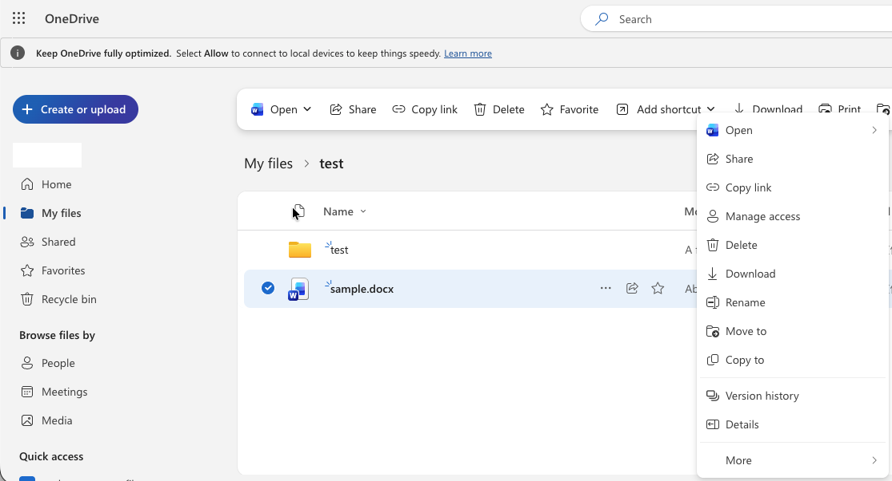{:.medium.center}
	- If you click “Copy link” instead of “Share”, a link for [“People with existing access”](#existing-access), rather than a shared link, will be created automatically. Therefore, we recommend creating links via “Share” instead of “Copy link”.

1. Click the gear icon at the top of the screen.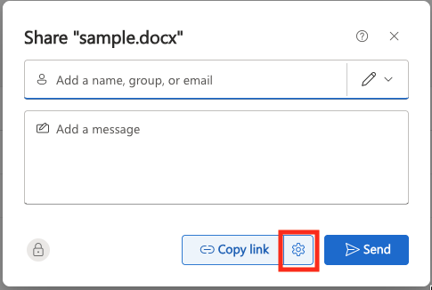{:.medium.center.border}

1. Change the settings of the shared link to be created as necessary. For details on each setting item, see “[Types of Shared Links That Can Be Created](#link-type)”.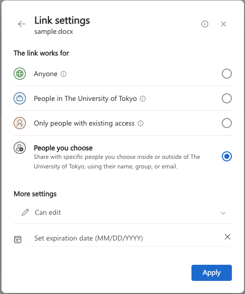{:.medium.center.border}

- “**Share the link with**”: You can set the range of users to be shared with.

- If you select “People with existing access”, you can obtain a link that can be accessed by all people who are already included in existing shared links. For details, see [Link for “People with existing access”](#existing-access).

- “**More settings**”: You can set the type of access rights.

If you want to set an expiration date

- If the range of users to be shared with is “Anyone”, you can set an expiration date for the shared link. Set the expiration date from “Set expiration date” under “More settings”.

If you want to set a password

- If the range of users to be shared with is “Anyone”, you can set a password for the shared link. Enter the password from “Set password” under “More settings”.

If you want to block download

- If the type of access rights is “Can view”, you can prevent the recipients from downloading the file. Turn on the checkbox labeled “Block download” under “More settings”.

1. Click the “Apply” button.

1. If you selected “People you choose” as the range of users to be shared with, specify the recipients in the field labeled “Add a name, group, or email”.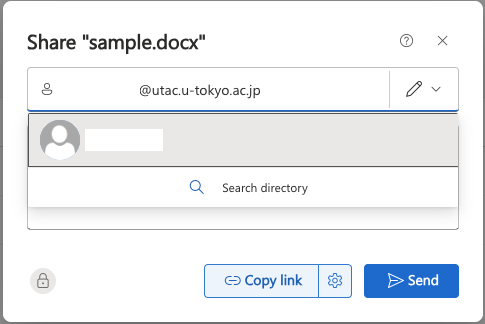{:.medium.center}

- If you specify an internal Microsoft account: Enter a name or an email address in the form of a UTokyo Account, which consists of a 10-digit Common ID followed by `@utac.u-tokyo.ac.jp`, in the field above to search for the account.

- You can also specify a Microsoft account by entering an email address ending in `@mail.u-tokyo.ac.jp`.
        - `@mail.u-tokyo.ac.jp`で終わるメールアドレスを入力することでもMicrosoftアカウントを指定できます．

- If you specify an email address or an external Microsoft account: Enter the email address directly in the field above.

1. Click the “Copy link” button. A new shared link will be created and copied to the clipboard.

#### Checking, Editing, and Deleting Shared Links
The procedure for checking, editing, and deleting shared links that have already been created is as follows.

1. Right-click the file you want to share, and click “Manage access”.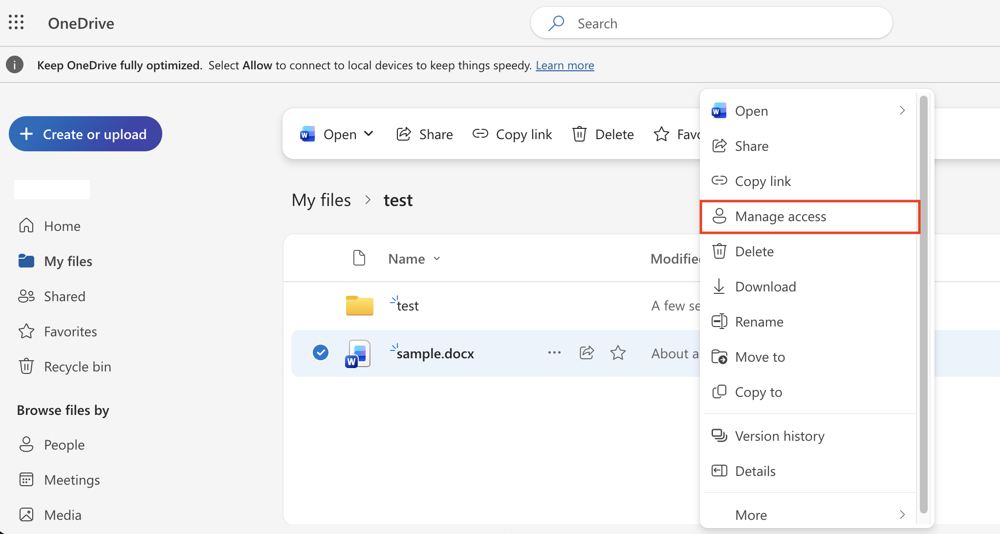{:.medium.center}

1. Click the “Links” tab.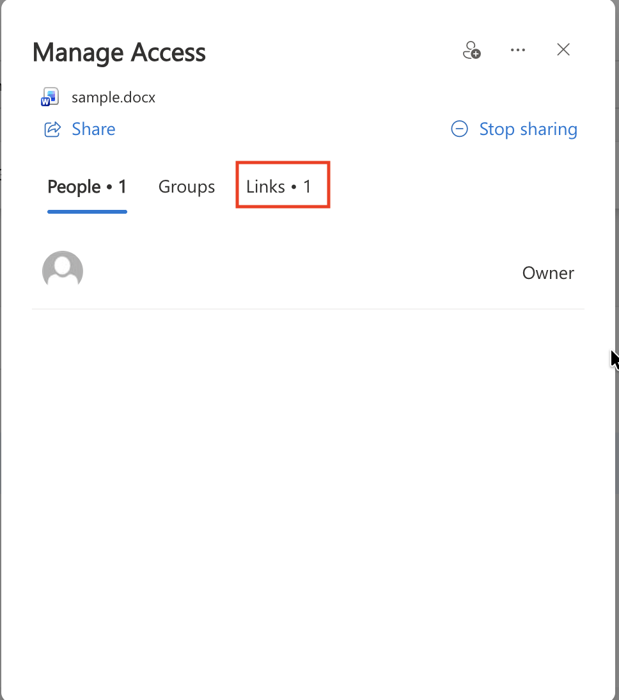{:.medium.center}

1. From this screen, you can check the list of shared links that have already been created, and edit or delete them.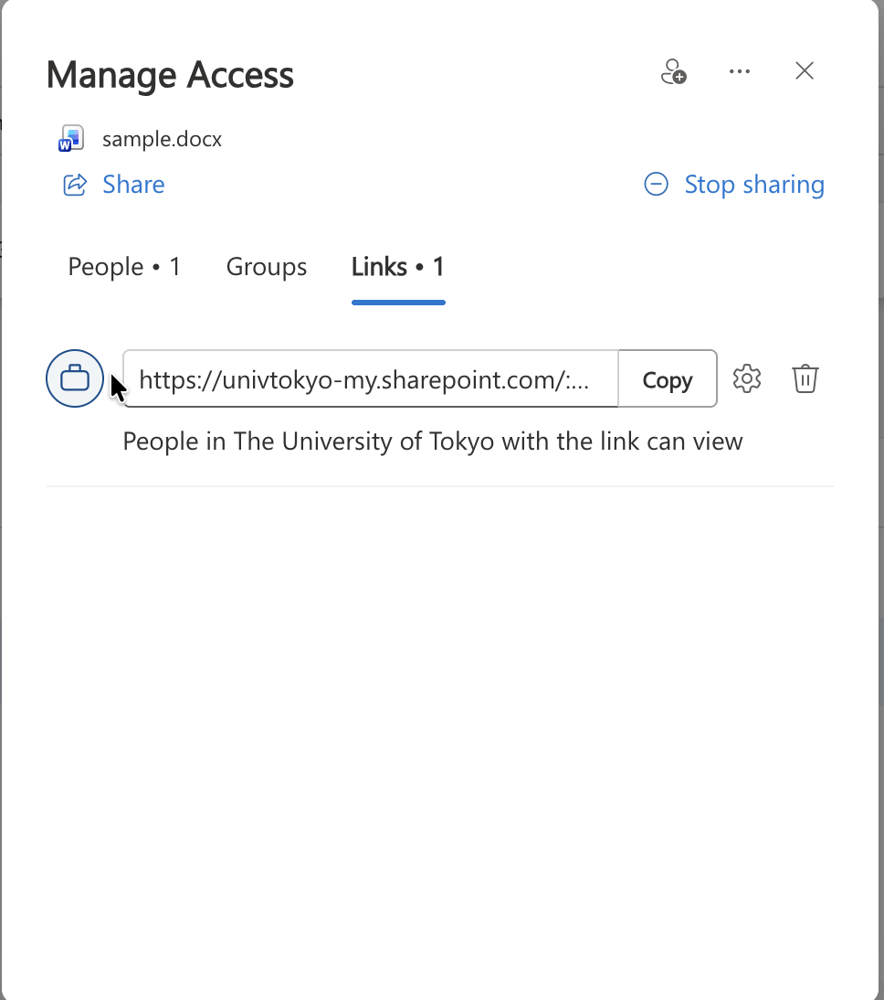{:.medium.center}

- **If you want to change the range of users or the type of access rights**

- You cannot change the range of users to be shared with or the type of access rights. If you want to change the range of users or the type of access rights, you need to delete the shared link and then create a new shared link with different permissions. However, if the range of users to be shared with is “People you choose”, you can exceptionally change the type of access rights.

- **If you want to change the expiration date of a shared link**

- To change the expiration date of a shared link, click the gear icon on the right side of the shared link, and set a new expiration date from “Settings”.

- **If you want to change the users to be shared with**

- For a shared link whose range of users to be shared with is “People you choose”, you can add new target users or remove users while keeping the URL of the link unchanged.

- To add a target user, click the gear icon on the right side of the shared link, and enter the Microsoft account of the user you want to add in the field labeled “Specify who this link works for”.

- To remove a target user, click the gear icon on the right side of the shared link, and click the “×” icon to the right of the user displayed at the bottom of the section labeled “This link works for”.

- **If you want to delete a shared link**
- To delete a shared link, click the trash icon on the right side of the shared link, and then click the “Delete” button. When you delete a shared link, the link becomes invalid, and the file can no longer be accessed via that link.

- **If you want to delete all shared links at once**

- To delete all shared links at once, click “Stop sharing” at the top of the screen, and then click the “Stop sharing” button. This deletes all shared links, and users other than the owner will no longer be able to access the file.

## Receiving Files
{:#file-request-feature}

In OneDrive, you can receive files from others by creating a **file request link** for a folder in advance and asking others to upload files. A person who receives a file request link can upload files to the link creator’s folder by accessing the link.

File request links have the following characteristics.

- A person who accesses a folder via a file request link cannot view or edit other folders contained in the folder.
- Anyone who knows the link can upload files via a file request link. You cannot create a link that limits the range of target users.

- The names of files uploaded via a file request link will have a string identifying the uploader added to the beginning of the original file name.

- If the uploader is signed in to a Microsoft account, the name associated with that account is added to the beginning of the file name. Otherwise, the full name that the uploader is asked to enter when uploading is added to the beginning of the file name.

### Procedures
#### Creating a New File Request Link
{:#create-request-link}

The procedure for creating a new file request link is as follows.

1. Right-click the folder you want to specify as the upload destination, and click “Request files”.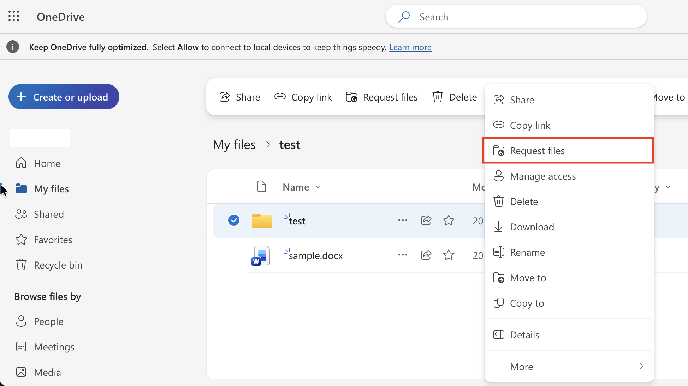{:.medium.center}

1. If necessary, enter a description in the text field, and then click “Next”.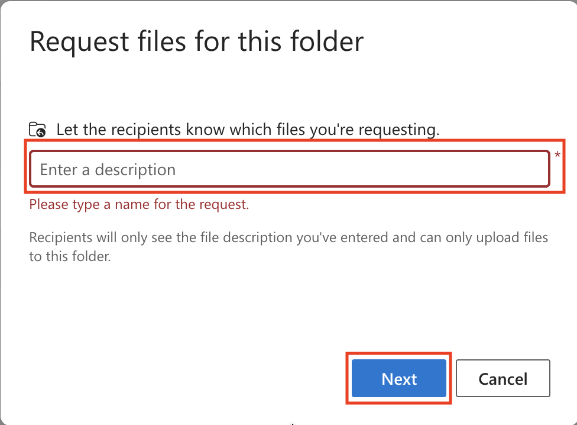{:.medium.center}

- The description you enter will be displayed when the recipient accesses the file request link.

1. Click the “Copy link” button. A new file request link will be created and copied to the clipboard.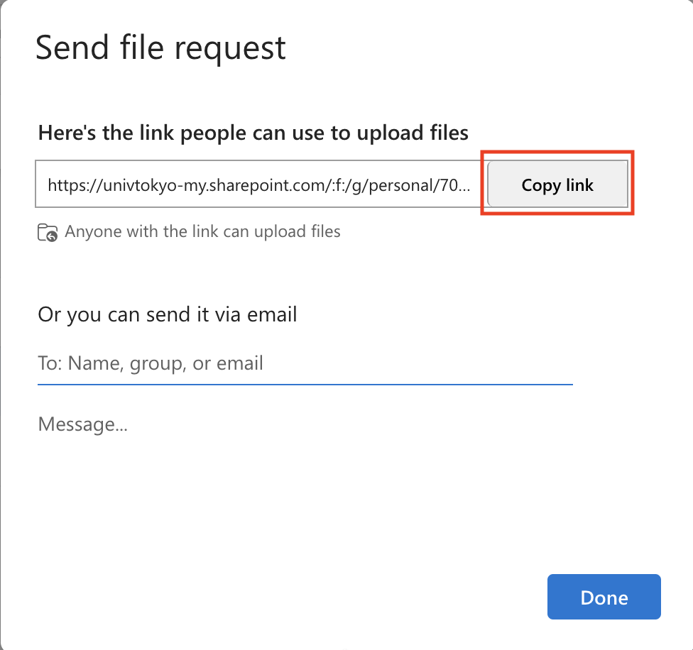{:.medium.center}

#### Checking and Deleting File Request Links

The procedure for checking and deleting file request links that have already been created is as follows.

1. Right-click the folder for which you created the file request link, and click “Manage access”.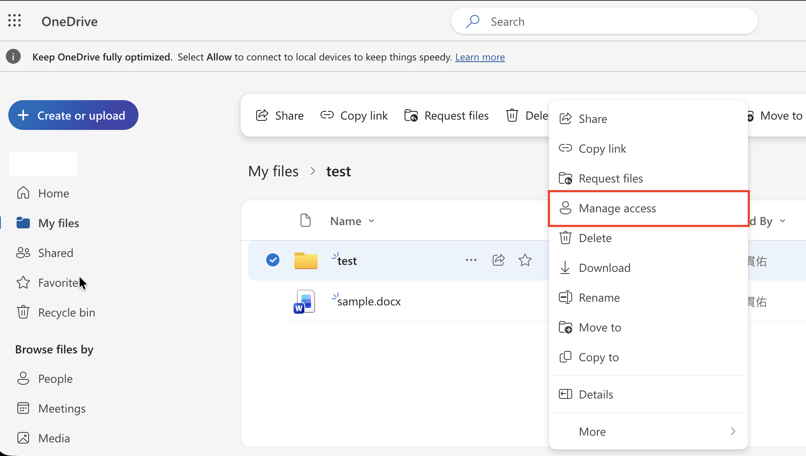{:.medium.center}

1. Click the “Links” tab.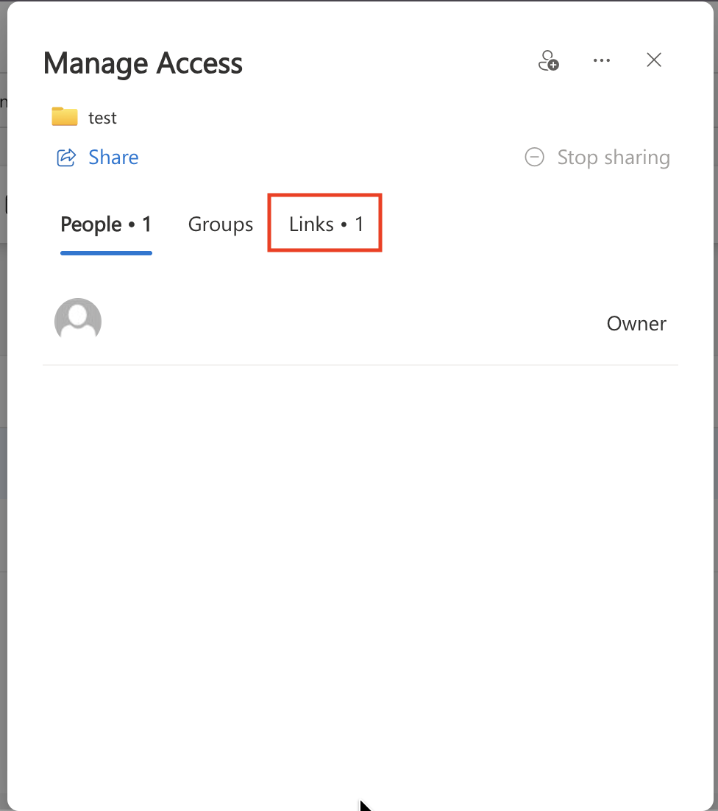{:.medium.center}

1. From this screen, you can check and delete file request links that have already been created.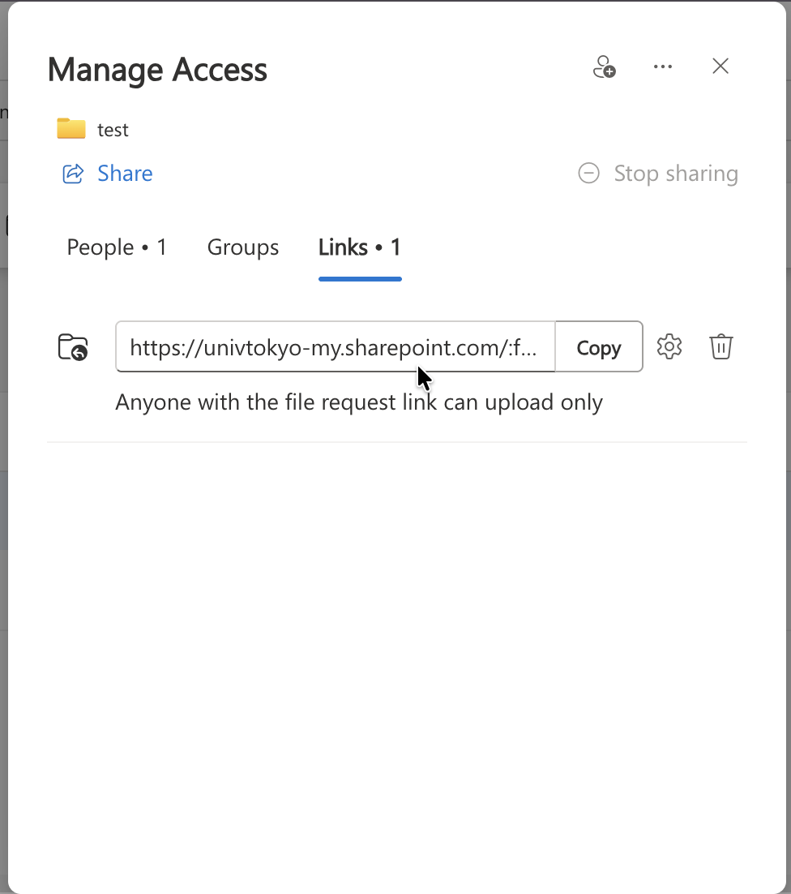{:.medium.center}

- **If you want to delete a file request link**

- To delete a file request link, click the trash icon on the right side of the file request link, and then click the “Delete” button. When you delete a file request link, the link becomes invalid, and files can no longer be uploaded via that link.
