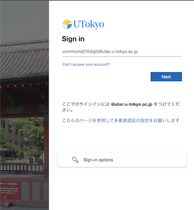

## About
{:#about}

This page explains how to sign in to Microsoft systems using UTokyo Account.

The University of Tokyo provides [UTokyo Microsoft License](../), which allows you to use Microsoft systems with UTokyo Account. If you are prompted to sign in to Microsoft systems using UTokyo Account, please follow the instructions in "[Sign in to Microsoft systems](#instruction)" below.

If you are already signed in with a different Microsoft account and want to switch to UTokyo Account, please refer to "[Switching to UTokyo Account if signed in with a different Microsoft account](#switch_accounts)." In addition, the recommended method for using multiple Microsoft accounts in the same browser is explained in "[Using multiple Microsoft accounts in the same browser](#multiple_accounts)." Please refer to this section if you have two UTokyo Accounts, one for students and one for faculty and staff, or if you want to use your personal or other organization's Microsoft account in addition to UTokyo Account.

For general information about UTokyo Microsoft License and details of available systems, please refer to "[UTokyo Microsoft License](../)."

## Sign in to Microsoft systems
{:#instruction}

This section explains how to sign in using your UTokyo Account if a screen appears requesting you to sign in to the Microsoft system.

When signing in to Microsoft systems using UTokyo Account, contrary to signing in to other systems, you may encounter a sign-in screen that includes the Microsoft logo. In that case, please follow the steps below to sign in. On the other hand, if the screen is not as shown below but a normal sign-in screen (with a picture of Yasuda Auditorium) is displayed, please sign in following "[Sign in to the ICT systems with your UTokyo Account](/en/utokyo_account/#signin)."

<figure class="gallery">

</figure>

1. Please check the displayed screen and follow the instructions below.
    - If **"Sign in"** ("サインイン" in Japanese) is displayed below the Microsoft or the UTokyo logo
        - Enter "10-digit Common ID + `@utac.u-tokyo.ac.jp`" in the input field and click "Next" ("次へ" in Japanese) button.
    - If **"Pick an account"** is displayed below the Microsoft logo
        - If an account with "10-digit Common ID + `@utac.u-tokyo.ac.jp`" is displayed, select that account. If "Signed in" is displayed below the account name, you are already signed in to Microsoft systems with UTokyo Account. By selecting this account, you can continue to use Microsoft systems.
        - If an account with "10-digit Common ID + `@utac.u-tokyo.ac.jp`" is not displayed, click "Use another account," enter "10-digit Common ID + `@utac.u-tokyo.ac.jp`" in the input field, and then click "Next."
2. After the message "Taking you to your organization's sign-in page" is displayed, you will be automatically redirected to the sign-in page with the image of Yasuda Auditorium. Follow the instructions in "[Sign in to the ICT systems with your UTokyo Account](/utokyo_account/#signin)" to sign in.
    

    
Help when this procedure does not work

    - If you see **"Enter a valid email address, phone number, or Skype name."** or **"We couldn't find an account with that username. Try another, or get a new Microsoft account."**
        - The input is incorrect. Please check if you have entered "10-digit Common ID + `@utac.u-tokyo.ac.jp`" correctly.
    - If you see **"That Microsoft account doesn't exist. Enter a different account or get a new one."**
        - You cannot sign in with UTokyo Account on this sign-in page. If you see this screen even though the system supports signing in with UTokyo Account, please contact the [support desk](/en/support/).
    

## Switching to UTokyo Account if signed in with a different Microsoft account
{:#switch_accounts}

This section explains the procedure for signing in to the Microsoft system with your UTokyo Account if you are already signed in with other Microsoft accounts.

1. Please click the person icon at the top right of the screen of the Microsoft system you are using.
    - The appearance of the icon may vary depending on the system you are using.
2. A pull-down menu will appear, so follow the steps below.
    - If the UTokyo Account you want to sign in with is displayed
        - Select the displayed account name and follow the on-screen instructions to sign in. Depending on the situation, you may be asked to confirm your identity with multi-factor authentication (MFA) or be redirected to the sign-in page with the image of Yasuda Auditorium. For detailed sign-in instructions, please refer to "[Sign in to the ICT systems with your UTokyo Account](/en/utokyo_account/#signin)."
    - If the UTokyo Account you want to sign in with is not displayed
        - Click "Sign in with another account." Then, the sign-in screen with the Microsoft logo will be displayed. Follow the instructions in "[Sign in to Microsoft systems](#instruction)" to sign in.
            

                
If "Sign in with another account" is not displayed

                Click "Sign out" to sign out of the currently signed-in Microsoft account, and then sign in again with UTokyo Account.
            

If the above steps do not work, please try the methods "[using incognito browsing](#secret_browsing)" or "[using multiple profiles](#profiles)" described in "[Using multiple Microsoft accounts in the same browser](#multiple_accounts)."

## Using multiple Microsoft accounts in the same browser
{:#multiple_accounts}

If you have been given two UTokyo Accounts, one for students and one for faculty and staff, or if you have a personal or organizational Microsoft account in addition to your UTokyo Account, using multiple Microsoft accounts in the same browser may cause account switching to not function properly.

Instead of using a different browser for each Microsoft account to avoid this issue, you can use multiple Microsoft accounts in the same browser by using the browser's incognito browsing function or using multiple profiles.

### Using incognito browsing
{:#secret_browsing}

If you want to temporarily use a different Microsoft account, it is convenient to use the incognito browsing function of your browser.

Incognito browsing is a function that allows you to use the browser without having the browser remember information such as browsing history or sign-in information. While using the incognito browsing function, not only is no information remembered, but the browser is also unaffected by information that is remembered when you normally use the browser. In other words, in incognito browsing, you can view web pages without being affected by the sign-in information stored in the browser. Therefore, if you sign in to a Microsoft account using the incognito browsing function, you can use the Microsoft system without being affected by the other Microsoft accounts you normally sign in to.

Note that the incognito browsing method is only suitable if you want to temporarily sign in with a different account. This is because the information of the signed-in account is deleted from the browser after closing the browser window. If you use a Microsoft account frequently and want to use it continuously, the "[Use multiple profiles](#profiles)" method described below is convenient.

The name of the incognito browsing feature and the procedure for using it vary depending on the browser. For details, please refer to the official documentation for each browser listed below.

- **Google Chrome**：[Browse in Incognito mode](https://support.google.com/chrome/answer/95464?hl=en)
- **Safari**：[Browse privately in Safari on Mac](https://support.apple.com/guide/safari/browse-privately-ibrw1069/mac)
- **Microsoft Edge**：[Browse InPrivate in Microsoft Edge](https://support.microsoft.com/en-us/microsoft-edge/browse-inprivate-in-microsoft-edge-cd2c9a48-0bc4-b98e-5e46-ac40c84e27e2)
- **Firefox**：[Private Browsing - Use Firefox without saving history](https://support.mozilla.org/en-US/kb/private-browsing-use-firefox-without-history)

### Using multiple profiles
{:#profiles}

If you want to use different Microsoft accounts on an ongoing basis, it is convenient to use multiple profiles in the same browser.

A profile is a function that allows you to store multiple pieces of information (bookmarks, history, passwords, etc.) set and stored in the browser in parallel. Using multiple profiles allows you to sign in to different Microsoft accounts for each profile, and the signed-in state for each profile is maintained even when the window is closed, making it ideal for using different Microsoft accounts on an ongoing basis.

The procedure for creating a profile varies depending on the browser. For details, please refer to the official documentation for each browser listed below.

- **Google Chrome**：[Use Chrome with multiple profiles](https://support.google.com/chrome/answer/2364824?hl=en)
- **Safari**：[Create a profile in Safari on Mac](https://support.apple.com/guide/safari/ibrwf3a9e7d6/mac)
- **Microsoft Edge**：[Sign in and create multiple profiles in Microsoft Edge](https://support.microsoft.com/en-us/topic/sign-in-and-create-multiple-profiles-in-microsoft-edge-df94e622-2061-49ae-ad1d-6f0e43ce6435)
- **Firefox**：[Profile Manager - Create, remove or switch Firefox profiles](https://support.mozilla.org/en-US/kb/profile-manager-create-remove-switch-firefox-profiles)
