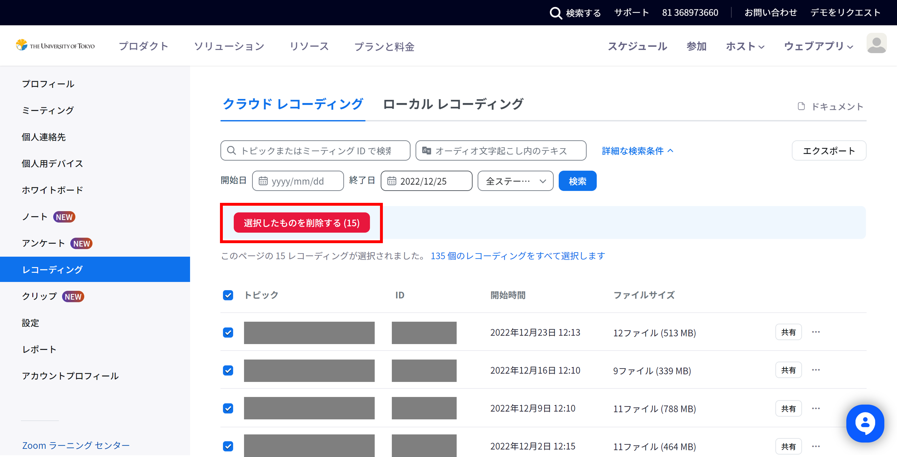
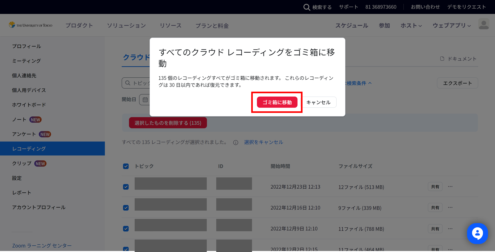
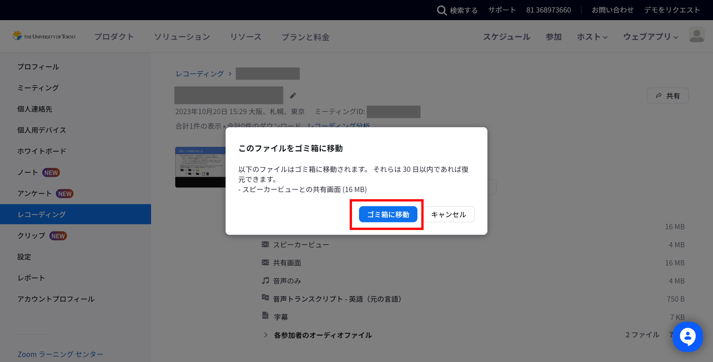
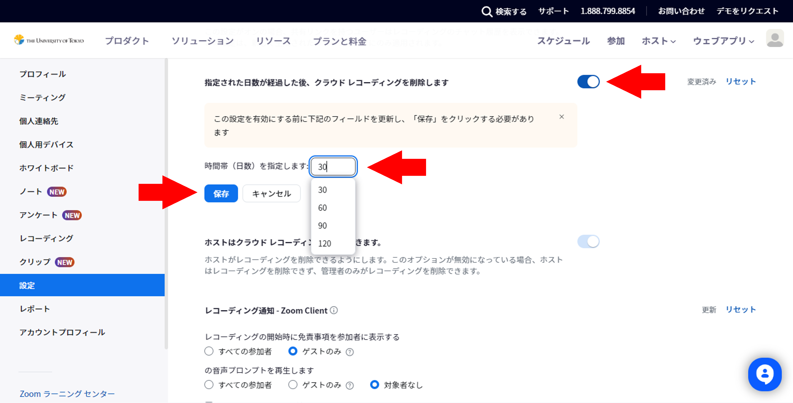
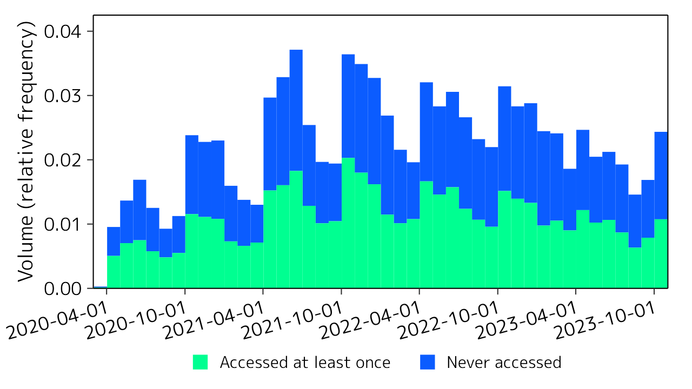
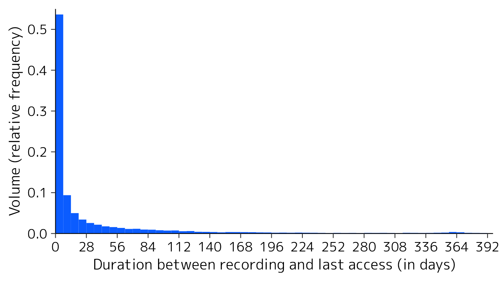

Thank you for the cooperation of the members of the University of Tokyo in the operation of Zoom and other information systems.

It has been three years since the University of Tokyo started providing Zoom in March 2020. During this time, **the storage volume used for "cloud recording" has been increasing**, and the associated cost burden is no longer negligible. Since the recorded data is stored infinitely and is expected to continue to grow in the future, we have concluded that it is necessary to reduce the volume used in order to ensure sustainable operation.

A survey of the status of stored cloud recordings revealed that approximately 50% of the volume used was data that had not been accessed even once (Figure 1 below). Of those recordings that were accessed at least once, about half were accessed within a week of recording and about 80% were accessed within two months of recording, indicating that recordings that have been accessed for a certain period of time tend not to be accessed (Figure 2 below). This suggests that **a large amount of data continues to be stored even though it is no longer needed**. Considering these facts, we have decided to call on our members to delete unnecessary recordings first, rather than take immediate action to impose a mandatory restriction.

Therefore, **please delete unnecessary recordings by periodically checking the data stored in your account**. For the procedure instructions, please refer to the description below.

Also, for data that you need to keep, please consider downloading it and uploading to Google Drive, YouTube, OneDrive, etc., and deleting the data on Zoom. In addition, Zoom has a function to automatically delete data at a certain period of time after recording. For those who often use cloud recording, it is a good idea to enable this setting instead of deleting data manually. Please see below for details on how to do these actions.

We thank you in advance for your cooperation.

## Procedures

### How to delete stored cloud recordings

1. Access [the recording management screen of Zoom](https://u-tokyo-ac-jp.zoom.us/recording) with a browser.
1. From the list of cloud recordings, select recordings you wish to delete and check the checkboxes.
    - You can use the search box at the top of the screen to find recordings quickly.
    - Selecting the uppermost checkbox in the vertical line of checkboxes will make all the checkboxes below it checked.
1. After you have selected all recordings for deletion, press the "Delete Selected" button.
    {:.medium.center}
1. A confirmation screen with the message "Move Cloud Recordings to Trash" will appear; then press the "Move to Trash" button. Note that "Deleting..." will be displayed in the recording list screen for a while after the deletion operation, but it will disappear after a while and can be ignored.
    {:.medium.center}

In addition to this, you can delete only a part of files in a particular single recording. For example, if you have a recording that has a speaker view and a shared screen separately, you can delete only the recording of the speaker view.

1. Access [the recording management screen of Zoom](https://u-tokyo-ac-jp.zoom.us/recording) with a browser.
1. Find the recording that contains the file to be deleted in the list of recordings, and select its meeting topic to go to the detail screen.
1. On the recording detail screen, hover the mouse pointer over the file to be deleted and select the trash icon.
    {:.medium.center}
1. A confirmation screen with the message "Move This File to Trash" will appear; then press the "Move to Trash" button.
    {:.medium.center}

### Saving and shareing data outside of Zoom

The following systems are available for saving and sharing video data online at the University of Tokyo.

- Google Drive
    - Please refer to the [Google Drive](/google/drive/) page (in Japanese) or [Google Drive Help](https://support.google.com/drive/) for usage.
    - The storage capacity is limited to 100 GB per person. You can increase the capacity by paying fees.
- YouTube
    - Please refer to [YouTube Help "Upload YouTube videos"](https://support.google.com/youtube/answer/57407) for usage. Also, instructions for [restricting YouTube content to university members only](https://www.sodan.ecc.u-tokyo.ac.jp/en/hack/youtube-utokyo-only-en/) are available.
    - To [upload videos longer than 15 minutes](https://support.google.com/youtube/answer/71673), you will need to perform a process called "verifying account". Even after verifying your account, you cannot upload videos that exceed 256GB or 12 hours in a single file. Currently, there is no limit to the number of videos that can be uploaded or their total size.
- OneDrive
    - Please refer to the [OneDrive](/microsoft/onedrive/) page (in Japanese) or [OneDrive for work or school help](https://support.microsoft.com/en-us/office/1eaa32e9-3229-47c2-b363-0a5306cb8c37) for usage.
    - For the maximum storage capacity, we are planning to change it to about 50GB per person due to the limitation by Microsoft. ~~Details will be announced in the near future.~~
    - (March 2024 Update) For details on the storage limitations of OneDrive, please see [Regarding the Storage Limitations of OneDrive and Others Used with UTokyo Account (First Report)](/notice/2023/1225-microsoft-storage/) page (in Japanese).

### How to set up automatic data deletion at a certain period of time after recording

1. Access the settings management screen of Zoom with a browser and open the "Recording" tab.
1. Find the item titled "Delete cloud recordings after a specified number of days" and select the toggle to enable this setting. Then, a box for specifying the number of days after recording that the data will be automatically deleted will appear; so enter a desired number of days and press "Save".
    {:.medium.center}

## Survey Results of Cloud Recording Usage

<figure>
    
    <figcaption class="center">Figure 1: Access history of Zoom cloud recordings (by time of recording)</figcaption>
</figure>

<figure>
    
    <figcaption class="center">Figure 2: Distribution of time between recording and last access for Zoom cloud recordings</figcaption>
</figure>
