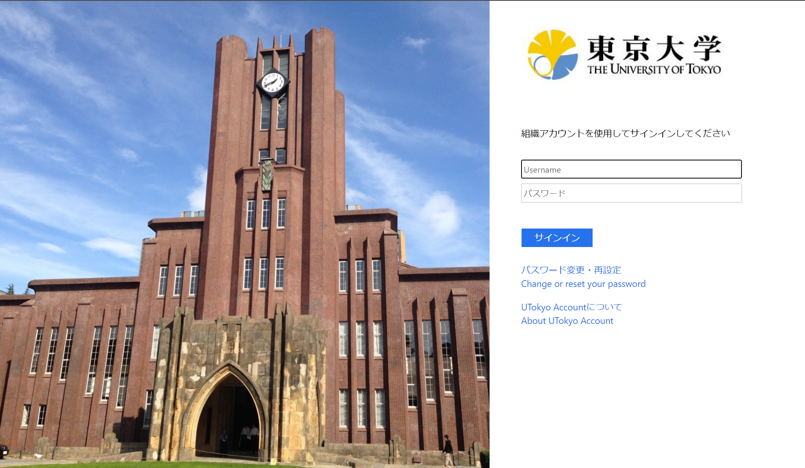
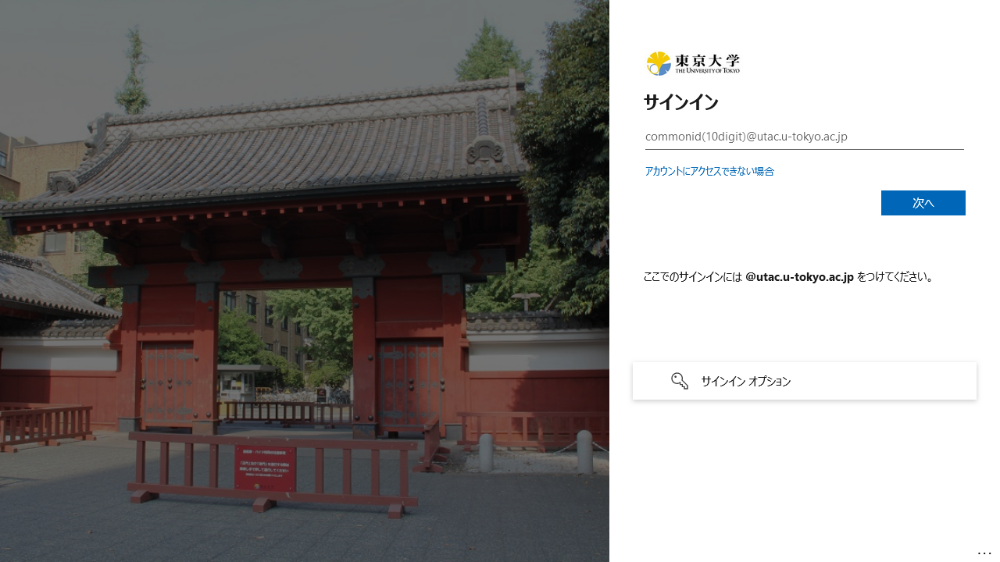

On 12 March 2024 (scheduled), several system changes will be applied to the authentication infrastructure of UTokyo Account. These changes are designed to facilitate the mandatory use of multi-factor authentication for UTokyo Account. For more information on the mandatory use of multi-factor authentication, please refer to "[Multi-Factor Authentication is Mandatory for UTokyo Account](/en/notice/2024/mfa100-schedule)”.

## More information systems will require `@utac.u-tokyo.ac.jp` when signing in
{:#require-utac}

When signing in to your UTokyo Account, the screen on the left below used to appear and you could sign in with your 10-digit common ID and password, omitting `@utac.u-tokyo.ac.jp` in some cases. After this system change, more often the screen on the right below will appear and you will be required to enter your “10-digit common ID + `@utac.u-tokyo.ac.jp`”.

<figure class="gallery">
    
    
</figure>

※ The screen on the right is one that has ever been appeared, but the background image and layout will be changed on this occasion.

This change applies to information systems marked with “○” in the UTokyo Account Service Directory. Typical examples are as follows:

- UTAS
- UTOL
- Zoom
- ECCS Cloud Email (Google Workspace)
- UTokyo MyOPAC
- EZproxy

Please understand that this change is necessary to make passwordless sign-in widely available, which is explained next.

## Passwordless sign-in will be widely available.
{:#passwordless-sign-in}

Passwordless sign-in is a system that allows users to sign in without entering a password. With this system change, passwordless sign-in will be available in many cases.

This change applies to information systems marked with “○” in the [UTokyo Account Service Directory](https://login.adm.u-tokyo.ac.jp/utokyoaccount/). Typical examples are as follows:

- UTAS
- UTOL
- Zoom
- ECCS Cloud Email (Google Workspace)
- UTokyo MyOPAC
- EZproxy

There are two passwordless sign-in methods available for UTokyo Account: FIDO security key and Microsoft Authenticator. Each of these methods is described below.

Please note that these passwordless sign-in methods do not require other methods of identity verification, as they alone constitute multi-factor authentication.

### Using passwordless sign-in with a FIDO security key
{:#using-fido}

If you are using a FIDO Security Key as your UTokyo Account's multi-factor authentication identity verification method, you can use passwordless sign-in with a FIDO Security Key. Please refer to [the FIDO Security Key Initial Settings](/utokyo_account/mfa/fido-security_key/) for information on how to set up the initial settings and the available OS and browsers.

The sign-in process proceeds as follows:

1. When the sign-in screen appears, press “Sign-in options”.
2. When multiple options are displayed, select “Sign in with security key”.
3. Follow the on-screen instructions to enter your PIN, complete biometric authentication or tap the security key, then sign-in is complete.
   - If you are prompted to select an account, select UTokyo Account.

### Using passwordless sign-in with Microsoft Authenticator
{:#microsoft-authenticator}

If you are using Microsoft Authenticator as your UTokyo Account's multi-factor authentication method, you can use passwordless sign-in with Microsoft Authenticator by making an additional setting.

The setting procedure is as follows:

1. If you have not registered Microsoft Authenticator as your identification method, follow the “[Initial Setup Procedures for Multi-Factor Authentication for UTokyo Accounts](/en/utokyo_account/mfa/initial/)” to register Microsoft Authenticator as your identification method.
2. Launch the Microsoft Authenticator app on your smartphone and select your UTokyo Account displayed on the app.
3. Press “Enable phone sign-in.”
4. Press “Continue.”
5. Follow the instructions to sign in.
6. When you see the message “Please help us keep your device secure,” press “Register.” This completes the setup. 

The sign-in process proceeds as follows:

1. When the sign-in screen appears, enter your “10-digit common ID + `@utac.u-tokyo.ac.jp`”.
2. Enter the displayed numbers into the Microsoft Authenticator app.
3. Sign-in is complete.

## FIDO security keys will be supported in all information systems that support multi-factor authentication.
{:#fido-in-all}

Until now, some systems that support multi-factor authentication did not support FIDO security keys. After this system change, FIDO security keys can be used in all information systems that support multi-factor authentication. The following are examples of information systems that will newly support FIDO security keys.

- UTokyo MyOPAC
- EZproxy
- Business travel expense system
- Academic Authentication Federation
