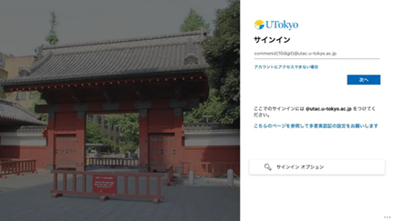

  Issued: February 3, 2025

To all UTokyo Account users (members of UTokyo),

Division for Information and Communication Systems

Thank you for your continued use of our information systems.

We are pleased to announce that we will be upgrading the authentication infrastructure of the UTokyo Account that you all use. This upgrade will make it easier and safer to use, so we appreciate your cooperation.

- Date and time of work: from Saturday, February 22, 2025, 9:00 AM to Sunday, February 23, 2025, noon
- Impact of the work: There will be no impact on signing in to services with the UTokyo Account (you can use it as usual). 
  However, the following functions will be unavailable: 
  Account users: You will not be able to change your password or apply for multi-factor authentication. 
  Department account administrators: Management functions, including the issuance of password notifications, will be unavailable. 
  Main improvements: The UTokyo Account sign-in screen will be unified and made easier to use. 
  {:.center}  
  After that time, all sign-in screens will have the Akamon gate as the background, and the screen with the Yasuda Auditorium background will no longer appear.
  
- Note: After noon on February 23, you may be asked to re-sign in to the UTokyo Account for some services. 

## Contacts
Division for Information and Communication systems : dics-senryaku.adm@gs.mail.u-tokyo.ac.jp  
