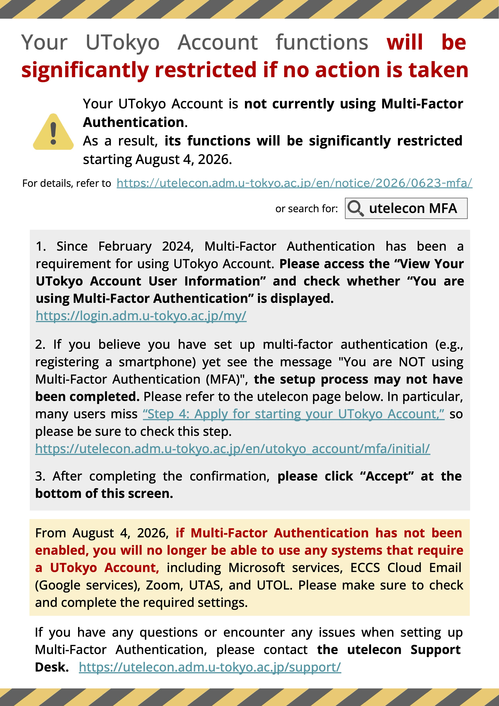

  Kenjiro TAURA, Chief Information Security Officer and Director General of the Division for Information and Communication Systems

To strengthen our security, we introduced Multi-Factor Authentication (MFA) for the UTokyo Account, the common account used to access most of the university's information systems. Since its introduction in September 2021, we made it mandatory in February 2024 and have sent repeated announcements and direct messages to users who had not yet set it up. Currently, 94.4% of faculty and staff and 97.7% of students use MFA. However, to avoid disrupting education, research, and daily operations, we allowed many services (such as UTAS, UTOL, Google, Microsoft, and Zoom) that were available before we introduced MFA to remain accessible without it.

Recently, cyberattacks have been increasing globally, and our university is constantly targeted. These attacks often use brute-force methods, looking for a vulnerable user or system as a gateway to attack the entire organization. Leaving even a few accounts without MFA creates a dangerous security hole that puts the entire University of Tokyo at risk. To prevent this, we have decided to make MFA setup a strict requirement to use all services.

This change will not affect the vast majority of you who are already using MFA. If you have not set it up yet, you will be prompted to configure MFA the next time you sign in to a service with your UTokyo Account. You will be able to use the systems normally once the setup is complete.

Taking the university's academic calendar into account, this change will take effect on **August 4, 2026**.

We will continue to notify everyone as this date approaches. Starting June 26, users who have not yet set up MFA will see a warning screen with setup instructions when they attempt to sign in.

{:.border}

If you need help setting up MFA or experience any issues, please contact the [utelecon Support Desk](/en/support/).

Thank you for your understanding and cooperation.

  Contacts：Division for Information and Communication Systems  
  dics.adm@gs.mail.u-tokyo.ac.jp 

