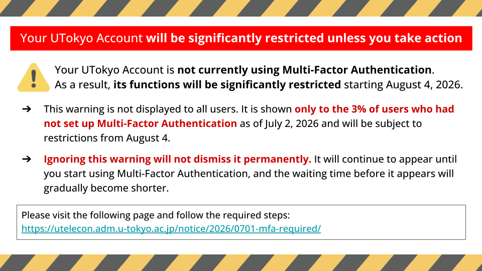

This page explains the action required if you see a screen like the one below when using your UTokyo Account.

{:.small.center.thin-border}

(The wording and design of the screen may vary depending on when it is displayed.)

## What Happens If You Do Not Take Action

Your UTokyo Account is currently not using multi-factor authentication. As a result, **its functions will be significantly restricted starting August 4, 2026**. Please set up Multi-Factor Authentication by following the steps in "Required Action" below.

<b class="box">
After August 4, 2026, if you are not using Multi-Factor Authentication, you will no longer be able to use **any system that requires a UTokyo Account**, including Microsoft, ECCS Cloud Email (Google), Zoom, UTAS, and UTOL.
</b>

For information about what multi-factor authentication is and how to use it, please see "[Using Multi-Factor Authentication (MFA) for UTokyo Accounts](/en/utokyo_account/mfa/)".

For the reason why all users are required to use multi-factor authentication, please see the notice "[UTokyo Account Multi-Factor Authentication is now required for all services](/en/notice/2026/0623-mfa/)".

## Required Action

1. Access the "View Your UTokyo Account User Information" and check whether the message "You are using Multi-Factor Authentication (MFA)" is displayed.

<b class="box center">
  [View Your UTokyo Account User Information](https://login.adm.u-tokyo.ac.jp/my/)
</b>

2. If the message "You are not using Multi-Factor Authentication (MFA)" is displayed, please follow the steps in "[Initial Setup Steps for UTokyo Account Multi-Factor Authentication](/en/utokyo_account/mfa/initial/)" to complete the initial setup.

<b class="box center">
  [Initial Setup Procedures for Multi-Factor Authentication for UTokyo Accounts](/en/utokyo_account/mfa/initial/)
</b>

3. If you have already registered a smartphone or other device but the message "You are not using Multi-Factor Authentication (MFA)" is displayed on the "View Your UTokyo Account User Information" site, there is a possibility that the UTokyo Account setup has not been completed.

    - In particular, many users have not completed "[Step 4: Apply for starting your UTokyo Account](/en/utokyo_account/mfa/initial/#apply)". Please confirm this.

4. Once the Multi-Factor Authentication setup is complete, the warning screen will no longer be displayed.

## Inquiries

If you have any questions or encounter issues with the Multi-Factor Authentication setup, please contact the [utelecon support desk](/support/).