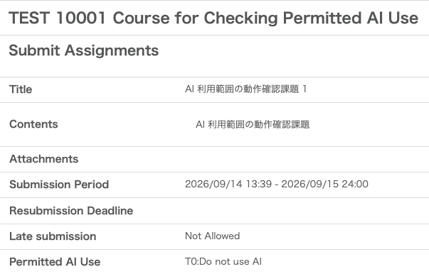
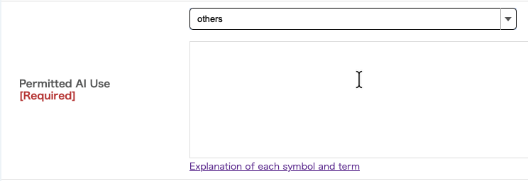

Created: September 28, 2026 
Information Technology Center 

## Overview

At the University of Tokyo, we have previously announced regarding the use of generative AI in classes: "[2] Clearly state your stance as instructor on the use of generative AIs for each class and assignment." (For details, please refer to the utelecon webpage "[Policy on the use of AI tools in classes (ver. 1.0)](/en/docs/ai-tools-in-classes/)"). Therefore, ahead of the 2026 Autumn Semester, we are introducing the "**Permitted AI Use**" feature in "Assignments" created within UTOL (UTokyo LMS), and setting it will be required for assignments created from then on.

Please note that as of September 2026, this feature is under development. Actual UTOL screens during operation may differ from the figures shown below. We ask for your understanding. The release of this feature to UTOL is scheduled for the lunch break on Tuesday, September 29.

## Permitted AI Use

Our university classifies typical AI use scenarios into five categories, as shown in Table 1. For details, please refer to "[Classifying and Indicating Permitted AI Use in Coursework](/en/gen-ai/education/ai-use-policy-levels/)".

<figure>
<figcaption>Table 1: Typical AI Use Scenarios</figcaption>

| Scene | Name | Description |
| :---- | :---- | :---- |
| **S1** | questions/research | ask about points you do not understand look up general or background knowledge about the topic of the assignment |
| **S2** | 	discussion/idea-bouncing | discuss with AI, i.e. bounce ideas off it consult about the choice of topic in assignments where students set their own topic |
| **S3** | feedback | obtain feedback on answers or reports you have written yourself |
| **S4** | drafting | have AI produce a draft or part of your submission, then build on it to finalize what you submit |
| **S5** | creative use | various uses beyond AI as a study aid have AI output critically examined learn about the various ways of working with AI |

</figure>

Therefore, when working on an assignment, instructors will specify whether AI use is prohibited entirely or up to which of the above classifications is permitted, using the Permitted AI Uses shown in Table 2.

<figure>
<figcaption>Table 2: Permitted AI Uses</figcaption>

| Label[^1] | Description | [AIAS](https://aiassessmentscale.com/) category[^2] |
| :---- | :---- | :---- |
| **T0** | No AI Use | No AI |
| **T1** | questions/research only | AI Planning |
| **T2** | T1 \+ discussion/idea-bouncing | AI Planning |
| **T3** | T2 \+ feedback | AI Collaboration |
| **T4** | T3 \+ drafting | Full AI |
| **T5** | T4 \+ creative use | AI Exploration |

</figure>

[^1]: Ti means permitting the use of AI in scenes S1 through Si.
[^2]: AIAS refers to "[The AI Assessment Scale](https://aiassessmentscale.com)".

Note that if the assignment does not fall under any of the ranges in Table 2, the instructor setting the assignment should give a specific explanation of the Permitted AI Use for that assignment.

## Changes to Assignment Features

### For Course Instructors / TAs

Figures 1 and 2 show the assignment editing screen operated by course instructors and TAs. When creating an assignment, please select one of the labels from Table 2 using the drop-down menu in Figure 1.

<figure>

<figcaption>Figure 1: Permitted AI Use options on the assignment editing screen</figcaption>
</figure>

If the Permitted AI Use for the assignment does not fall under any of the options in Table 2, please select "Other". As shown in Figure 2, a text input form will appear, where you can explain the Permitted AI Use for the assignment.

<figure>

<figcaption>Figure 2: Permitted AI Use description input on the assignment editing screen</figcaption>
</figure>

### For Students

Figure 3 shows the assignment submission screen operated by students.

The Permitted AI Use by the instructor for the given assignment will be displayed. If you do not understand the meaning of terms or symbols, please click the link directly below to refer to the webpage explaining them in detail.

<figure>

<figcaption>Figure 3: Assignment submission screen</figcaption>
</figure>

## Notes

* A Permitted AI Use can be set for assignments after the completion of the release work during the lunch break on Tuesday, September 29.
* Assignments created on UTOL prior to the release work will not have a Permitted AI Use. Even for courses held in the 2026 Autumn Semester, some assignments may not have a Permitted AI Use.
* Once the submission period starts—meaning after students can view the assignment—the Permitted AI Use cannot be changed.
* UTOL does not check whether the deliverables submitted by students comply with the Permitted AI Use for the assignment.
