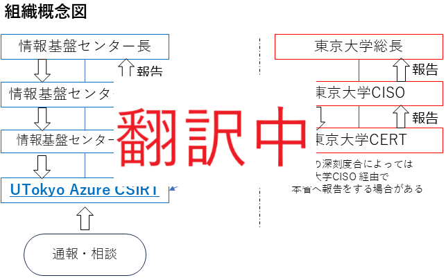
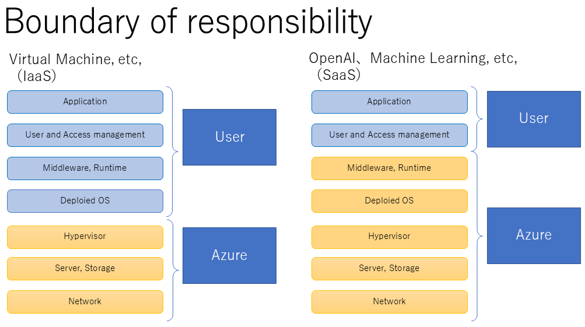
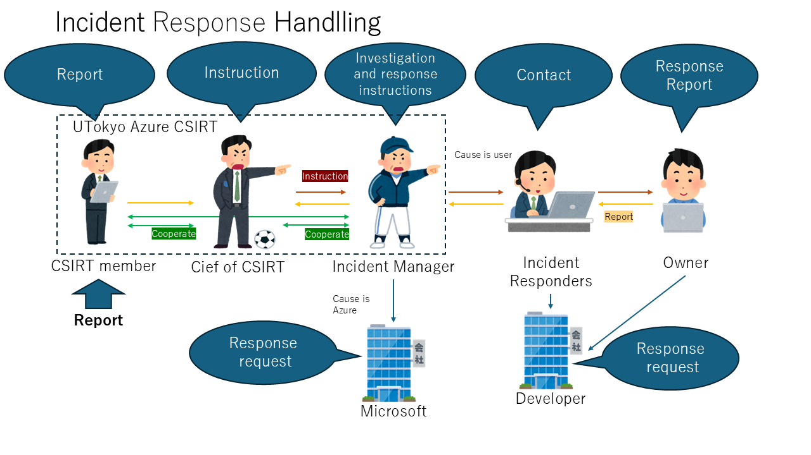

## UTokyo Azure CSIRT

The UTokyo Azure CSIRT has been established to manage and respond to incidents that occur on UTokyo Azure.

The UTokyo Azure CSIRT was established as a subordinate organization of the Information Technology Center CERT (ITC-CERT), and incidents handled by this CSIRT are reported and shared by ITC-CERT to higher-level organizations.

{:.center.border}

## Boundary of responsibility

UTokyo Azure is a cloud service that uses resources from Microsoft Azure services, and the boundary of responsibility varies depending on the service used.
- Depending on the type of service provided, this may not necessarily apply. UTokyo Azure CSIRT will ultimately determine the demarcation point of responsibility.

{:.medium.center.border}

## Incident Handling

The process for responding to incidents accepted by UTokyo Azure CSIRT is mainly as follows:

- Member of CSIRT
- Chief of CSIRT
  - representative of CSIRT
- Incident Manager
  - Manage and respond to incidents as they occur.
  - If an incident occurs and is within the scope of Microsoft's responsibility, the Incident Manager will work with you to address the issue.
- Incident Responders
  - Departmental sub-CERTs of UTokyo CERT of the department to which the subscription owner belongs
- Owner
  - The owner of the subscription where the incident occurred

{:.medium.center.border}

## If the incident is not reported via UTokyo Azure CSIRT

Please respond together with the Departmental sub-CERTs of UTokyo CERT.

Please also report the incident to UTokyoContact and ReportContact and Report

## Contact, Report

- UTokyo Azure CSIRT： utokyo-azure-csirt-group@g.ecc.u-tokyo.ac.jp
