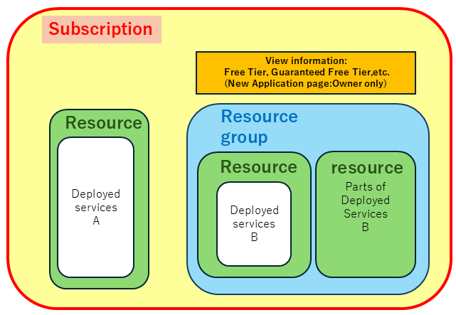

import HelpItem from "@components/utils/HelpItem.astro";

If you want to share **subscriptions** or **resources** (scopes) with members of your laboratory or collaborators, the representative can apply for a subscription and add members to that subscription with the appropriate permissions (roles) to make it possible to share.

Also, what a sharer can do will depend on which resource they are assigned to, who they are assigned to, and what role they are assigned to.

Please refer to this link for instructions on assigning permissions.
- [Steps to assign an Azure role to subscriptions and resources](/en/research_computing/utokyo_azure/faq/addrole)

If you're not sure what to do, we recommend assigning the following:
- **Sharing with faculty**: For sharing that includes costs, assign to the subscription with the **Owner** role. For sharing that does not include costs, assign to the subscription with the **Contributor** role.
- **Sharing with students**: If you want them to manage resources including creating new resources, assign to the subscription with the **Contributor** role. If you only want them to manage existing services, assign to the resource or resource group with **Contributor**.
- **Use only**: If you only want to use the service without managing it, assign the account and permissions to the service, but do not assign roles to the subscription or resources. In this case, the way accounts and permissions are assigned varies depending on the service, so please refer to the help for each service for details.

## Roles and Members (Role-Based Access Control: RBAC)

In Microsoft Azure, you can grant permissions to other accounts to access each scope by setting which permissions (roles) to assign to whom (members). This is called role-based access control (RBAC), and you can use this function to share subscriptions and resources you create.

## Permission Inheritance

Microsoft Azure inherits permissions from higher scopes to lower scopes. Specifically, in the diagram below, inner scopes inherit permissions from outer scopes. Permissions are irreversible and are not inherited to outer scopes. The top-level scope is a subscription.

- Deployed services such as virtual machines may be an exception to privilege inheritance. (described later)
- There are cases where permissions are not necessarily inherited. If it is important that permissions are inherited, be sure to check that they are, and if they are not, assign the necessary permissions individually.

{:.medium.center}

## Assign a member with the **Owner** role to the subscription.

The **Owner** has the authority to assign all roles (with some exceptions) and is assigned to the applicant's UTokyo Account by default. The main privileges are as follows.

- Assign other members and roles to the subscription.
  - However, depending on the conditions when assigning the owner role to a member, that member may not have some privileges.
- View the details of your subscription on the `Subscription Management page` of the **UTokyo Azure:New Application page**.
  - The current of limit the Free Tier and Guaranteed Free Tier can only be viewed on the subscription management page of the UTokyo Azure New Application page.
  - Billing information will also be displayed, so be careful not to give owner privileges to the wrong member.
- Use that subscription to create resources for the new service.

Unless you want to completely transfer the subscription to another member, please do not assign other members the privileges of the **Owner who can assign all roles**. If you want to assign the owner role to that member for sharing purposes, make sure to make a conditional selection.

## Assign a member with the **Contributor** role to the subscription.

**Contributor** role has the same permissions as the Owner role, except that permissions cannot be assigned to other members. Normally, if you want to share your subscription with other members, please grant this privileges.

- **have privileges**
  - Use that subscription to create resources for the new service.
  - Check resource usage from the Azure Portal.
- **have no privileges**
  - Assign roles to other members to each scope.
  - View the subscription details on the Subscription Management page of the **UTokyo Azure:New Application page**.

## Assign a member with the **Owner** role to a resource or resource group.

You will be given privileges to assign all roles to that resource.

- **have privileges**
  - Assign other members and roles to the resource or resource groups.
    - However, depending on the conditions when assigning the owner role to a member, that member may not have some privileges.
  - Create a new resource in the resource group.
    - For example, adding a new interface to a virtual machine, adding a new subnetwork resources, etc.
- **have no privileges**
  - Create a resource or resource group for the new Azure service.

## Assign a member with the **Contributor** role to the resource or resource groups.

Has the same privileges as the Owner, except that the role cannot be granted to other members.

- **have privileges**
  - Create a new resource in the resource group.
    - For example, adding a new interface to a virtual machine, adding a new subnetwork resources, etc.
- **have no privileges**
  - Assign roles to other members to the resource or resource group.
  - Create a resource for the new Azure service.

## About permissions for deployed services

Deployed services may not be subject to Azure permission inheritance.

- For example, when a virtual machine is deployed, the system account and administrative privileges for that OS will not be inherited from the Azure service and will be managed separately.
- For such services, if you want to add members only to the service, set the accounts and permissions only in the deployed service, not in Azure.
