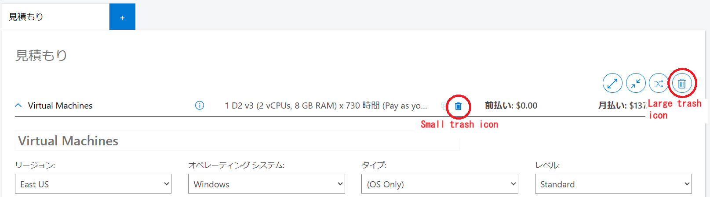

Microsoft Azure provides a fee calculation tool that allows you to estimate the cost of using each service. This tool can be used to estimate in advance to avoid exceeding the Guaranteed Free Tier when using a service, and to investigate the cause of higher than expected charges when using a service. This article explains the procedure and points to note when using the Pricing calculator for UTokyo Azure services.
- [Microsoft Azure Pricing calculator](https://azure.microsoft.com/en-us/pricing/calculator/)

## Preparation

※ **This step is not necessarily required**. Please perform it if you want to strictly calculate it as an Enterprise Agreement contract. If you want to skip it, proceed to the next **Usage Procedure**.

- First, Please log in with your UTokyo account. 
- Select a service, such as Virtual Machine, and select "Enterprise Agreement" under "Select a Program/Offer" at the bottom of the added quote sheet.
- You will be asked to confirm whether you have an agreement with the University of Tokyo, so please click `Apply`.
- It will take some time for the price data to be added, so please just wait without doing anything. It usually takes a few minutes.
- Once the calculator icon disappears, the process is complete. Continue to the next step.
  
## Usage procedure

If you selected any irrelevant services in **Preparation**, please delete those items first.

1. Select the `Products` tab.
2. Enter the service name or keyword in Search Products.
3. If you find the service you are looking for, click on it. Nothing will look different, but if you scroll down the screen, the selected service will be added under `Your Estimate`.
  - If you tap repeatedly, the number of items will be added accordingly. If you add more than you need, you can delete just that item by clicking **the small trash icon** in the middle of the top of the added item. You can also delete all added items at once by clicking **the large trash icon** in the upper right.

{:.medium.center.border}

4. You can estimate the cost by entering information in the added fields.

## Points to note

- Only pay-as-you-go billing is available with UTokyo Azure, so **please do not select anything other than pay-as-you-go billing**.
- At the end, you will be asked to enter support and license information. Usually, the following are the default values, so there is no problem leaving them as they are. If the options are different, please select them again.
  - Support：Basic
  - Select your program/offer：
    - If you have carried out the `Preparation` steps：Enterprise Agreement(EA)
    - If you have skip the `Preparation` steps：Microsoft Customer Agreement(MCA)
- There are cases where you cannot search by service name (e.g. Azure AI Foundry). In that case, try searching by keyword instead of the service name.
