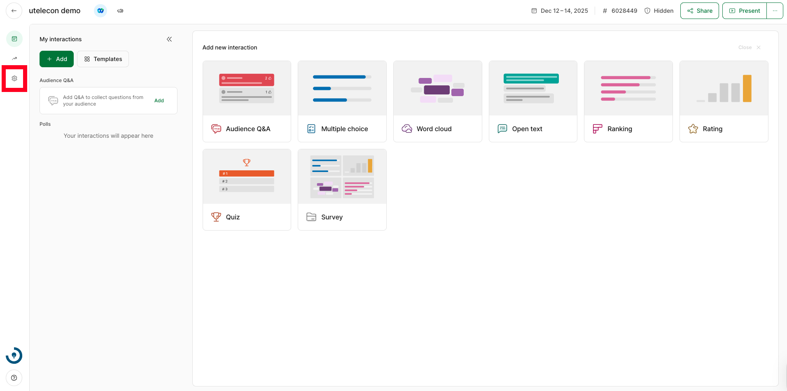

When Slido is used with a University of Tokyo account, users are eligible for advanced event settings that are unavailable in free accounts.
The settings can be changed by selecting “Settings” in the upper-right corner of the event host’s screen. The host screen can be accessed from the [event list page](https://admin.sli.do/events).

This page describes the settings that need to be checked, particularly when Slido is used in class.

* **General**
  * **Basic information**: Basic information, such as event name, start date, and end date, can be edited.
  * **Share access**: Collaborators (members who comanage the event, similar to Zoom’s alternative host) can be added. When Slido is used in a class, it is recommended to set members, such as teaching assistants, as collaborators.
  * **Multiple rooms**: Multiple groups can be created within an event.
* **Privacy**
  * **Hidden from search**: Users can prevent the site from showing up in search results, such as Google. It is recommended to turn this on when Slido is used in class.
  * **Require authentication**: Participants may be required to enter their names, email addresses, and event-specific passcodes to join an event.
* **Features**
  * **Audience Q&A**
    * **Moderation**: This feature allows hosts to review questions submitted by participants before they appear live for everyone.
    * **Replies**: This allows participants and hosts to reply to the submitted questions.
    * **Anonymous questions**: This allows participants to ask anonymous questions.
    * **Close questions**: This prevents all participants from asking questions.
