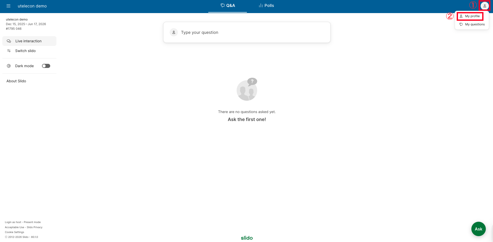
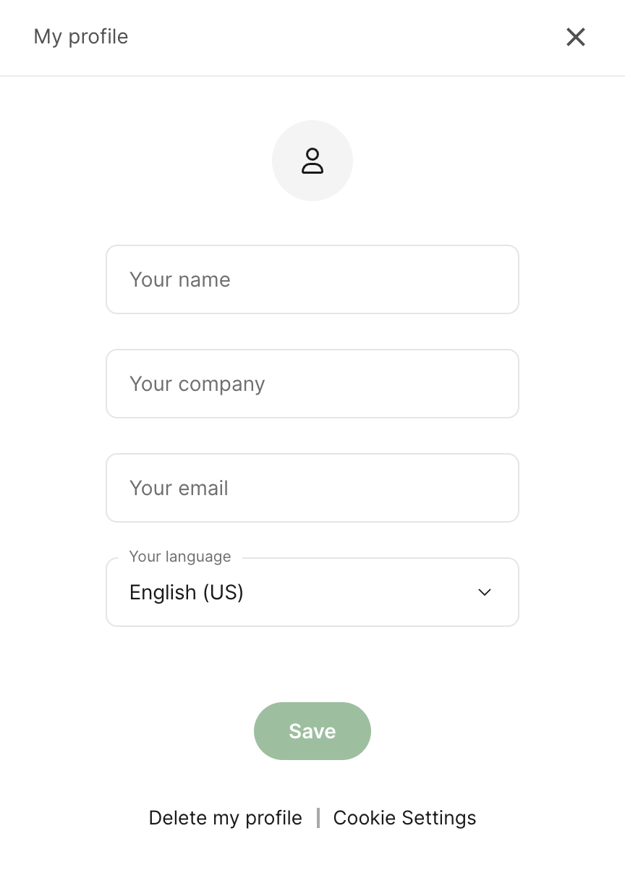
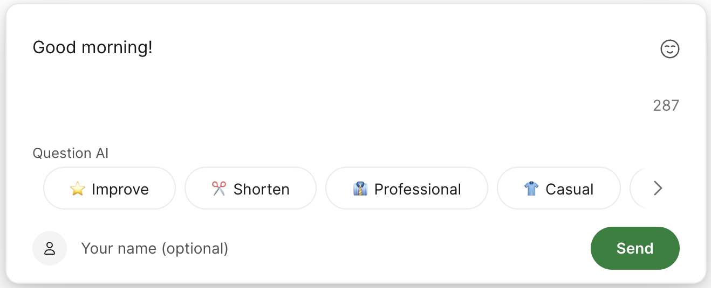
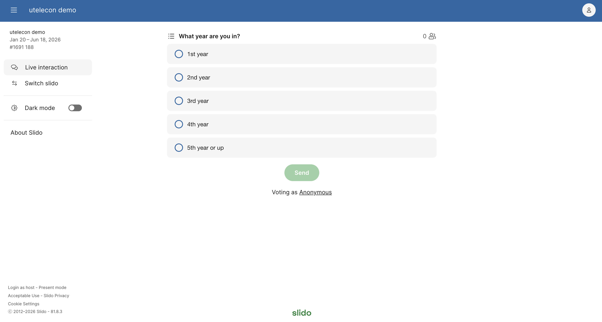

This page describes what operations the participants (students) can perform in Slido.

To use Slido as an event host, please refer to “[What Hosts Can Do in Slido](../how_to_use_host/).”

  
How to display the participant view in English

If the Slido screen is displayed in a language other than English, you can change the language to English by following these steps:

1. Click ① the icon in the top right corner of the screen, and select ② “My profile”. 
2. Select “English (US)” from “Your language”, and click “Save”. 

	
## Using the Q&A Feature

Selecting “Q&A” at the top of the screen allows you to check the questions and comments sent by other participants. You can also “Like” the questions and comments sent by other participants. By “liking” a post, you can show that you are interested in it.

The questions and comments submitted by other participants are displayed in descending order by the number of “Likes” given to each post (“Popular”: order by popularity). The displayed order is updated automatically. You can also re-sort the posts in reverse chronological order by selecting “Recent” on the screen.

### Sending Questions and Comments

To submit a question or comment, click “Type your question” on the “Q&A” screen or “Ask” at the bottom right of the screen.

Type your question or comment in the text input field on the screen, and click “Send” to send your question or comment.

When you select an option in the “Question AI” section, the text you entered will be rewritten by the AI as follows:
* **Improve**: Fixes typos and refines the text into more natural and clear expressions.
* **Shorten**: Summarizes long text into simple questions containing only the key points. (Useful when there is a character limit.)
* **Professional**: Converts the text into polite expressions suitable for addressing superiors or for formal situations.
* **Casual**: Converts the text into slightly informal and friendly expressions.
* **Joyful**: Adds emojis to the end of sentences and converts the text into a cheerful and lively tone.

You can send your question or comment anonymously, but if you want to enter your name, please use the “Your name (optional)” field at the bottom right of the text input field. The name you enter into this field will be visible to other participants.

## Using the Vote Function

Select “Polls” from the top of the screen to answer questions and surveys from the host.

If the host has not set up a poll, nothing will appear in the “Polls” screen.

