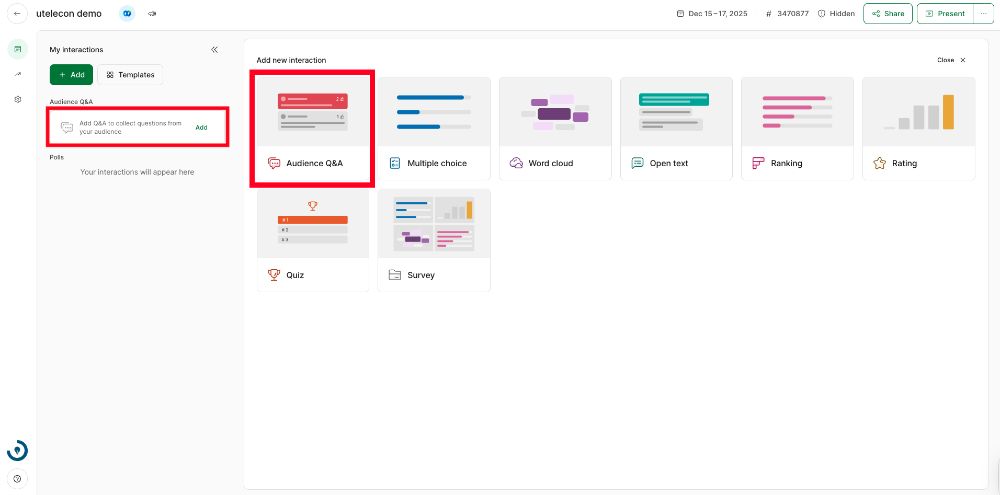
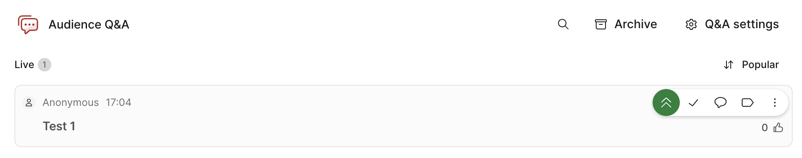
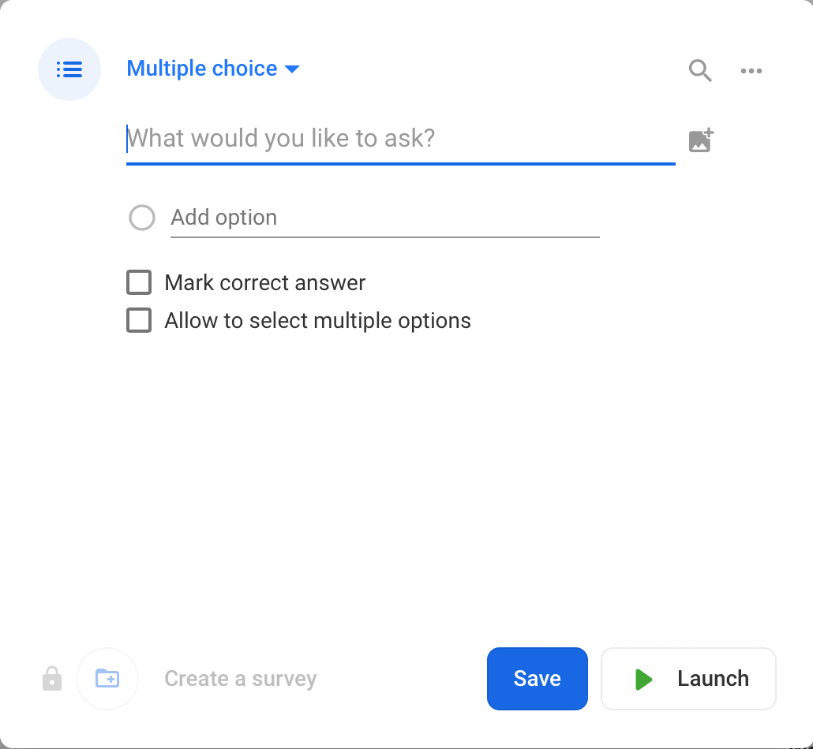
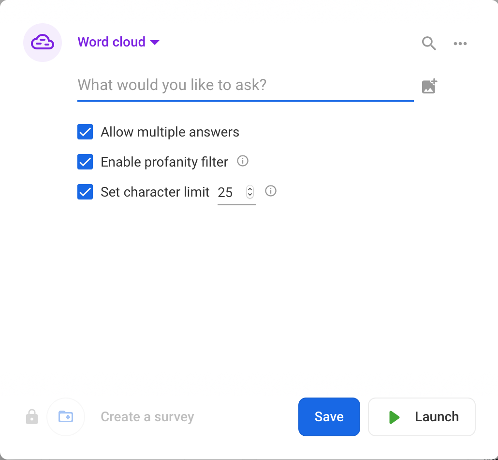
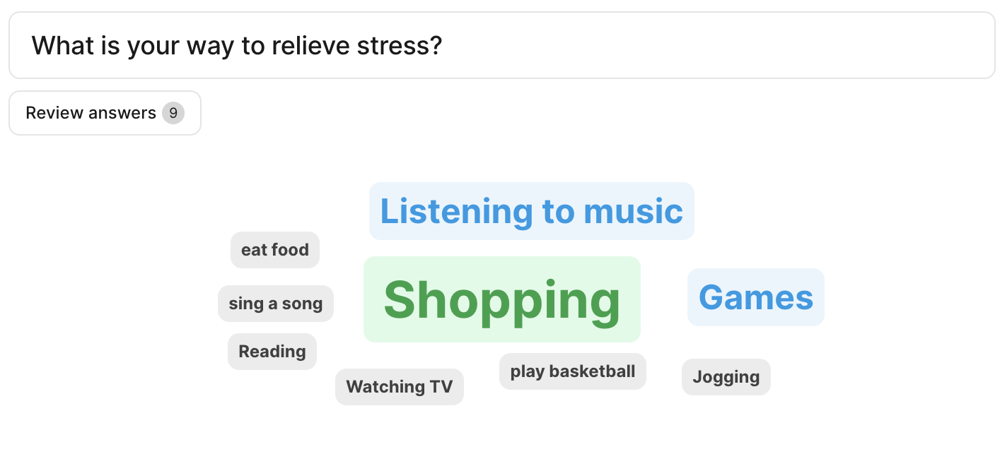
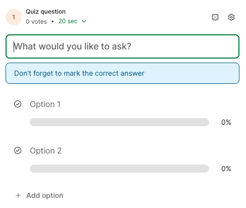
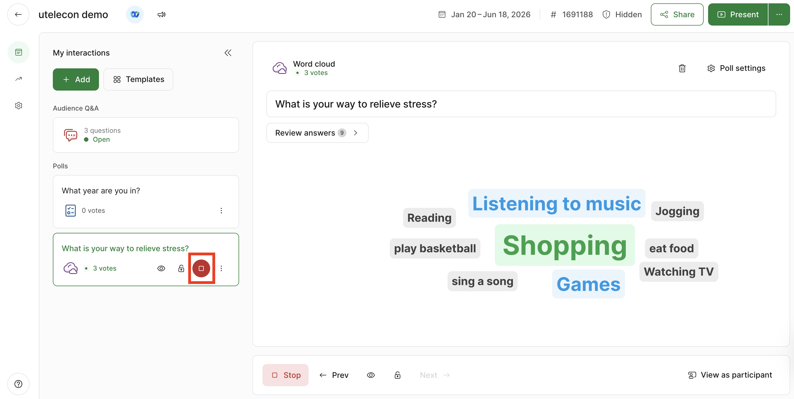
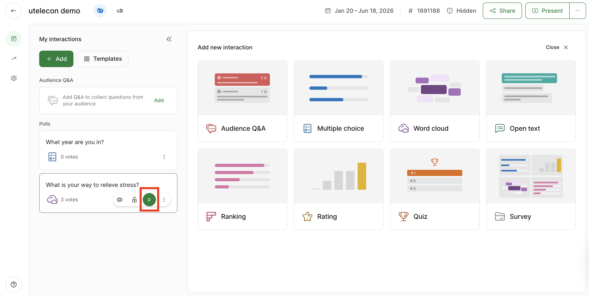

This page explains what hosts can do in Slido’s host page. Please access the host page from [Event List Page](https://admin.sli.do/events).

Please refer to “[What Students Can Do in Slido](how_to_use_audience)” when you use Slido as a participant.

## Checking Students’ Questions

In Slido, students can send questions and comments.
Please select “Audience Q&A"” in the upper left corner of the screen. The questions and comments from students will be displayed in the "Live" column on the right side of the screen.

By default, the questions and comments are displayed in descending order of the number of “Likes” given to each post (“Top”: most popular), and are automatically updated.
You can also sort by “Recent”: sort posts from newest to oldest. Just select the down arrow at the top right of the screen.

<figure>

</figure>

By hovering the cursor over each question/comment, the following buttons will appear and you can make an action to the question/comment. 
**"★" (Star Question)**: Slido changes the display every time a new question/feedback is submitted, so it is easy to lose track of the question/feedback. By marking a Star to a question/comment, you can check the starred questions and comments later. Please note that the participants will not know which question/comment is starred.
* **"^" (Highlight Question)**: You can pin a specific question/comment to the top of the screen. Pinned posts will be fixed at the top of all participants' screens.
* **"☑︎" (Mark as answered)**: By selecting this button, you can archive a question/comment 
. Archived questions will be invisible to students, but always visible to teachers.

By clicking on the ellipsis at the bottom right, you can see the options below:
* **Edit**: Edit questions/comments from students.
* **Reply**: Reply to a question/comment.
* **Archive**: Archive questions/comments from students. The archived questions/comments are not visible to the students, but are always available to the teachers (select Archive above the tab). You can also retrieve the questions/comments from the archive by clicking the "Restore question" button.
* **Delete**: Delete questions/comments from students.

## Starting a Poll

In Slido, the polls feature allows teachers to ask questions/quizzes to students.
Select “Live polls” in the upper left corner of the screen.

<figure>

</figure>.

(1) Event name and date 
(2) Event code 
(3) View and download the QR code of the event 
(4) Create a poll (see below) 
(5) View the poll displayed to students (see below).

### Creating a Poll
There are six types of polls. You can create a new poll by clicking the button of each function icon from the poll function screen.

* Multiple choice - Set up questions in multiple choice format .
* Word cloud - Answers to questions are visualized as a "cloud" (participants answer in a short text form same as in Open text) 
    * The answers will be displayed in format as shown in the figure. If there are multiple identical answers, the word will be displayed larger. (On students' screen) 
* Quiz - Set up questions for which the correct answers will be displayed .
* Rating - Set up a 10-point scale item .
* Open text - Set up short answer questions.
* Ranking - Set multiple items for participants to rank .

### Managing Your Polls

The created polls will be displayed on both the left and right side of the screen. On the left side of the screen, all polls you have created will be displayed. On the right side of the screen, the votes displayed to participants will be shown. To stop displaying polls to participants, click the red button displayed on the left side of the screen. .

When you click the red button, polls displayed on the right side of the screen will disappear (refer to the image above). If you want to make the polls visible to participants again, click the green button (which was originally red) on the left side of the screen. 
