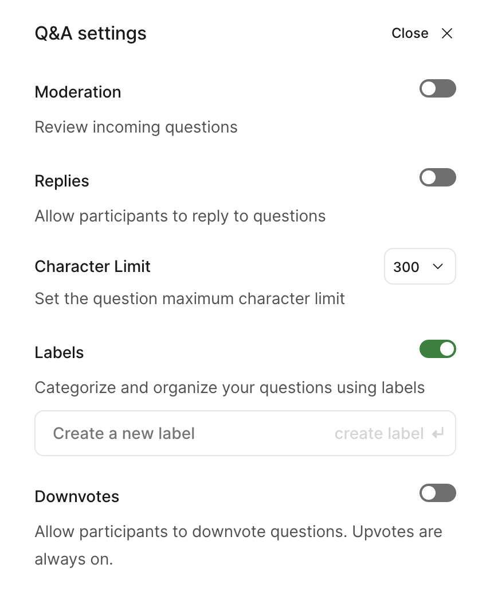
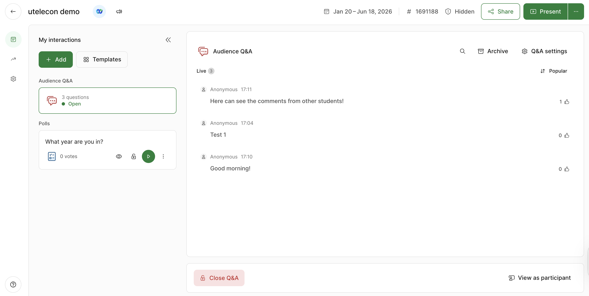
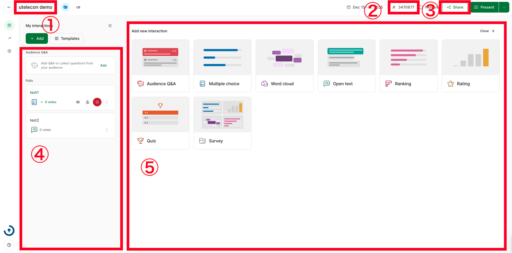

This page explains what hosts can do in Slido’s host page. Please access the host page from [Event List Page](https://admin.sli.do/events).

Please refer to “[What Students Can Do in Slido](../how_to_use_audience/)” when you use Slido as a participant.

## Starting a Q&A

In Slido, the Q&A feature allows students to freely send questions and comments.

### Creating a Q&A

To create a Q&A, select “Audience Q&A” in the upper left corner of the screen or under “Add new interaction”.

<figure>

</figure>

### Q&A Settings

Clicking “Q&A settings” in the top right corner of the Q&A screen allows you to change detailed settings for accepting questions. It is recommended to configure these in advance according to the nature of the class.

* **Moderation**: Keep submitted questions hidden from the screen until approved by the teacher. This is effective for preventing inappropriate posts.
* **Replies**: Students can reply to other people's questions.
* **Character limit**: Set the maximum number of characters that can be entered for a question.
* **Labels**: You can use the tag (label) feature to categorize and manage questions. You can also create new labels from the “Create a new label” field.
* **Downvotes**: Students can downvote questions to express disagreement. Note that the “Like” (upvote) feature is always enabled.

<figure>

</figure>

### Checking Students’ Questions

The questions and comments from students will be displayed in the "Live" column on the right side of the screen.

By default, the questions and comments are displayed in descending order of the number of “Likes” given to each post (“Top”: most popular), and are automatically updated.
You can also sort by “Recent”: sort posts from newest to oldest. Just select the up/down arrows (“⇅” icon) at the top right of the screen.

<figure>

</figure>

By hovering the cursor over each question/comment, the following buttons will appear and you can make an action to the question/comment. 
* **Highlight (Green icon)**: You can pin a specific question/comment to the top of the screen. Posts set here will also be fixed at the top of all participants' screens.
* **Mark as answered (Checkmark)**: By selecting this button, you can archive a question/comment 
. Archived questions will be invisible to students, but always visible to teachers.
* **Reply (Speech bubble icon)**: Reply to the question/comment.
* **Label (Tag icon)**: Since Slido updates the display every time a new question/comment is submitted, it is easy to lose track of items. By creating and attaching labels such as “Later” or “Important”, you can categorize and manage questions from students. Note that participants cannot see that the host has attached a label.

By clicking on the ellipsis at the bottom right, you can see the options below:
* **Select ☑︎**: Select questions/comments from students and perform actions such as labeling or archiving in bulk.
* **Edit**: Edit questions/comments from students.
* **Archive**: Archive questions/comments from students. The archived questions/comments are not visible to the students, but are always available to the teachers (select Archive above the tab). You can also retrieve the questions/comments from the archive by clicking the "Restore question" button.
* **Delete**: Delete questions/comments from students.

If you click **Archive** at the top right of the screen, a list of archived questions/comments will be displayed. Hovering the cursor over each question/comment reveals the following button (in addition to those already mentioned), allowing you to perform actions on it.

* **Restore (Counter-clockwise arrow)**: Restores the question/comment from the archive.

## Starting a Poll

In Slido, the polls feature allows teachers to ask questions/quizzes to students.

<figure>

</figure>

(1) Event name and date 
(2) Event code 
(3) View and download the QR code of the event 
(4) View the poll displayed to students (see below) 
(5) Create a poll (see below)

### Creating a Poll

To create a poll, select “Add (Add new interaction)” in the upper left corner of the screen.
There are six types of polls. You can create a new poll by clicking the button of each function icon from the poll function screen.

* Multiple choice - Set up questions in multiple choice format .
* Word cloud - Answers to questions are visualized as a "cloud" (participants answer in a short text form same as in Open text) 
    * The answers will be displayed in format as shown in the figure. If there are multiple identical answers, the word will be displayed larger. (On students' screen) 
* Open text - Set up short answer questions.
* Ranking - Set multiple items for participants to rank .
* Rating - Set up a 10-point scale item .
* Quiz - Set up questions for which the correct answers will be displayed .
* Survey - Create a survey combining multiple questions (unlike the above 6 types, participants answer multiple questions collectively as one set).

### Managing Your Polls

The created polls will be displayed on both the left and right side of the screen. On the left side of the screen, all polls you have created will be displayed. On the right side of the screen, the votes displayed to participants will be shown. To stop displaying polls to participants, click the red button displayed on the left side of the screen. .

When you click the red button, polls displayed on the right side of the screen will disappear. If you want to make the polls visible to participants again, click the green button (which was originally red) on the left side of the screen. 
