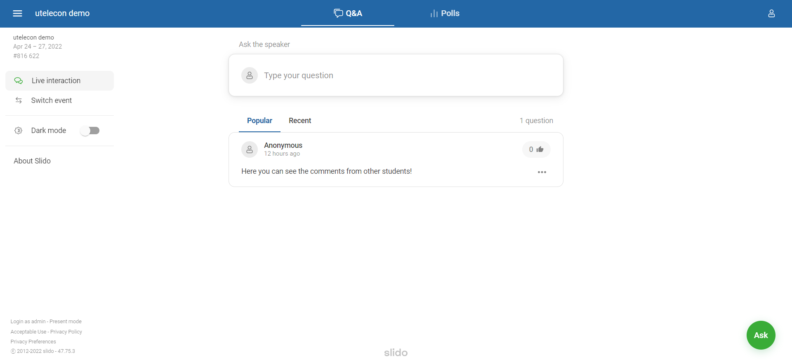

## What is Slido?

Slido is a web service that provides features such as Q&A, live polling, and surveys for interactive communication with participants in classes, conferences, and lectures.

Teachers can receive questions from students (Q&A) and ask students questions (live polling) in classes. Slido has the following advantages over Zoom chat.

- Students can post questions anonymously, making it easier for them to ask questions.
- Students can "like" questions that others have posted, so they can see which questions are of high interest among peers.
- You can reply to each question individually, so that you can avoid the confusion of mixing up multiple questions (this may be useful, for example, when teaching assistants answer questions in writing).

Slido can also be used as a bulletin board where students can post their comments as well as questions.

## For Students

If you use Slido as a student (i.e., if you are invited to Slido by the host), you need not prepare anything; just receive a URL or QR code from the host and access Slido. (If the host provides you with an "access code" instead of a URL or QR code, enter it in the input box at the top of the [Slido top page](https://www.sli.do/) to open the Slido screen.)

For more information about what you can do with Slido, please see "**[What Students Can Do in Slido](how_to_use_audience)**".

## For Hosts

### How to use

In Slido, each room is called an "event". If you want to use Slido as a host, you need to create an "event". The procedure is as follows.

1. [Sign in with your UTokyo account](login). 
2. Create an event and check the URL to share it](create_event)
    - Change the settings](change_event_settings) if necessary 
3. Share the URL with students. In class, you may share the URL with students via Zoom chat. 
4. Check out students’ questions and vote on them. See "**[What Hosts Can Do in Slido](how_to_use_host)**" for specific steps.
{:start="0"}

### Slido Account and License for UTokyo Members
Slido can be used for free. However, you can use the paid features below by signing in with a UTokyo Webex account as Slido is linked to Webex .
* **Moderation**: You can choose whether a question posted by a participant(student) will be visible to other students immediately or only after the host (lecturer) has reviewed the content. (In the free version, it will always be visible to other students immediately).
**Replies**: You can choose whether only the host or both the host and students can reply to a posted question (in the free version, only the host can reply).
* **Poll/Survey**: You can embed polls in images and conduct polls with multiple questions.
* **Export**: You can export (download) question data.

It is recommended to [sign in with a UTokyo account](login) when using Slido in class.

## Implementation and Practices 

* **[Basic Use and Practices of Slido](https://dalt.c.u-tokyo.ac.jp/wp-content/uploads/2019/02/KOMEX-DALT-Newsletter-201806.pdf)** (in Japanese): This article concerns the basic use and implementation of Slido in class. It is published in the Active Learning Newsletter of Division of Active Learning and Teaching, Komaba Organization for Educational Excellence (KOMEX), College of Arts and Sciences, UTokyo. 　
* **[How to use Slido in class](https://dalt.c.u-tokyo.ac.jp/wp-content/uploads/2019/07/KOMEX-DALT-Newsletter-201907.pdf)** (in Japanese): This article exemplifies how Slido is adopted in two classes. It is published in the Active Learning Newsletter of Division of Active Learning and Teaching, Komaba Organization for Educational Excellence (KOMEX), College of Arts and Sciences, UTokyo. 
* **[Good Practice of Online Class / Professor Yuko Yoshimoto, Pychology I](/good-practice/interview/yotsumoto)** (in Japanese): This article is about how anonymous questions and inquiries are received from students via Slido in a class of College of Arts and Sciences. Slido serves not only as a tool in class, but also as a means for student interaction. 
* **[Good Practice of Online Class / Professor Yosuke Tanaka, Anatomy III (Neurology)](/good-practice/interview/tanaka)** (in Japanese): This article is about how anonymous questions and inquiries are collected in a class of the Faculty of Medicine.
* **[Good Practice of Online Class / Professor Kayoko Kurita: Creating a "Place for Learning"](/good-practice/interview/kurita)** (in Japanese): This article is about how anonymous questions and inquiries are managed in a class of the Faculty of Education. 
