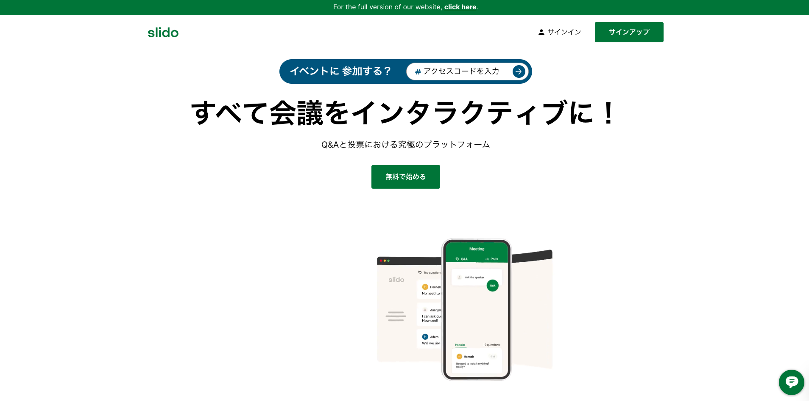

To host an event, you are required to log into Slido. Login is not necessary if you are joining an event as a participant. 

Login is possible with your personal account, but logging in with your UTokyo Account allows you to use Slido’s paid functions. The following are steps to log in with your UTokyo Account:

1. Go to the [official website](https://www.sli.do/).  
2. Click “Log in” in the upper right corner of the screen. Then click “Log in with Webex.” You will not use the “Your email” field on this screen.  
3. After the Webex sign-in screen opens, enter your 10-digit Common ID followed by `@utac.u-tokyo.ac.jp` (e.g., `1234567890@utac.u-tokyo.ac.jp`). `@utac.u-tokyo.ac.jp` indicates that you are a UTokyo member.  
4. Unless you have already signed in, the UTokyo Account sign-in page will be displayed. Please sign in.
5. If you see “The University of Tokyo” in the top left corner of the screen, you have successfully logged into Slido with your UTokyo Account. 
