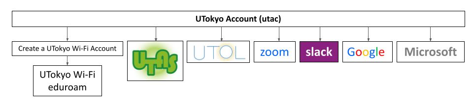
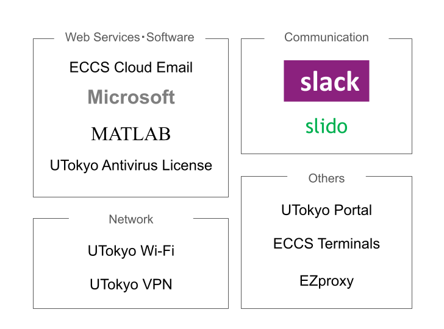

import UTokyoAccountChangePassword from '@components/en/systems/utokyo_account/ChangePassword.mdx'
import UTokyoAccountMFA from '@components/en/systems/utokyo_account/MFA.mdx'
import ZoomSigninBrowser from '@components/en/systems/zoom/SigninBrowser.mdx'
import InformationSecurity from '@components/en/InformationSecurity.mdx'
import UtolLogin from '@components/ja/systems/utol/Login.mdx'

<b class="box">
{/* An information session titled "<a href="/events/2025-03-12/">Information Session on ICT Systems and Tools for UTokyo Members (Conducted in Japanese)</a>" will be held on March 12, 2025 at 3:00 PM. Please refer to this page as well. */}
An information session titled "<a href="/events/2025-03-12/">Information Session on ICT Systems and Tools for UTokyo Members (Conducted in Japanese)</a>" was held on March 12, 2025. Materials and recordings of the session are provided on the linked page. Please refer to this page as well.
</b>

## Introduction
{:#introduction}

This page explains the initial account setup and necessary systems for staff members (who are not directly in charge of education) to conduct their work.

**Note**: If your workplace uses Office Work Terminals (事務業務端末, thin client system or remote access environment for remote working), you will receive instructions from your department's PC equipment manager. After completing the initial setup of your UTokyo Account, please follow those instructions.

First, please complete the initial setup of your UTokyo Account by following these steps:

1. **Change your password from the initial password**
1. **Set up Multi-Factor Authentication (MFA)**
1. **Take the Information Security Education and pass the test**

For more details, please refer to the explanations below and the respective pages on utelecon.

Also, we provide updates and announcements via [the official X account](https://x.com/utelecon_pr_en). Please follow that and get the latest information.

For faculty members, please refer to [Getting Ready for ICT Systems at the UTokyo (for Faculty Members)](/en/faculty_members/).

### Troubleshooting: Technical Support Desk

If you have any problems or need advice on using information systems, please consult the **[Technical Support Desk](/en/support/)**. The Technical Support Desk provides consultation services through three tools: chat, online call, and email form. The Technical Support Desk will respond quickly through the collaboration of student staff "Common Supporters" and faculty members.

## Overall view of the UTokyo system

The UTokyo provides various information systems such as Microsoft, Google, and so on. In order to use these various systems, you need to sign in using a university-wide account called UTokyo Account. The following figure shows an overview of the UTokyo information systems.

At the start of semesters, the UTokyo holds a briefing session for faculty and staff on the overview of each of the UTokyo systems. The information systems provided by the UTokyo are diverse and difficult to grasp, but the explanations of each system and its relationship are provided at the briefing sessions to make them easier to understand. Please refer to "[Information Session on ICT Systems and Tools for UTokyo Members (only in Japanese)](/events/2025-03-12/)" for the briefing for 2025 S Semester.

## Getting Started: Initial Setup of the Common ID "UTokyo Account", etc

“UTokyo Account” is a university-wide account used for signing in to UTokyo’s IT systems, such as Zoom and UTOL (which are explained later).

UTokyo Account is represented by a 10-digit number (Common ID) followed by `@utac.u-tokyo.ac.jp`, which indicates that you are a member of the University of Tokyo, such as `0123456789@utac.u-tokyo.ac.jp`.

The following is an explanation of the UTokyo Account’s initial setup procedure. Please read this section carefully, as it is an important procedure necessary for using UTokyo’s systems.

### Changing the Initial Password for your UTokyo Account
{:#change-initial-password}

<UTokyoAccountChangePassword variant="faculty_members" />

### Setting up "Multi-Factor Authentication for your UTokyo Account"
{:#setting-up-mfa}

<UTokyoAccountMFA />

### Attending the Information Security Education
{:#information-security-education}

<InformationSecurity variant="faculty_members" />

### Initial setup for Staff Members

By completing the steps above, you will have finished the "はじめに (Introduction)" section of the page below.
For further initial setup instructions, please refer to the following page.

**[UTokyo Account Initial Setup (For Staff, in Japanese)](https://univtokyo.sharepoint.com/sites/utokyoportal/wiki/d/UTokyo_Account_Initial_Settings.aspx)**{:.box.center}

## Other UTokyo's IT Systems
{:#other-systems}
In addition to the systems described above, UTokyo subscribes to and operates various information systems that can be used for classes, education, and research. Some of them are described below.

{:.medium}

### UTokyo Portal

This is an internal portal site for faculty and staff. In addition to allowing you to check necessary procedures and documents, UTokyo Portal provides manuals for various "things you want to do" as a handy guide at the bottom of the top page. Various notifications will also be posted on this page, so please check them regularly.

**[UTokyo Portal (in Japanese)](https://login.adm.u-tokyo.ac.jp/utokyoportal)**{:.box.center}

### UTokyo VPN

UTokyo's certain information systems (such as the Personnel Information MyWeb) can only be accessed from the campus network. This service allows users to access these systems from off-campus.

**[UTokyo VPN](/en/utokyo_vpn/)**{:.box.center}

### UTokyo Wi-Fi

This is a campus-wide Wi-Fi service. It provides access to databases and e-journals that are only available on campus. Please note that you cannot use this service unless you prepare in advance.

**[UTokyo Wi-Fi](/en/utokyo_wifi/)**{:.box.center}

### ECCS Cloud Email (Google Workspace)

This is an account for using Google’s services (Google Workspace) as a UTokyo member.

With this account, you can use various services including Gmail, which allows you to use your UTokyo email address (`xxxx@g.ecc.u-tokyo.ac.jp`), Google Drive (an online storage service), Google Docs (a document creation service), Google Sheets (a spreadsheet service), Google Forms (a form creation service), YouTube (a video streaming service), and Google Meet (a web conferencing service). It also allows you to restrict the sharing to UTokyo members only (limited access), which is a feature not available to regular Google accounts.

**[ECCS Cloud Email (Google Workspace)](/en/google/)**{:.box.center}

### UTokyo Microsoft License

UTokyo provides access to Microsoft’s services through a university account and offers downloads of Microsoft Office applications such as Word and Excel (available only to students and university-employed faculty and staff). In addition, you can use various functions such as Teams (business chat tool), Outlook for the Email System for Staff (`@mail.u-tokyo.ac.jp`), Microsoft Office Web Apps, OneDrive (a file storage service), Microsoft Forms (a form creation service).

**[UTokyo Microsoft License](/en/microsoft/)**{:.box.center}

### Zoom

This is the most widely used web conference system at UTokyo.
UTokyo's Zoom license allows users to host meetings with up to 300 participants for a maximum of 30 hours when signed in with a UTokyo Account.

**[Zoom](/en/zoom/)**{:.box.center}

### UTokyo Slack

This is a type of business chat tool service used for communication through text messages. A key feature is the ability to create multiple channels for simultaneous discussions. In UTokyo Slack, "workspaces," which serve as units where people gather to communicate, can be created upon application from faculty and staff.

**[UTokyo Slack](/en/slack/)**{:.box.center}

