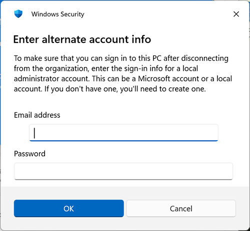

import ArrowOverlay from "@components/utils/ArrowOverlay.astro";
import workplace from "./workplace.png";

## Introduction
{:#about}

This page explains how to remove the UTokyo Account association from a Windows PC that has been set up to sign in with a UTokyo Account (Microsoft Entra ID).

If you used your UTokyo Account to sign in when setting up your personal Windows PC, that PC will be in a state associated with your UTokyo Account (a "Microsoft Entra joined" state). If the PC remains in this state, it will be managed by the university, and **you will be unable to sign in to the PC when your UTokyo Account expires, such as upon leaving the university**.

If your personal PC is in this state, please follow the steps on this page to remove the association while you are still affiliated with the university.

### How to Check Whether Your UTokyo Account Is Associated

1. Open Windows "Settings" (you can open it by pressing <kbd>Windows</kbd>+<kbd>I</kbd> on your keyboard).
1. Select "**Accounts**" → "**Access work or school**".
    - You can also access this directly by entering `ms-settings:workplace` in "Run" (<kbd>Windows</kbd>+<kbd>R</kbd>).
1. If your UTokyo Account is displayed on this screen, your UTokyo Account is associated. Please follow the steps on this page to remove the association. If it is not displayed, no action is needed.

## Prerequisites
{:#preparation}

Before removing the association, please complete the following preparations.

### Prepare a Separate Administrator Account on the PC
{:#admin-account}

After removing the association, you will no longer be able to sign in to the PC using your UTokyo Account. Therefore, **you must prepare a separate account in advance and grant it administrator privileges**.

Please use one of the following as the separate account:

- **Personal Microsoft account**: If you already have one, add it to the PC and grant it administrator privileges.
- **Local account**: You can also create a new local account on the PC and grant it administrator privileges.

### Back Up Your BitLocker Recovery Key
{:#bitlocker}

If BitLocker (drive encryption) is enabled on the PC, the recovery key may be stored in the device information of your UTokyo Account. **Once the association is removed, the recovery key stored in your UTokyo Account will be deleted, and you will be unable to recover your data if encryption recovery becomes necessary.**

Please back up the recovery key in advance by following these steps:

1. Access the [Microsoft device list page](https://myaccount.microsoft.com/device-list).
1. Select the target device and check the **BitLocker recovery key**. The recovery key is a 48-digit number separated into groups of 6 digits.
    - Please note that this is different from the "BitLocker Key ID".
1. Save the recovery key in a **safe location other than the PC**, such as a written note or a file stored elsewhere.

### Back Up Data on the PC
{:#backup}

Removing the association may result in losing access to data stored in the UTokyo Account user area. If there is any data you cannot afford to lose, please back it up to an external drive or cloud storage in advance.

## Steps to Remove the Association
{:#disconnect}

Once the prerequisites are complete, follow these steps to remove the association.

1. Open Windows "Settings" (you can open it by pressing <kbd>Windows</kbd>+<kbd>I</kbd> on your keyboard).
1. Select "**Accounts**" → "**Access work or school**".
    - You can also access this directly by entering `ms-settings:workplace` in "Run" (<kbd>Windows</kbd>+<kbd>R</kbd>).
1. Confirm that your UTokyo Account is displayed, then click "**Disconnect**".
    - If your UTokyo Account is not displayed, the association does not exist and no further steps are necessary.
    <ArrowOverlay image={workplace} x={900} y={570} angle={315}/>
1. A confirmation message will appear: "Are you sure you want to remove this account? This will remove your access to resources like email, apps, network, and all content associated with it. Your organization might also remove some data stored on this device." Review the message and click "**Yes**".
1. A "Disconnect from the organization" screen will appear. Confirm the explanation that "After disconnecting, you won't be able to sign in to this PC with your organization's account", then click "**OK**".
1. A screen will appear asking you to enter the credentials of an administrator account. Enter the credentials of the account you [prepared in advance](#admin-account).
    - Although it says "Email address", if you are using a local account, enter the account name.
    
1. Your sign-in session will be removed, and the PC will automatically sign out and restart.

After restarting, sign in to the PC using the administrator account you prepared in advance.
