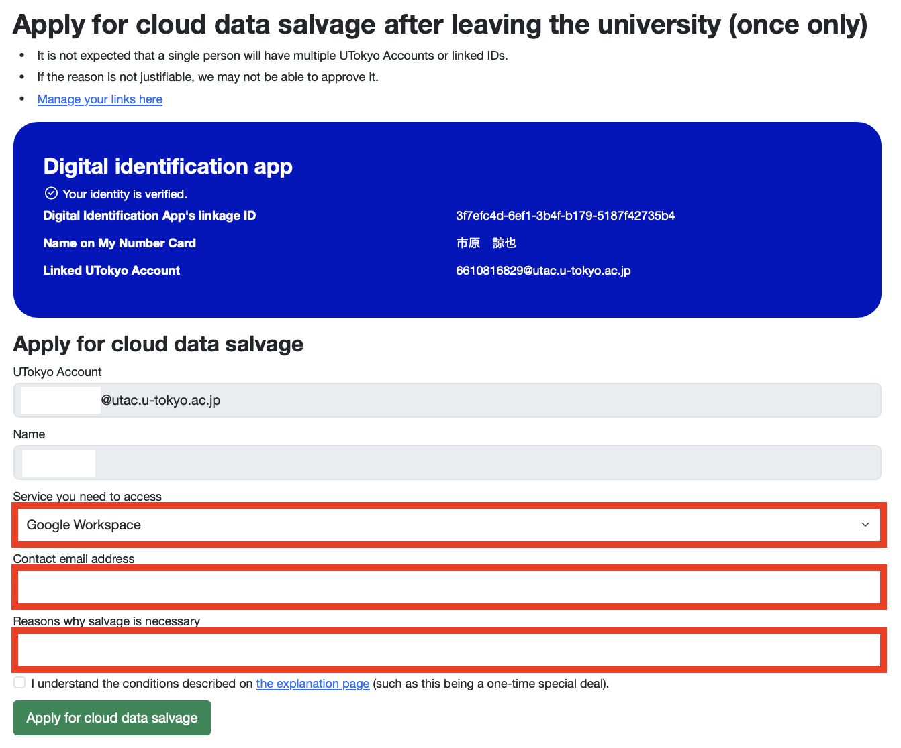

    The "cloud data salvage" described on this page (a special measure to temporarily provide access to your data or account from your period of enrollment once your UTokyo Account has been revoked) will be available for application from **October 1, 2025**. Pre-linking the “[UTokyo Account Identity Verification Service](/en/utokyo_account/ident-myna/)” will be available from the evening of September 10. Please ensure you complete the pre-linking process **before you leave the university**.

When you leave the University of Tokyo upon graduation, resignation, etc., your UTokyo Account will be revoked at the end of your period of enrollment, and you will no longer be able to sign in to your account. Therefore, if you wish to continue using data stored in various information systems such as Zoom, ECCS Cloud Email, and Microsoft 365, you must back up your data by following the procedures on the "[Data Backup upon Leaving the University of Tokyo](../backup/)" page.

However, if for some reason you are not able to create a backup before leaving and you need to access your data or account after leaving the university for a justifiable reason, we may be able to provide exceptional access to some of your data or account under certain conditions. This is a special measure called “cloud data salvaging”. By using the cloud data salvaging, you can temporarily back up your ECCS Cloud Email history and data on Google Drive/OneDrive, or add email forwarding settings to your ECCS Cloud Email.

This page explains the conditions and application procedures to request the cloud data salvaging.

Please note that this service will commence on October 1, 2025, and will be operated on a trial basis for the time being.

## Conditions for Using Cloud Data Salvaging
{:#usage-conditions}
There are several conditions for using cloud data salvaging. Please read and understand the following conditions carefully before applying.

* **Who can apply**: Former members of the University of Tokyo who have left due to graduation, resignation, etc., and **180 days have not yet passed since their UTokyo Account was revoked**.
  * Please note that some or all of your data may still be permanently deleted and not be recoverable due to circumstances such as the university’s overall storage capacity even if still within 180 days of account revocation. Please be aware that **the fundamental principle is [to back up your data before you leave](../backup/)**.
* **Eligible Services**: The following are applicable from among the cloud services available with a UTokyo Account.
  * **[ECCS Cloud Email](/en/google/) account**
    * We will enable you to log in to your ECCS Cloud Email account with a special password, without the need of going through your UTokyo Account.
    * This will give you access to all data within the Google system, such as Gmail and Google Drive.
    * You will also be able to perform various operations within your Google account, such as setting a forwarding address to Gmail.
    * However, for email addresses from [the Mail Hosting Service](https://mh.ecc.u-tokyo.ac.jp/) (only in Japanese) (email addresses with domains other than `g.ecc.u-tokyo.ac.jp` that can be used with ECCS Cloud Email), please consult the respective domain administrators separately.
  * **Files stored on [OneDrive](/en/microsoft/onedrive/)**
    * Access is not provided to the Microsoft account itself under the UTokyo Microsoft License. Instead, we only provide a means to salvage files stored on your personal OneDrive.
    * Therefore, data from the Email System for Staff, Teams, and Teams team drives are not eligible for recovery.
    * Furthermore, data from services such as Microsoft Forms and Power Platform (Power Automate, Power Apps, etc.) are not eligible as they do not exist in a format that can be downloaded as files from OneDrive.
* **Identity Verification**: To confirm that the applicant is the owner of the UTokyo Account, you must have pre-linked with [the UTokyo Account Identity Verification Service](/en/utokyo_account/ident-myna/) during your enrollment and still possess a My Number Card at the time of application.
* **Other Conditions**:
  * You can use the cloud data salvaging service **only once** for each service (ECCS Cloud Email and OneDrive). If you apply for both services at the same time, you can use the service only once.
  * The access period is **limited to one week**. Please complete the necessary backups and setting up of forwarding addresses during this period.
  * Please note that applications for the cloud data salvaging are not always approved. We may decline your application depending on the reason provided.

## Application Procedures
If you wish to apply for cloud data salvaging, please do so through the "[UTokyo Account Identity Verification Service](/en/utokyo_account/ident-myna/)".

If you are unable to use the UTokyo Account Identity Verification Service, please see "[Procedures for When the UTokyo Account Identity Verification Service is Unavailable](#no-myna)".

### Application Instructions
1. Access the "UTokyo Account Identity Verification Service" from the following link.
**[UTokyo Account Identity Verification Service](https://identification.adm.u-tokyo.ac.jp/verify/)**{:.box.center}
1. Click "Verify identity with My Number Card" and follow the on-screen instructions to complete the identity verification process.
1. Click "Apply for cloud data salvage after leaving the university (once only)."
1. Fill in the "Service you need to access", "Contact email address", and "Reasons why salvage is necessary" fields. After reviewing the [Conditions for Using Cloud Data Salvaging](#usage-conditions), check the box next to "I understand the conditions described on the explanation page (such as this being a one-time special deal)", and then click "Apply for cloud data salvage". 
    - Service you need to access: Please select whether you wish to salvage cloud data from Google Workspace or OneDrive. If you need to salvage data from both services, you must submit a separate application for each one.
    - Contact email address: Enter the email address that you will use for correspondence with the utelecon support desk.
    - Reasons why salvage is necessary: Please provide a specific and concrete reason why you need to salvage the data. Please be aware that your application may be denied depending on the details of your reason.
{:.small.center.thin-border}
1. After you submit your application, an automated confirmation email will be sent from the utelecon Technical Support Desk to the address you entered in the "Contact email address" field. Please check to make sure you have received it. If you do not receive the email within one hour, please contact [Technical Support Desk](/en/support/).
1. You will be notified of the approval or rejection of your application by email sent to the address you entered. If your application is approved, please back up your data, set up forwarding, etc., within one week, following the instructions on the "[Data Backup upon Leaving the University of Tokyo](../backup/)" page.

### Procedure for When the UTokyo Account Identity Verification Service is Unavailable
{:#no-myna}
As a general rule, the "UTokyo Account Identity Verification Service" is used for identity verification for cloud data salvaging. However, if you are unable to use this service, we will accept your application on an exceptional basis provided that you meet both of the following conditions:

* You were enrolled at the University of Tokyo as a student immediately before leaving.
* You have consulted with the office of academic affairs of the college/faculty/graduate school you belonged to immediately before leaving and have obtained their cooperation for identity verification.

If you wish to use the cloud data salvaging service, please contact the office of academic affairs of the college/faculty/graduate school you belonged to immediately before leaving. Inform them that you would like to retrieve data from your UTokyo Account and request identity verification and forwarding of your request to the utelecon Technical Support Desk, and provide them with the following required information.
* UTokyo Account (10-digit Common ID + @utac.u-tokyo.ac.jp)
* Student ID number immediately before leaving
* Full name
* College/faculty/graduate school immediately before leaving
* Reason why this measure is necessary (please provide a specific reason **why this measure is absolutely necessary**. For example, "I failed to back up a portion of my research data from my time as a student, and it is essential evidence for a paper I am submitting". Simply stating the reason for not having been able to back up, such as "I forgot to back up", may not be sufficient for approval.)
* Service for access provision (ECCS Cloud Email, OneDrive, or both)
* Applicant's contact information (email address)

Please note that subsequent communication will be conducted through the utelecon support desk's email form, so please read the notes on the "[Email Form page](/en/support/email-form/)" in advance.

Note for staff in departmental offices: Please conduct identity verification using an appropriate method as determined by your department, such as checking official photo identification documents. While we assume this will be done in person, if unavoidable, it can be conducted via a web conference (e.g., Zoom) that allows for video exchange. Once the applicant's identity has been verified, please contact [the utelecon Technical Support Desk via **the email form**](/en/support/email-form/) with the required information. Further details will be provided through internal communication.
