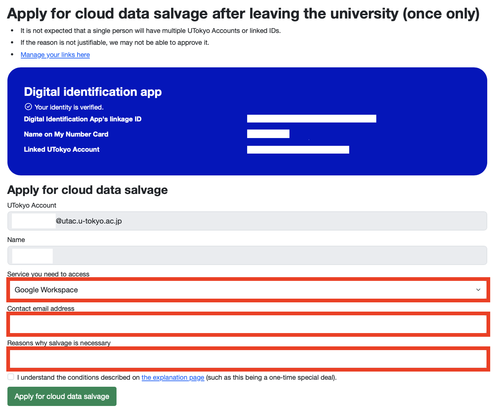

    このページで説明する「クラウドデータ救出」（UTokyo Account失効後に，在籍時のデータ・アカウントへのアクセスを一時的に提供する特例措置）は，**2025年10月1日以降**に申請可能となります．ただし，「[UTokyo Account本人確認サービス](/utokyo_account/ident-myna/)」の事前連携は，9月10日夕方頃から可能です．事前連携は必ず**離籍前に**済ませてください．

    The "cloud data salvage" described on this page (a special measure to temporarily provide access to your data or account from your period of enrollment after your UTokyo Account has been revoked) will be available for application from **October 1, 2025**. Pre-linking in the “[UTokyo Account Identity Verification Service](/en/utokyo_account/ident-myna/)” will be available from the evening of September 10. Please ensure you complete the pre-linking process **before you leave the university**.

卒業・退職等により東京大学から離籍する際には，在籍期間の終了に伴ってUTokyo Accountが失効しサインインができなくなります．そのため，ZoomやECCSクラウドメール，Microsoft 365などの各種情報システムに保存されているデータを引き続き利用したい場合は「[離籍時のデータのバックアップについて](../backup/)」のページの手順に沿って，データのバックアップを取る必要があります．

When you leave the University of Tokyo upon graduation, resignation, etc., your UTokyo Account will be revoked at the end of your period of enrollment, and you will no longer be able to sign in. Therefore, if you wish to continue using data stored in various information systems such as Zoom, ECCS Cloud Email, and Microsoft 365, you must back up your data by following the procedures on the "[Backing Up Your Data When Leaving the University](../backup/)" page.

しかし，なんらかの理由で離籍前にバックアップを作成できず，離籍後に正当な理由でどうしてもデータやアカウントへのアクセスが必要になった場合には，いくつかの条件のもとで特例的に，一部のデータやアカウントへのアクセスを提供できる場合があります．この措置を「クラウドデータ救出」と呼びます．クラウドデータ救出を利用することで，一時的に，ECCSクラウドメールのメール履歴や，Googleドライブ・OneDriveのデータをバックアップしたり，ECCSクラウドメールの転送設定を追加したりできます．

However, if for some reason you are unable to create a backup before leaving and you have a justifiable reason to access your data or account after you have left, we may be able to provide exceptional access to some of your data or account under certain conditions. This is a special measure called "cloud data salvage". By using the cloud data salvage, you can temporarily back up your ECCS Cloud Email history and data on Google Drive/OneDrive, or add email forwarding settings to your ECCS Cloud Email.

このページでは，クラウドデータ救出の措置を希望するにあたって必要な条件と，申請方法について説明します．

This page explains the conditions and application procedures for requesting the cloud data salvage measure.

なお，この取り扱いは2025年10月1日より開始し，当面は試行として運用します．

Please note that this service will commence on October 1, 2025, and will be operated on a trial basis for the time being.

## クラウドデータ救出を利用するための条件
## Conditions for Using Cloud Data Salvage
{:#usage-conditions}
クラウドデータ救出を利用するには，いくつかの条件があります．次の条件を理解したうえで申請してください．

There are several conditions for using the cloud data salvage. Please understand the following conditions before applying.

* **申請できる方**：過去に東京大学に在籍していた方で，卒業・退職等（離籍）により**UTokyo Accountが失効してから180日間以内**の方．
* **Who can apply**: Former members of the University of Tokyo who have left due to graduation, resignation, etc., and are **within 180 days of their UTokyo Account being revoked**.

  * ただし，UTokyo Account失効後180日以内であっても，大学全体の保存容量の都合等により，一部または全部のデータを完全に削除し，提供できない状態にしてしまう場合があるので，ご注意ください．**あくまで[離籍前にバックアップを取る](../backup/)ことが原則**だとご認識ください．
  * Please note that even within 180 days of account revocation, some or all of your data may be permanently deleted and become unavailable due to circumstances such as overall university storage capacity. Please be aware that **the fundamental principle is [to back up your data before you leave](../backup/)**.

* **アクセス提供対象**：UTokyo Accountで利用できるクラウドサービスのうち，次のもの．
* **Eligible Services**: Among the cloud services available with a UTokyo Account, the following are eligible.

  * **[ECCSクラウドメール](/google/)のアカウント**
  * **[ECCS Cloud Email](/en/google/) account**

    * 特別なパスワードを用いて，UTokyo Accountを経由せずにECCSクラウドメールのアカウントにログインできるようにします．
    * We will enable you to log in to your ECCS Cloud Email account with a special password, without going through your UTokyo Account.

    * GmailやGoogleドライブなど，Googleのシステム全般のデータにアクセスできます．
    * This will give you access to all data within the Google system, such as Gmail and Google Drive.

    * Gmailの転送設定の追加など，Googleアカウントで行う各種の操作も可能です．
    * You will also be able to perform various operations within your Google account, such as adding a forwarding setting in Gmail.

    * ただし，[メールホスティングサービス](https://mh.ecc.u-tokyo.ac.jp/)のメールアドレス（ECCSクラウドメールで利用できる，`g.ecc.u-tokyo.ac.jp`以外のドメイン名のメールアドレス）については，別途ドメイン管理者に相談してください．
    * However, for email addresses from [the Mail Hosting Service](https://mh.ecc.u-tokyo.ac.jp/) (only in Japanese) (email addresses with domains other than `g.ecc.u-tokyo.ac.jp` that can be used with ECCS Cloud Email), please consult the respective domain administrator separately.

  * **[OneDrive](/microsoft/onedrive/)に保存されたファイル**
  * **Files stored on [OneDrive](/en/microsoft/onedrive/)**

    * UTokyo Microsoft LicenseにおけるMicrosoftアカウントそのものへのアクセスを提供するのではなく，あくまで個人のOneDriveに保存されたファイルのみをサルベージして提供します．
    * Access is not provided to the Microsoft account itself under the UTokyo Microsoft License; rather, we only provide a means to salvage files stored in your personal OneDrive.

    * したがって，職員メールシステム，Teams，Teamsチームドライブのデータなどは対象外です．
    * Therefore, data from the Email System for Staff, Teams, and Teams team drives are not eligible.

    * また，Microsoft FormsやPowerPlatform（PowerAutomate，PowerAppsなど）などのデータは，OneDriveからダウンロードできるファイルとしての形は持たないため，対象外です．
    * Additionally, data from services like Microsoft Forms and Power Platform (Power Automate, Power Apps, etc.) are not eligible as they do not exist in a format that can be downloaded as files from OneDrive.

* **本人確認について**：申請者がUTokyo Accountの所有者本人であることを確かめるため，在籍中に[UTokyo Account本人確認サービス](/utokyo_account/ident-myna/)を事前連携しており，申請時点でもマイナンバーカードを保有している必要があります．
* **Identity Verification**: To confirm that the applicant is the owner of the UTokyo Account, you must have pre-linked with [the UTokyo Account Identity Verification Service](/en/utokyo_account/ident-myna/) during your enrollment and still possess a My Number Card at the time of application.

* **その他の条件**：
* **Other Conditions**:

  * クラウドデータ救出を利用できる回数は，ECCSクラウドメールとOneDriveそれぞれにつき**1回限り**です．両方の対象を同時に申請した場合は，その1回のみ利用可能です．
  * You can use the cloud data salvage service **only once** for each service (ECCS Cloud Email and OneDrive). If you apply for both services at the same time, you can use the service only once.

  * アクセスできる期間は，**1週間に限ります**．この間に必要なバックアップや転送設定等を済ませてください．
  * The access period is **limited to one week**. Please complete the necessary backups and forwarding settings during this period.

  * クラウドデータ救出の申請は必ず許可されるとは限りません．申請理由によってはお断りする可能性もありますので，ご了承ください．
  * Please note that applications for the cloud data salvage are not always approved. We may decline your application depending on the reason provided.

## 手続きの流れ
## Application Procedure

クラウドデータ救出を希望する方は「[UTokyo Account本人確認サービス](/utokyo_account/ident-myna/)」を通じて申請してください．  

If you wish to apply for cloud data salvage, please do so through the "[UTokyo Account Identity Verification Service](/en/utokyo_account/ident-myna/)".

UTokyo Account本人確認サービスを利用できない場合は，「[UTokyo Account本人確認サービスを利用できない際の対応](#no-myna)」をご覧ください．

If you are unable to use the UTokyo Account Identity Verification Service, please see "[Procedure for When the UTokyo Account Identity Verification Service is Unavailable](#no-myna)".

### 申請手順
### Application Instructions

1. 以下のリンクから「UTokyo Account本人確認サービス」にアクセスしてください．
**[UTokyo Account本人確認サービス](https://identification.adm.u-tokyo.ac.jp/verify/)**{:.box.center} Access the "UTokyo Account Identity Verification Service" from the link below.
**[UTokyo Account Identity Verification Service](https://identification.adm.u-tokyo.ac.jp/verify/)**{:.box.center}

1. 「マイナンバーカードで本人確認」を押して，画面に表示される手順に従って本人確認を完了させてください． Click "Verify identity with My Number Card" and follow the on-screen instructions to complete the identity verification process.

1. 「離籍後のクラウドデータ救出を申請する（1回限り）」を押してください． Click "Apply for cloud data salvage after leaving the university (once only)."

1. 「アクセスが必要なサービス」「連絡の付くメールアドレス」「救出が必要な理由」を記入してください．[救出を利用するための条件](#usage-conditions)を確認の上「説明ページに記載の条件（1回限りの特別措置であることなど）を理解しました。」にチェックを入れて，「クラウドデータ救出を申請する」を押してください． Fill in the "Service you need to access", "Contact email address", and "Reasons why salvage is necessary" fields. After reviewing the [Conditions for Using Cloud Data Salvage](#usage-conditions), check the box next to "I understand the conditions described on the explanation page (such as this being a one-time special deal)", and then click "Apply for cloud data salvage".
    - アクセスが必要なサービス：Google WorkspaceとOneDriveのどちらのクラウドデータを救出したいか選択してください．両方のデータを救出したい場合は，お手数ですがそれぞれのサービスごとに申請を行ってください． 
    - Service you need to access: Please select whether you want to salvage cloud data from Google Workspace or OneDrive. If you need to salvage data from both services, you must submit a separate application for each one.

    - 連絡の付くメールアドレス：uteleconサポート窓口とのやり取りに使うメールアドレスを入力してください．
    - Contact email address: Enter the email address that you will use for correspondence with the utelecon Technical Support Desk.

    - 救出が必要な理由：どうしても救出が必要な理由を具体的に入力してください．内容によっては許可できないことがあります．
    - Reasons why salvage is necessary: Please provide a specific and concrete reason why you need to salvage the data. Please be aware that your application may be denied depending on the details of your reason.

{:.small.center.thin-border}
1. 申請後，uteleconサポート窓口から「連絡の付くメールアドレス」欄に記入されたメールアドレス宛に自動応答メールが送信されますのでご確認ください．もしメールが1時間経過後も届かない場合は、お手数ですが[サポート窓口](/support/)までお問い合わせください． After you submit the application, an automated confirmation email will be sent from the utelecon Technical Support Desk to the address you entered in the "Contact email address" field. Please check to make sure you have received it. If you do not receive the email within one hour, please contact [Technical Support Desk](/en/support/).

1. 後日，uteleconサポート窓口から記入されたメールアドレス宛に，クラウドデータ救出の許否について通知されます．許可された場合は，1週間以内に「[離籍時のデータのバックアップについて](../backup/)」の説明に沿って，データのバックアップ・転送設定などをしてください．You will be notified of the approval or rejection of your cloud data salvage application by email. If your application is approved, please back up your data, set up forwarding, etc., within one week, following the instructions on the "[Backing Up Your Data When Leaving the University](../backup/)" page.

### UTokyo Account本人確認サービスを利用できない場合の対応
### Procedure for When the UTokyo Account Identity Verification Service is Unavailable
{:#no-myna}

クラウドデータ救出の際の本人確認には，原則として「UTokyo Account本人確認サービス」を用いますが，それが利用できない場合には，次の条件を両方満たせば例外的に申請を受け付けます．

As a general rule, the "UTokyo Account Identity Verification Service" is used for identity verification for cloud data salvage. However, if you are unable to use this service, we will accept your application on an exceptional basis provided that you meet both of the following conditions:

* 離籍直前に，学生として東京大学に在籍していたこと．
* You were enrolled at the University of Tokyo as a student immediately before leaving.

* 離籍直前まで所属していた学部・研究科等の学務・教務担当窓口に相談の上，本人確認の協力が得られること．
* You have consulted with the academic affairs office of your former college/faculty/graduate school and have obtained their cooperation for identity verification.

クラウドデータ救出の利用を希望する方は，離籍直前まで所属していた学部・研究科等の学務・教務担当窓口に「UTokyo Accountで利用していたデータ等を取り出したいので，本人確認の上，uteleconサポート窓口に取り次いでほしい」旨と，以下の必要事項を伝えてください．

If you wish to use the cloud data salvage service, please contact the academic affairs office of the college/faculty/graduate school you belonged to immediately before leaving. Inform them that you would like to retrieve data from your UTokyo Account and request identity verification and forwarding of your request to the utelecon support desk, and provide them with the following required information.

* UTokyo Account（10桁の数字）
* UTokyo Account (10-digit Common ID + @utac.u-tokyo.ac.jp)

* 離籍直前の学籍番号（学生証番号）
* Student ID number immediately before leaving

* 氏名
* Full name

* 離籍直前の学部・研究科等
* College/faculty/graduate school immediately before leaving

* 措置が必要な理由（どうしても**措置が必要な**理由を具体的にお伝えください．例えば「在学時の研究データの一部のバックアップに失敗しており，それが投稿論文の作成にあたって必要な根拠資料であるため」など．たんに「バックアップを忘れていたため」など，バックアップできなかった理由だけでは許可できないことがあります）
* Reason why this measure is necessary (Please provide a specific reason **why this measure is absolutely necessary**. For example, "I failed to back up a portion of my research data from my time as a student, and it is essential evidence for a paper I am submitting." Simply stating the reason for not having been able to back up, such as "I forgot to back up," may not be sufficient for approval.)

* アクセス提供対象サービス（ECCSクラウドメール，OneDrive，または両方）
* Target services for access provision (ECCS Cloud Email, OneDrive, or both)

* 本人連絡先（メールアドレス）
* Applicant's contact information (email address)

なお，以後のやり取りはuteleconサポート窓口のメールフォームを通じて行うため，[メールフォームのページ](/support/email-form/)に記載の注意事項にあらかじめ目を通しておいてください．

Please note that subsequent communication will be conducted through the utelecon Technical Support Desk's email form, so please read the notes on the "[Email Form page](/en/support/email-form/)" in advance.

※部局の担当の方へ：本人確認は，公的な写真付き本人確認書類を確認するなど，部局で判断いただき適切な方法により実施してください．対面で行うことを想定していますが，やむを得ない場合，ビデオ映像をやり取りできるWeb会議（Zoom等）で対応することも考えられます．申請者の本人確認が取れたら，[uteleconサポート窓口の**メールフォーム**](/support/email-form/)から，必要事項を添えてご連絡ください．詳しくは内部連絡でお伝えします．

Note for staff in departmental offices: Please conduct identity verification using an appropriate method as determined by your department, such as checking official photo identification documents. While we assume this will be done in person, if unavoidable, it can be conducted via a web conference (e.g., Zoom) that allows for video exchange. Once the applicant's identity has been verified, please contact [the utelecon Technical Support Desk via **the email form**](/en/support/email-form/) with the required information. Further details will be provided through internal communication.
