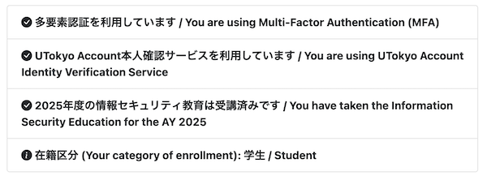
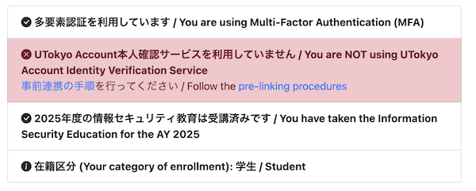

import If from "@components/utils/If.astro"

{/**
  * @typedef {object} Props
  * @property {"link" | "unlink" | "notSpecified"} variant
  */}

You can check the link status on the UTokyo Account Identity Verification Service or the "View Your UTokyo Account User Information" site.

### Checking on the UTokyo Account Identity Verification Service

1. Please access the [UTokyo Account Identity Verification Service](https://identification.adm.u-tokyo.ac.jp/verify/).
1. If identity verification is required, please complete the verification using the Digital Authentication App.
1. <If cond={props.variant === "link"}>
   In the "Digital Authentication App" section, please confirm that the UTokyo Account associated with your name is displayed correctly.
   </If>
   <If cond={props.variant === "unlink"}>
   If no information about the linked UTokyo Account is displayed in the "Digital Authentication App" section, the unlinking process has been completed.
   </If>
   <If cond={props.variant === "notSpecified"}>
   Please check whether the information for the linked UTokyo Account is displayed in the "Digital Authentication App" section.
   </If>

### Checking on the "View Your UTokyo Account User Information" site

1. Access the "[View Your UTokyo Account User Information](https://login.adm.u-tokyo.ac.jp/my/)" site.
1. Click the "Sign In" button in the upper right corner.
  {:.border}
1. Unless you are already signed in to your UTokyo Account, the sign-in screen will be displayed. Please sign in.
1. Click the "Display information" button.
  {:.border}
1. <If cond={props.variant === "link"}>
   If "You are using the UTokyo Account Identity Verification Service" is displayed, the pre-linking is complete.
   {:.border}
   </If>
   <If cond={props.variant === "unlink"}>
   If "You are NOT using UTokyo Account Identity Verification Service" is displayed, the unlinking is complete.
   {:.border}
   </If>
   <If cond={props.variant === "notSpecified"}>
   Please check the line displaying "You are using the UTokyo Account Identity Verification Service" or "You are NOT using the UTokyo Account Identity Verification Service".
   <figure class="gallery">{:.border}{:.border}</figure>
   </If>
