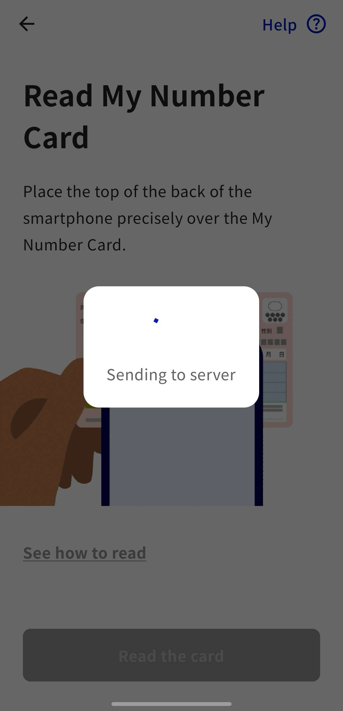

import CheckStatus from "../_CheckStatus.mdx"

## Introduction
This page explains the "pre-link process" that you need to complete before using the UTokyo Account Identity Verification Service.

The overall process is as follows:

- Step 1: [Setting up the digital identification app](#app-setup)
- Step 2: [Verify your identity using the app and your My Number Card](#auth)
- Step 3: [Sign in with your UTokyo Account to complete pre-linking ](#signin)
- Step 4: [Confirm the link status](#statuscheck)

When accessing the UTokyo Account Identity Verification Service, the procedure in Step 2 differs depending on whether you use a PC (together with a smartphone) or only a smartphone. We recommend completing the process using only a smartphone, as the procedure is more straightforward.

## What you need

- Your physical [My Number Card (Individual Number Card of Japan)](https://www.digital.go.jp/en/policies/mynumber) [^1]
- The 4-digit PIN (Personal Identification Number) you registered when you received your My Number Card. ([Electronic Certificate of User Proof (in Japanese)](https://faq.myna.go.jp/faq/show/3494), [PIN for Card Info Input Support (in Japanese)](https://faq.myna.go.jp/faq/show/2385)) [^2]
- A smartphone that can use the digital identification app (iOS 16.0 or later, or Android 11 or later) [^3]
- A PC, if you perform the procedure from a PC (you can also complete the entire procedure on a smartphone)

[^1]: The so-called ["Smartphone My Number Card"](https://www.digital.go.jp/en/policies/mynumber/smartphone-certification) (e.g., electronic certification for smartphones on Androids or iPhone My Number Card) is no longer available as of September 2025.
[^2]: If you have forgotten your PIN or it has been locked, you need to go to the office of the municipality where you are registered to have it initialized and reset. For details, please check the [My Number Card General Portal Site FAQ](https://www.kojinbango-card.go.jp/en-faq/#kojinbango) "Q10 I do not know the PIN for my Individual Number Card. What should I do?".
[^3]: The devices listed in the "マイナンバーカードに対応したスマートフォン一覧" (List of Smartphones Compatible with My Number Card) file on the page linked from the [JPKI (Japan Public Key Infrastructure) Portal Site (in Japanese)](https://www.jpki.go.jp/prepare/reader_writer.html) can be used.

## Step 1: Setting up the digital identification app
{:#app-setup}
First, please set up the digital identification app.

1. Install the "Digital Identification App" onto your smartphone from the following links.
    - [Link for iPhone](https://apps.apple.com/jp/app/id6454900894?l=en-US)
    - [Link for Android](https://play.google.com/store/apps/details?id=jp.go.digital.auth_and_sign)
1. Complete the user registration for the app by following the [registration method published on the Digital Agency of Japan's official website.](https://services.digital.go.jp/en/auth-and-sign/start-guide/).

## Step 2: Perform identity verification using the app and your My Number Card
{:#auth}

Next, verify your identity using your My Number Card and the Digital Identification App.  The steps differ slightly depending on whether you complete the verification **[using only a smartphone] (#auth-smartphone)**or **[use both a PC and a smartphone] (#auth-pc)**. The method is simpler if you only use a smartphone. Please follow the steps applicable to your situation.

### If using a smartphone only
{:#auth-smartphone}

1. Access the [UTokyo Account Identity Verification Service](https://identification.adm.u-tokyo.ac.jp/verify/) on your smartphone.
2. Tap "Verify identity with My Number Card" This will redirect you to the digital identification app. If the authentication steps menu appears, the process is working correctly.
    {:.border}{:.medium}

    {/* ここから共通 */}
    

    
If the digital identification app does not open and a different screen is displayed

     If the Digital Identification App is not installed, a screen will appear prompting you to install the app. Depending on your browser’s display zoom settings, the system may detect the access as coming from a PC and display a QR code instead. In either case, please return to [Step 1](#app-setup),  install the Digital Identification App, and complete the registration. 
     {:.border}{:.small}
    

    

    
If the digital identification app opens but a different screen is displayed.

    
    The app may be installed, but if you have not completed the user registration, the registration process may have been initiated. Please return to [Step 1](#app-setup) and complete the user registration.
    

    {/* ここまで共通 */}

    {/* ここから共通 */}
3. Follow the instructions in the app to authenticate using biometrics or a passcode.
4. Tap "Start" to proceed with the authentication steps.
    {:.border}
5. Enter the PIN for the "electronic certificate of user proof".
    {:.border}
6. Enter the PIN of the "app to support entering items on the card" (previously referred to as "PIN for Card Info Input Support"). If it is the same as the previous PIN, you can skip this step by tapping "Insert same PIN".
    {:.border}
7. Follow the instructions in the app, tap the "Read the card" button, and scan your My Number Card with your smartphone.
    - While the message "Reading…" is displayed, do not move the My Number Card away from your smartphone.
    - Once the scan is complete, the data will be automatically sent to the server.

    <figure class="gallery">{:.border} {:.border} {:.border}</figure>
8. A screen will appear asking for permission to authenticate with the UTokyo Account Identity Verification Service. After reviewing the privacy policy and terms and conditions, tap "Allow".
    {:.border}

    

    
When an option appears asking, "Stop authentication and information sharing?"

    Although the format differs slightly between Android and iOS, a prompt will appear asking, "Stop authentication and information sharing?".
    - If you select 'Stop', you will be redirected to a page that displays "Bad Request…" because this action is not supported by the UTokyo Account Identity Verification Service. In this case, please return to the UTokyo Account Identity Verification Service page and start over from the beginning of [Step 2](#auth-smartphone).
    - If you select 'Cancel' on this pop-up, you will be returned to the previous screen. Please proceed with the remaining steps.

    <figure class="gallery">{:.border}{:.small} {:.border}{:.small}</figure>

    {:.border}{:.small}

    

    {/* ここまで共通 */}
10. Tap “Return to the service in use” in the Digital Identification App or wait 10 seconds after the screen changes. You will be returned to the UTokyo Account Identity Verification Service.
    {:.border}

Initial setup is not yet complete. Proceed to [Step 3](#signin).

### If using both a PC and a smartphone
{:#auth-pc}

1. Access the [UTokyo Account Identity Verification Service](https://identification.adm.u-tokyo.ac.jp/verify/) on your PC.
2. Click "Verify identity with My Number Card". A QR code will be displayed.
    {:.border}{:.medium}

3. Scan the large QR code with the smartphone you set up in Step 1. If the QR code becomes invalid, click "Refresh QR code" below it to generate a new one. **Do not close the PC page after this**.

    <figure class="gallery"> {:.border}{:.medium} {:.border}{:.medium}</figure>

    

    
If you close the PC page

    Plese restart from the beginning of [Step 2](#auth-pc).
    

    {/* ここから共通 */}
    

    
If the Digital identification app does not open and a different screen is displayed

    If the Digital Identification App is not installed, a screen will prompt you to install it. Depending on your browser’s display zoom settings, the system may detect the access as coming from a PC and display a QR code instead. In either case, please return to [Step 1](#app-setup) to install and register the Digital Identification App．
    {:.border}{:.small}
    

    

    
If the Digital Identification App opens but a different screen is displayed

    The app may be installed, but if you have not completed user registration, the registration process may have been initiated. Please return to [Step 1](#app-setup) and register the app.
    

    {/* ここまで共通 */}

4. Enter the 6-digit number displayed on your smartphone into your PC. If it expires, refresh the 6-digit number.

    {/* ここから共通 */}
5. Follow the instructions shown on the app to authenticate using biometrics or a passcode.
6. Tap "Next" to proceed with the authentication steps.
    {:.border}
7. Enter the PIN for the "electronic certificate of user proof".
    {:.border}
8. Enter the PIN of the "app to support entering items on the card" (previously referred to as "PIN for Card Info Input Support"). If it is the same as the previous PIN, you can skip this step by tapping "Insert same PIN".
    {:.border}
9. Follow the instructions in the app, tap the "Read the card" button, and scan your My Number Card with your smartphone.
    - While the message "Reading…" is displayed, do not move the My Number Card away from your smartphone.
    - Once the scan is complete, the data will be automatically sent to the server.

    <figure class="gallery">{:.border} {:.border} {:.border}</figure>
10. A screen will appear asking for permission to authenticate with the UTokyo Account Identity Verification Service. After reviewing the privacy policy and terms and conditions, tap "Allow".
    {:.border}

    

    
When an options appears asking, "Stop authentication and information sharing?"

    Although the format differs slightly between Android and iOS, a prompt will appear asking, "Stop authentication and information sharing?"
    - If you select 'Stop,' you will be redirected to a page that displays "Bad Request…" because this action is not supported by the UTokyo Account Identity Verification Service. In this case, please return to the UTokyo Account Identity Verification Service page and start over from the beginning of [Step 2](#auth-smartphone).
    - If you select 'Cancel' on this pop-up, you will be returned to the previous screen. Please proceed with the remaining steps.

    <figure class="gallery">{:.border}{:.small} {:.border}{:.small}</figure>

    {:.border}{:.small}

    

    {/* ここまで共通 */}

11. Your work on the smartphone is now complete. Return to the PC screen.

Initial setup is not yet complete. Proceed to [Step 3](#signin).

## Step 3: Sign in with your UTokyo Account and complete the pre-linking process
{:#signin}

1. Click "Sign in with your UTokyo Account".
    {:.border}{:.medium}
2. Unless you are already signed in to your UTokyo Account, the sign-in screen will be displayed. Please sign in.
3. Click "Link your UTokyo Account and linked ID" as described above to link the accounts.
    {:.border}{:.medium}
4. If a button that says "Unlink the above " appears, the linkage has been successfully completed.
    {:.border}{:.medium}

## Step 4: Confirm the link status
{:#statuscheck}

### Checking on the UTokyo Account Identity Verification Service
1. On the UTokyo Account Identity Verification Service, confirm that your name and the linked UTokyo Account are displayed correctly.

{/* 9/7: /myでの確認方法はまだ利用できない状況です，したがって画像は用意できてません */}

### Checking on the "View Your UTokyo Account User Information" site
1. Access the "[View Your UTokyo Account User Information](https://login.adm.u-tokyo.ac.jp/my/)" site.
2. Click the "Sign In" button in the upper right corner.
3. Unless you are already signed in to your UTokyo Account, the sign-in screen will be displayed. Please sign in.
4. Click the "Display information" button.

<CheckStatus variant="link"/>