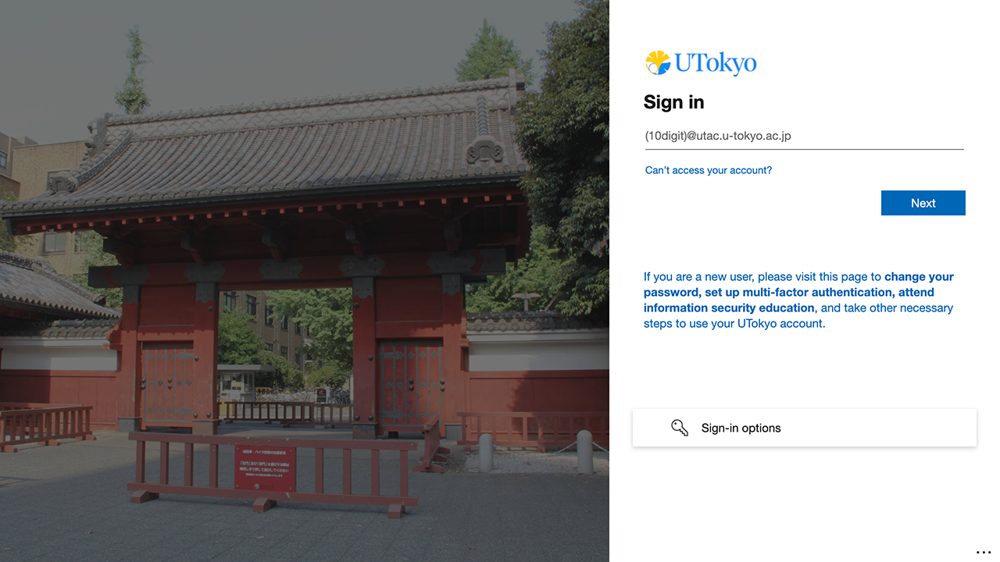
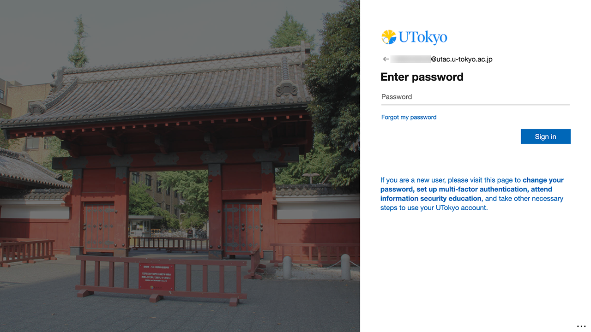
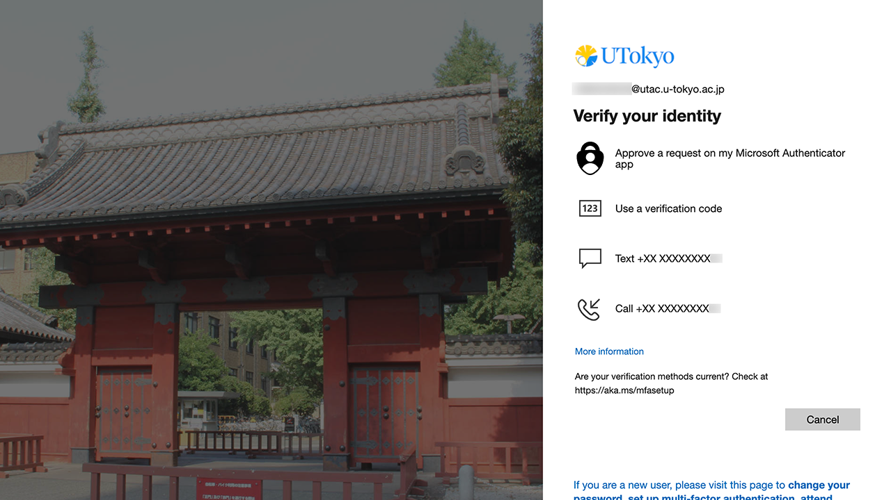
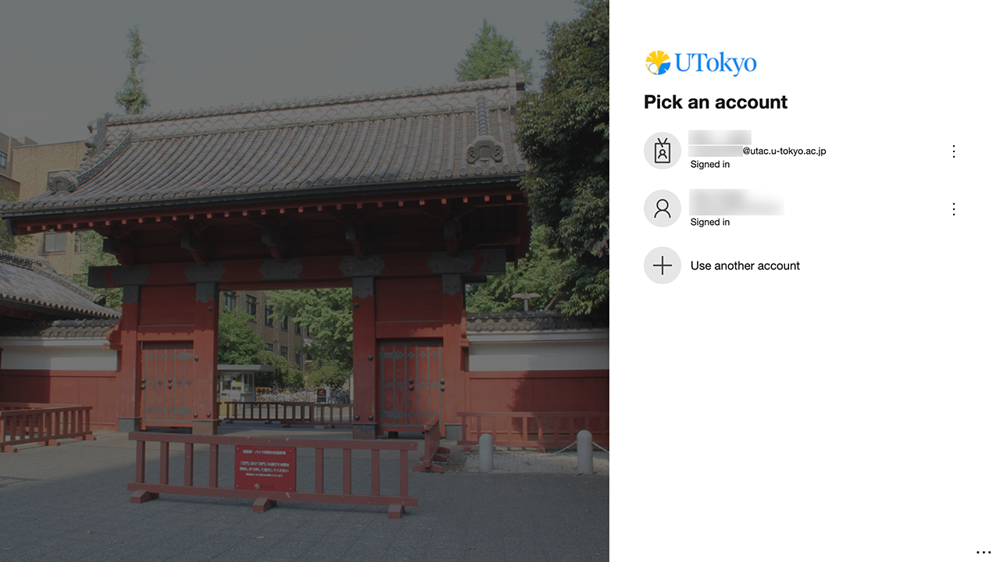
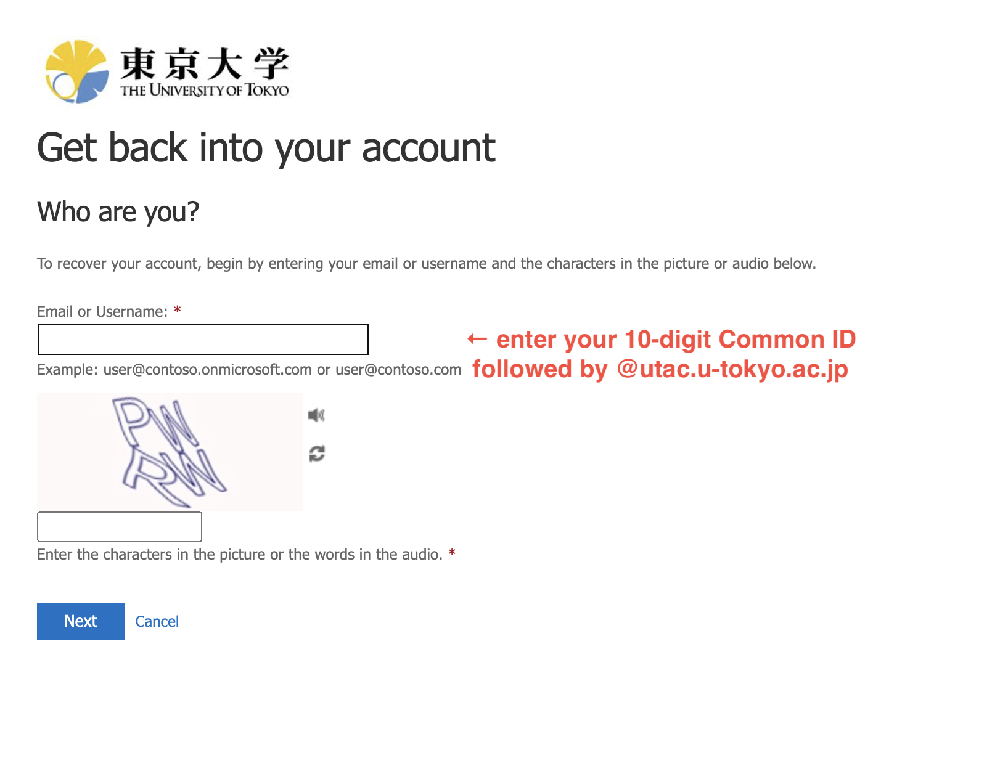
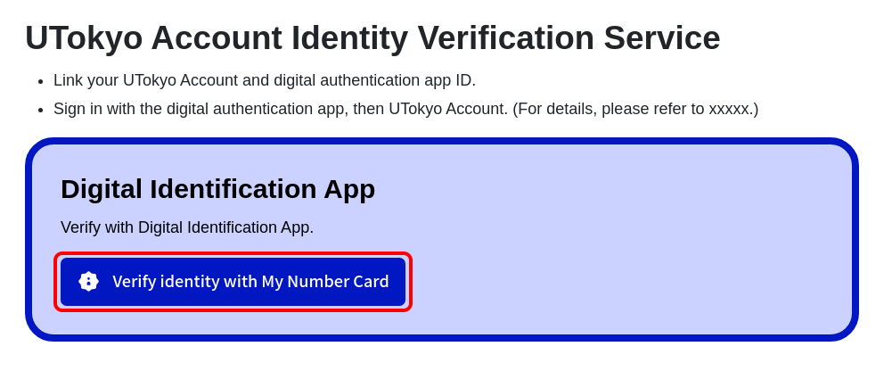
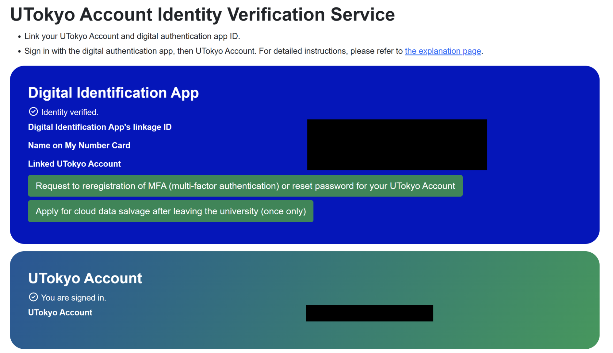
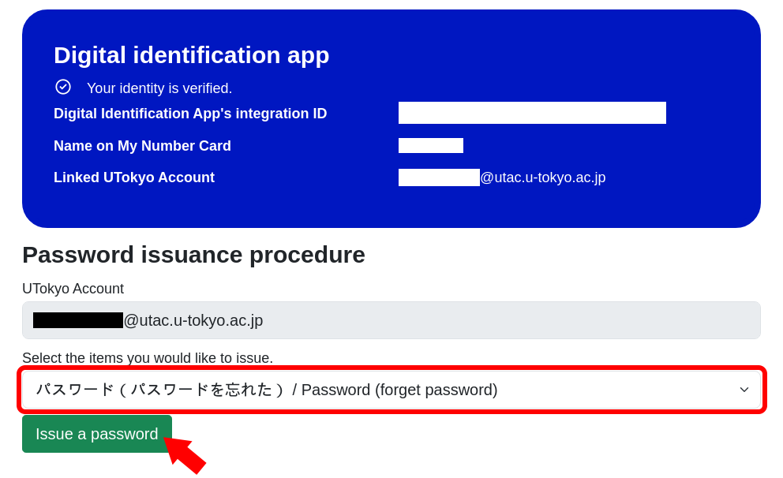
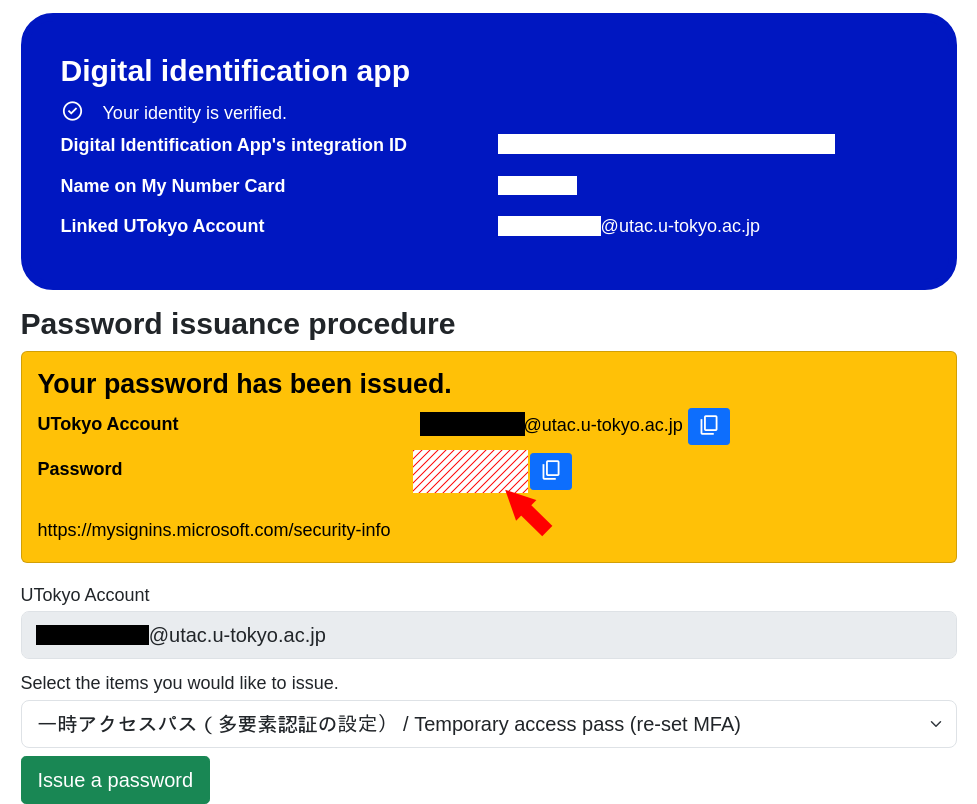
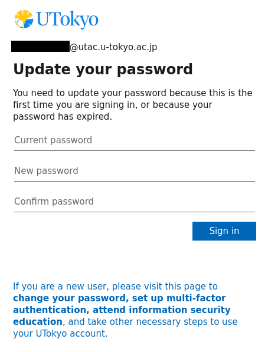

import ChangePassword from "@components/en/systems/utokyo_account/ChangePassword.mdx";
import MFA from "@components/en/systems/utokyo_account/MFA.mdx";
import InformationSecurity from '@components/en/InformationSecurity.mdx'

## What is UTokyo Account?
{:#about}

- **UTokyo Account** is a university-wide account that is required to use the ICT systems of the University of Tokyo. Students, faculty and staff of the University of Tokyo are required to sign in with this account to use various ICT systems.
  - Even if you do not currently have an account, you can receive a UTokyo Account if you are a member of an organization that has been accepted and managed by the university. If you wish to obtain an account, please contact the relevant office of your department (students should contact the academic office, and faculty and staff members should contact the personnel department).
- The username of UTokyo Account is represented by a 10-digit number and is also called the **“Common ID”**. In the ICT systems, a 10-digit Common ID followed by `@utac.u-tokyo.ac.jp`, which indicates that you are a member of the University of Tokyo, is sometimes used, such as `0123456789@utac.u-tokyo.ac.jp`.
  - The "10-digit Common ID + `@utac.u-tokyo.ac.jp`" is not an email address that can be used normally.
  - System notification emails sent to "10-digit Common ID + `@utac.u-tokyo.ac.jp`" may be forwarded to [the ECCS Cloud Email (Google Workspace)](/en/google/), but you cannot send emails using "10-digit Common ID + `@utac.u-tokyo.ac.jp`".
- For more information on the services available through the UTokyo Account, please see the **[UTokyo Account Service Directory](https://login.adm.u-tokyo.ac.jp/utokyoaccount/)** and [the "Systems of the University of Tokyo" page](/en/systems/).
  - The available systems differ depending on the user's enrollment status, affiliation, and so on, and not all systems are available to all users.

## How to start using UTokyo Account
{:#procedures}
### Changing the Initial Password for your UTokyo Account

<ChangePassword variant="individual" />

### Setting up “Multi-Factor Authentication for your UTokyo Account”

<MFA />

### Taking the Information Security Education
{:#information-security-education}

<InformationSecurity variant="individual" />

### Relevant initial setup
Once you have completed the above tasks, please also refer to the following pages.

- For students: "[Getting Ready for ICT Systems at the University of Tokyo (for New Students)](/en/oc/)".
- For faculty members: Please refer to the following two pages.
  - "[Getting Ready for ICT Systems at the University of Tokyo (for Faculty Members)](/en/faculty_members/)"
  - "[UTokyo Portal: UTokyo Accountの初期設定](https://univtokyo.sharepoint.com/sites/utokyoportal/wiki/d/UTokyo_Account_Initial_Settings.aspx)(Initial Setup of the UTokyo Account)(in Japanese)"<small>(* You must sign in with your UTokyo Account to view this page)</small>
- For staff members: "[UTokyo Portal: UTokyo Accountの初期設定](https://univtokyo.sharepoint.com/sites/utokyoportal/wiki/d/UTokyo_Account_Initial_Settings.aspx)(Initial Setup of the UTokyo Account)(in Japanese)"<small>(* You must sign in with your UTokyo Account to view this page)</small>

## Sign in to the ICT systems with your UTokyo Account
{:#signin}

This section explains how to sign in to various ICT systems using your UTokyo Account.

When using the ICT systems, if the following sign-in screen (with an image of Akamon Gate) appears, you need to sign in with your UTokyo Account. Please follow these steps to sign in:

{:.small.center.thin-border}
1. Enter "10-digit Common ID + `@utac.u-tokyo.ac.jp`" in the input field, then click "Next."
1. When the screen shown in the bottom-left screenshot appears, enter your password and click "Sign in."
1. If the "Verify your identity" screen shown in the bottom-right screenshot or the "Approve sign in request" screen appears, follow the on-screen instructions to complete the multi-factor authentication.
1. You will be signed in and redirected to the system page you are trying to access.

<figure class="gallery">{:.small.center.thin-border}{:.small.center.thin-border}</figure>

Additionally, during sign-in, you may see a screen like the following. In this case, please select the item labeled "10-digit Common ID + `@utac.u-tokyo.ac.jp`".

{:.small.center.thin-border}

Many of the ICT systems that allow users to sign in using their UTokyo Account are linked to each other, so that once a user has signed in with their username and password on one ICT system, the user does not subsequently need to enter the username and password to use another ICT system. This behavior is called **Single Sign-On (SSO)**.

## About passwords
{:#password}
### Validity period of a password
{:#password-expiration}

If you are using Multi-Factor Authentication, your password does not expire. Otherwise, your password is valid for 397 days (1 year + 1 month) after it is changed. The expiration date of the current password can be checked from [the User Menu](https://utacm.adm.u-tokyo.ac.jp/UserMenu/LoginServlet).

### Changing passwords
{:#change-password}

You can change your password from the "Password" menu on the [Security info page](https://mysignins.microsoft.com/security-info?domain_hint=univtokyo.onmicrosoft.com).

### If you forget your password
{:#forget-password}

If you forget your UTokyo Account password, you can sign back into your account using the following steps.

#### Reset your password by email
{:#reset-password}

If you have registered your email address in advance on one of the following, you can reset your password using that email address.

- [Security info page](https://mysignins.microsoft.com/security-info?domain_hint=univtokyo.onmicrosoft.com).
*This email address is registered during [the step 1 of Setting up Multi-Factor Authentication](mfa/initial/#first). If you wish to register directly on this page, please follow the steps below.
  1. Access [Security info page](https://mysignins.microsoft.com/security-info?domain_hint=univtokyo.onmicrosoft.com).
  1. Click "Add sign-in method" button.
  1. In the "Which method would you like to add?" field, select "Email" and click "Add".
  1. Follow the instructions on the screen.
- (For students <small>including accounts that are both students and faculty and staff members</small>) "E-MAIL 1" field on the "Register Address Update, etc." page in the "Student Info" section of [UTAS](https://utas.adm.u-tokyo.ac.jp/campusweb/campusportal.do).
  - For new students, the email address registered on [web registration system](https://utas-ew.adm.u-tokyo.ac.jp/) is set as "E-MAIL 1."
- (For faculty and staff members <small>excluding accounts that are both students and faculty and staff members</small>) "学内メールアドレス" (Campus Email Address) in the "パーソナルメニュー" (Personal Menu) of the [Personnel Information Myweb](https://univtokyo.sharepoint.com/sites/utokyoportal/wiki/d/Personal_information_and_ID_card.aspx)
  - The email address for this purpose must end with `u-tokyo.ac.jp`.

The procedure for resetting the password is as follows.

1. Access [password reset page](https://passwordreset.microsoftonline.com/?whr=univtokyo.onmicrosoft.com).
1. The following "Get back into your account" will appear. Enter "10-digit Common ID + `@utac.u-tokyo.ac.jp`" in the "Email or Username" field, and the text in the image below it, then press "Next".
    
    

	    
When the error message “You can't reset your own password because you haven't registered for password reset.” appears

	  Since your email address is not registered in the system, a notification email cannot be sent to you and therefore your password cannot be reset. Please [reissue a password from the help desks](#reissue-password). Once your password has been reissued, please register your email address in UTAS (for students) or Personnel Information MyWeb (for faculty and staff).
    

1. Confirm that a part of your pre-registered email address is displayed. You will receive an email notification with a confirmation code to reset your password.
1. When you receive the email, follow the instructions in the email to reset your password. If you do not receive the email, please check your spam folder or make sure that you are not using a different email address.
    - UTokyo Account passwords must be between 12 and 64 characters in length, include uppercase and lowercase letters, numbers, and symbols and must not include space ` `, double quotation `"`, dot `.`, or backslash or yen mark `\`.

#### Reissuing a password using the UTokyo Account Identity Verification Service

{:#reissue-password-ident-myna}
By pre-linking [the UTokyo Account Identity Verification Service](./ident-myna/), you can verify your identity online using your My Number Card and have a password reissue by yourself. This service allows you to complete the procedure without visiting an office in person. For details, please refer to "[UTokyo Account Identity Verification Service](./ident-myna/)".

##### Requirements for Using This Service

To use this service, you must meet all of the following conditions:

- You have completed the pre-link process for the UTokyo Account Identity Verification Service.
  - Please note that you must complete the pre-link process **before** you become unable to log in having forgotten your password.
- The verification method set for multi-factor authentication (MFA) is accessible.
  - If it is not accessible, please [reregister your verification method for MFA](mfa/reregister/) first.
- You have the following items on hand:
  - Your My Number Card (with a valid electronic certificate of user proof).
  - A smartphone capable of reading your My Number Card (with the digital identification app installed).
  - The following PINs (personal identification numbers) that you set when you received your My Number Card:
    - 4-digit PIN for electronic certificate of user proof
    - 4-digit PIN for Card Info Input Support

##### Reissue Procedure

The following steps can be performed on either a PC or a smartphone, but using a smartphone is recommended for a smoother interaction with the digital identification app.

1. Access the "UTokyo Account Identity Verification Service" link below.
   **[UTokyo Account Identity Verification Service](https://identification.adm.u-tokyo.ac.jp/verify/)**{:.box.center}
1. Click "Verify identity with My Number Card" and follow the on-screen instructions to complete the identity verification.
   {:.small.center.thin-border}
1. Click "Request to reregistration of MFA (multi-factor authentication) or reset password for your UTokyo Account".
   {:.small.center.thin-border}
1. In the "Select the items you would like to issue" field, select "Password (forget password)" and then click "Issue a password".
   {:.small.center.thin-border}
1. A "Your password has been issued" message will appear. Copy the temporary password provided, then access a page that requires UTokyo Account authentication (e.g., [Security info page](https://mysignins.microsoft.com/security-info)).
   {:.small.center.thin-border}
1. On the sign-in screen, enter your UTokyo Account (your 10-digit Common ID followed by `@utac.u-tokyo.ac.jp`) and the temporary password.

   

    
If the sign-in screen does not appear

   The sign-in screen will not appear if you are already signed in (e.g., if you have just reset your MFA settings). In that case, please follow these steps.

   1. Open the "Security info" page.
      **[Security info](https://mysignins.microsoft.com/security-info/)**{:.box.center}
   1. Select "Change password" from the menu on the left.
   1. In the "Old password" field, enter the temporary password you copied. In the "New password" fields, enter your new password, and then click "Submit".
   1. Your password has now been reissued and reset.

   

1. You will be prompted to verify your identity using multi-factor authentication (MFA). The steps vary depending on the verification method, so please follow the on-screen instructions.
1. After you sign in, you will be prompted to update your password. In the "Current password" field, enter the temporary password you copied. In the "New password" and "Confirm password" fields, enter your new password, and then click "Sign in".
   {:.small.center.thin-border}

#### Reissue a password from the help desks
{:#reissue-password}

If you have not registered your email address, or if the above procedure does not work, please contact the following help desks to reissue your password.

- For stdents: academic affairs office of your college/faculty/graduate school
    - Please bring your Student ID card.
    - If you are a first-year undergraduate student who has not yet received your student ID card, please bring your admission notification letter with you.
- For faculty and staff members: personnel office of your department

*Previously, ECCS Help Desks also accepted password reissuance requests, but due to repeated violations of the request guidelines, we have ended this service as of May 2025.

After completing the procedures, you will receive a "Notification regarding password for the UTokyo Account" containing your initial password. Please change your initial password to a new one, referring to "Task: Change the initial password" in [How to start using UTokyo Account](#procedures). (You cannot use the ICT services with your initial password.)

## Multi-Factor Authentication (MFA)
{:#mfa}

UTokyo Account has adopted the use of **Multi-Factor Authentication (MFA)**. If you set up Multi-Factor Authentication, you will be asked to confirm your identity via SMS or an authentication application in addition to your password, when signing in to your account. For more information, please refer to the [Using Multi-Factor Authentication for UTokyo Accounts](mfa/) page.

## UTokyo Account Identity Verification Service
{:#ident-myna}

The UTokyo Account Identity Verification Service is a system that allows you to verify your identity online using your [My Number Card (Individual Number Card of Japan)](https://www.digital.go.jp/en/policies/mynumber) that has been pre-linked with your UTokyo Account, in case you are unable to sign in to your UTokyo Account.

Specifically, it can be used in the following situations:

- When you fail to sign in to your UTokyo Account and want to reset it (e.g., when you have forgotten your password or need to reconfigure multi-factor authentication).
- When you need to retrieve cloud data after leaving the university (due to graduation, resignation, etc.) that you forgot to back up beforehand (i.e., when using the cloud data salvage service).
- When joining alumni services after graduation.

For more details, please refer to the [UTokyo Account Identity Verification Service page](./ident-myna/).
