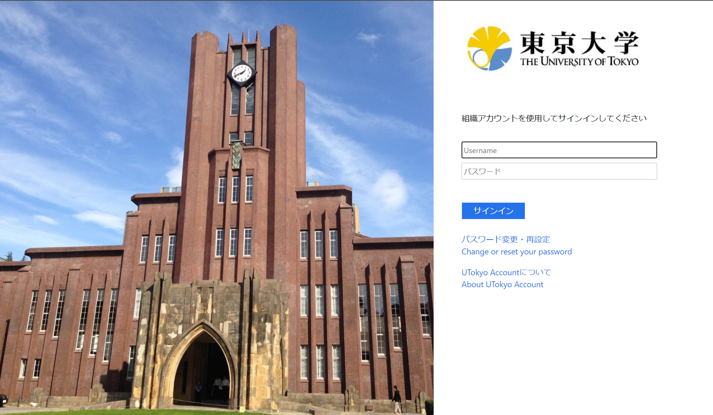
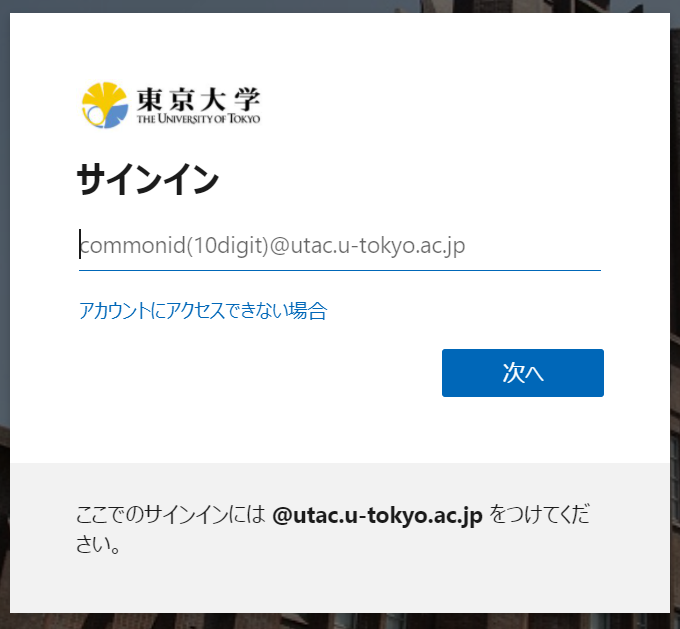
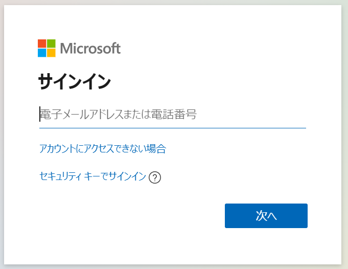

import UTokyoAccount from '@components/en/systems/utokyo_account/index.mdx';
import InformationSecurity from '@components/en/InformationSecurity.mdx'

## What is UTokyo Account?
{:#about}

- **UTokyo Account** is a university-wide account that is required to use the ICT systems of the University of Tokyo. Students, faculty and staff of the University of Tokyo are required to sign in with this account to use various ICT systems.
  - Even if you do not currently have an account,  a UTokyo Account can be issued if necessary. If you wish to obtain an account, please contact the relevant office of your department (students should contact the academic office, and faculty and staff members should contact the personnel department).
- The username of UTokyo Account is represented by a 10-digit number and is also called the **“Common ID”**. In the ICT systems, a 10-digit Common ID followed by `@utac.u-tokyo.ac.jp`, which indicates that you are a member of the University of Tokyo, is sometimes used, such as `1234567890@utac.u-tokyo.ac.jp`.
  - The "10-digit Common ID + `@utac.u-tokyo.ac.jp`" is not an email address that can be used normally.
  - System notification emails sent to "10-digit common ID + `@utac.u-tokyo.ac.jp`" may be forwarded to [the ECCS Cloud Email (Google Workspace)](/en/google/), but you cannot send emails using "10-digit common ID + `@utac.u-tokyo.ac.jp`".
- For more information on the services available through the UTokyo Account, please see the **[UTokyo Account Service Directory](https://login.adm.u-tokyo.ac.jp/utokyoaccount/)** and [the "Systems of the University of Tokyo" page (in Japanese)](/systems).

## Notes on using UTokyo Account
{:#notes}

1. UTokyo Account is granted to members of the university who are systematically accepted and managed by the university. (It will not be granted to those who are not systematically accepted by the university.)
1. The services available through the UTokyo Account vary depending on the user's identity, affiliation and so on.
1. To use the UTokyo Account and ICT systems that require a UTokyo Account, you must comply with the [UTokyo Guidelines for Information Ethics and Computer Use](https://www.u-tokyo.ac.jp/content/400156696.pdf). (Reference: [UTokyo Policy for Information Security](https://www.u-tokyo.ac.jp/en/about/information-security.html))
1. If you use the system inappropriately or cause safety issues that are against the Information Ethics and Computer Usage Guidelines for using the UTokyo Account and ICT systems that require a UTokyo Account, your account will be suspended.
1. Please refer to the information on this website for details on using UTokyo Account.

## How to start using UTokyo Account
{:#procedures}
<UTokyoAccount variant="individual" />

### Attending the Information Security Education
{:#information-security-education}

<InformationSecurity variant="individual" />

### Relevant initial setup
Once you have completed the above tasks, please also refer to the following pages.

- For students: "[Getting Ready for ICT Systems at the University of Tokyo (for New Students)](/en/oc/)".
- For faculty members: Please refer to the following two pages.
  - "[Getting Ready for ICT Systems at the University of Tokyo (for Faculty Members)](/en/faculty_members/)"
  - "[UTokyo Portal: UTokyo Accountの初期設定](https://univtokyo.sharepoint.com/sites/utokyoportal/wiki/d/UTokyo_Account_Initial_Settings.aspx)(Initial Setup of the UTokyo Account)(in Japanese)"<small>(* You must sign in with your UTokyo Account to view this page)</small>
- For staff members: "[UTokyo Portal: UTokyo Accountの初期設定](https://univtokyo.sharepoint.com/sites/utokyoportal/wiki/d/UTokyo_Account_Initial_Settings.aspx)(Initial Setup of the UTokyo Account)(in Japanese)"<small>(* You must sign in with your UTokyo Account to view this page)</small>

## Sign in to the ICT systems with your UTokyo Account
{:#signin}

UTokyo Account provides access to a variety of ICT systems. The sign-in methods vary depending on the situation.

- When the following screen (with an image of Yasuda Auditorium) is displayed, you can sign in with your 10-digit Common ID and password.

- If the image of Yasuda Auditorium does not appear and the sign-in screen appears as shown below, please enter "10-digit common ID + `@utac.u-tokyo.ac.jp`".
    <figure class="gallery">
        
        
    </figure>

Many of the ICT systems that allow users to sign in using their UTokyo Account are linked to each other, so that once a user has signed in with their username and password on one ICT system, the user does not subsequently need to enter the username and password to use another ICT system. This behavior is called **Single Sign-On (SSO)**.

## About passwords
{:#password}
### Validity period of a password
{:#password-expiration}

If you are using Multi-Factor Authentication, your password does not expire. Otherwise, your password is valid for 397 days (1 year + 1 month) after it is changed. The expiration date of the current password can be checked from [the User Menu](https://utacm.adm.u-tokyo.ac.jp/webmtn/LoginServlet).
*Before March 9, 2023, passwords were valid for 365 days regardless of whether or not Multi-Factor Authentication was enabled (see [this page](/en/notice/2023/03-utokyo_account-password) for details). Passwords set before March 9, 2023 will remain valid for 365 days and will not be extended, and passwords set after that date will have a new validity period.

A password is valid for one year after it is changed. The expiration date of your current password can be checked from the [User Menu](https://utacm.adm.u-tokyo.ac.jp/webmtn/LoginServlet).

### Changing passwords
{:#change-password}

You can change your password from the "Password Change" menu on the [User Menu](https://utacm.adm.u-tokyo.ac.jp/webmtn/LoginServlet). The password can be changed even if it has expired, so there is no need to reset or reissue a password.

### If you forget your password
{:#forget-password}

If you forget your UTokyo Account password, you can sign back into your account using the following steps.

#### Reset your password by email
{:#reset-password}

If you have registered your email address in advance on one of the following, you can reset your password using that email address.

- (Students only) "E-MAIL 1" field on the "Register Address Update, etc." page in the "Student Info" section of [UTAS](https://utas.adm.u-tokyo.ac.jp/campusweb/campusportal.do).
  - For new students, the email address registered on https://utas-ew.adm.u-tokyo.ac.jp/ is set as "E-MAIL 1."
- (Faculty and staff members only) "学内メールアドレス" (Campus Email Address) in the "パーソナルメニュー" (Personal Menu) of the [Personnel Information Myweb](https://univtokyo.sharepoint.com/sites/utokyoportal/wiki/d/Personal_information_and_ID_card.aspx)
  - The email address for this purpose must end with `u-tokyo.ac.jp`.
- [Security info page](https://mysignins.microsoft.com/security-info?domain_hint=utac.u-tokyo.ac.jp).
  - This email address is set in [the step 1 of Setting up Multi-Factor Authentication](mfa/initial/#first).
  - If you have not set this email address, you can set it from "Add sign-in method" in the page above.

The procedure for resetting the password is as follows.

1. Access [password reset page](https://passwordreset.microsoftonline.com/?whr=utac.u-tokyo.ac.jp).
1. The following "Get back into your account" will appear. Enter "10-digit Common ID + `@utac.u-tokyo.ac.jp`" in the "Email or Username" field, and the text in the image below it, then press "Next".
1. Confirm that a part of your pre-registered email address is displayed. You will receive an email notification with a confirmation code to reset your password.
1. When you receive the email, follow the instructions in the email to reset your password. If you do not receive the email, please check your spam folder or make sure that you are not using a different email address.
    - UTokyo Account passwords must be between 12 and 64 characters in length, include uppercase and lowercase letters, numbers, and symbols and must not include space ` `, double quotation `"`, dot `.`, or backslash or yen mark `\`.

#### Reissue a password from the help desks
{:#reissue-password}

If you have not registered your email address, or if the above procedure does not work, please contact the following help desks to reissue your password.

- The academic office of our college/faculty/graduate school (students only).
    - Please bring your Student ID card.
- Personnel department of your department (faculty and staff members only)
- [ECCS Help Desks](https://www.ecc.u-tokyo.ac.jp/en/emap.html)
    - Students must bring their Student ID card, and faculty and staff members must bring their Staff ID card.
    - The Help Desks are located in the Information Education Building (Komaba Campus), Information Technology Center (Asano Section, Hongo Campus), and Fukutake Hall (Hongo Campus).

After completing the procedures, you will receive a "Notification regarding password for the UTokyo Account" containing your initial password. Please change your initial password to a new one, referring to "Task: Change the initial password" in [How to start using UTokyo Account](#procedures). (You cannot use the ICT services with your initial password.)

	
When the error message “You can't reset your own password because you haven't registered for password reset.” appears

	Since your email address is not registered in the system, a notification email cannot be sent to you and therefore your password cannot be reset. Please [reissue a password from the help desks](/en/utokyo_account/#reissue-password). Once your password has been reissued, please register your email address in UTAS (for students) or Personnel Information MyWeb (for faculty and staff).

## Multi-Factor Authentication (MFA)
{:#mfa}

UTokyo Account has adopted the use of **Multi-Factor Authentication (MFA)**. If you set up Multi-Factor Authentication, you will be asked to confirm your identity via SMS or an authentication application in addition to your password, when signing in to your account. For more information, please refer to the [Using Multi-Factor Authentication for UTokyo Accounts](mfa/) page.
